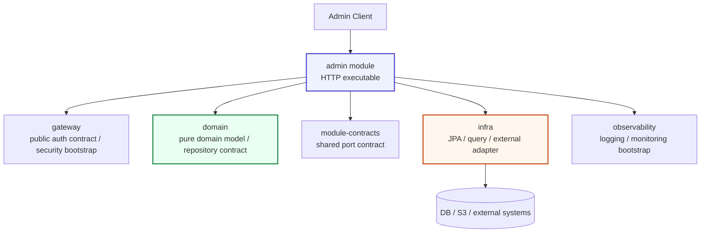
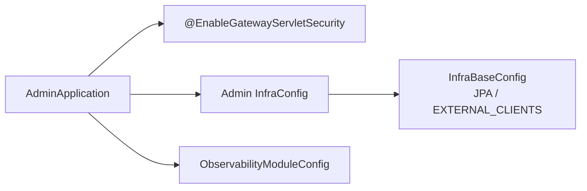
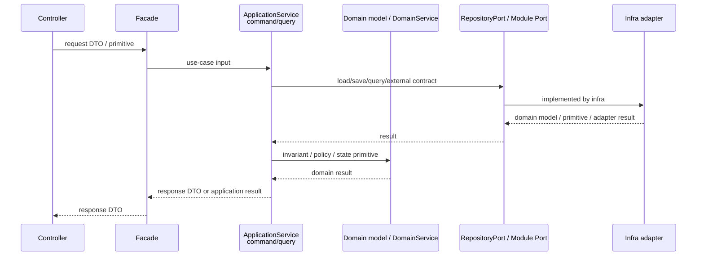
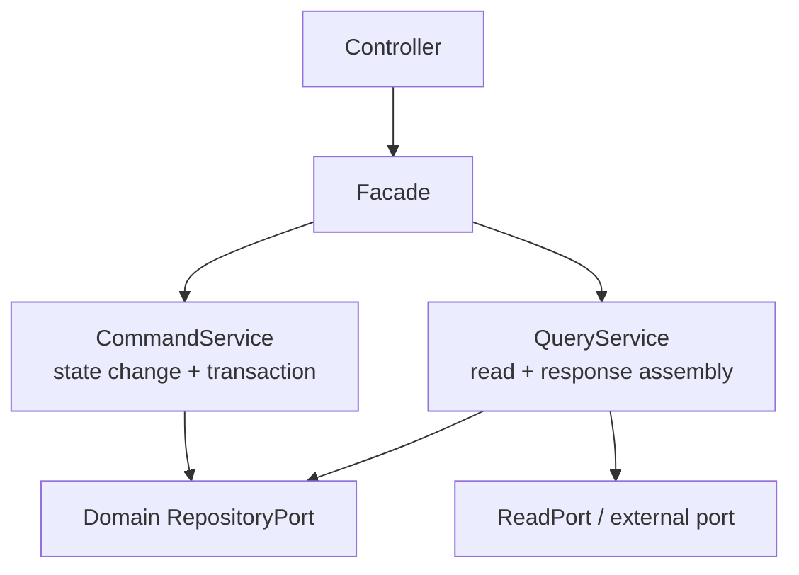
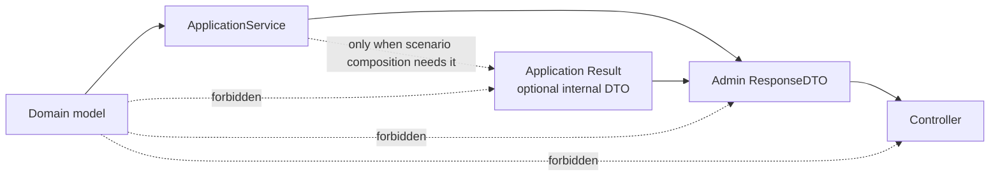
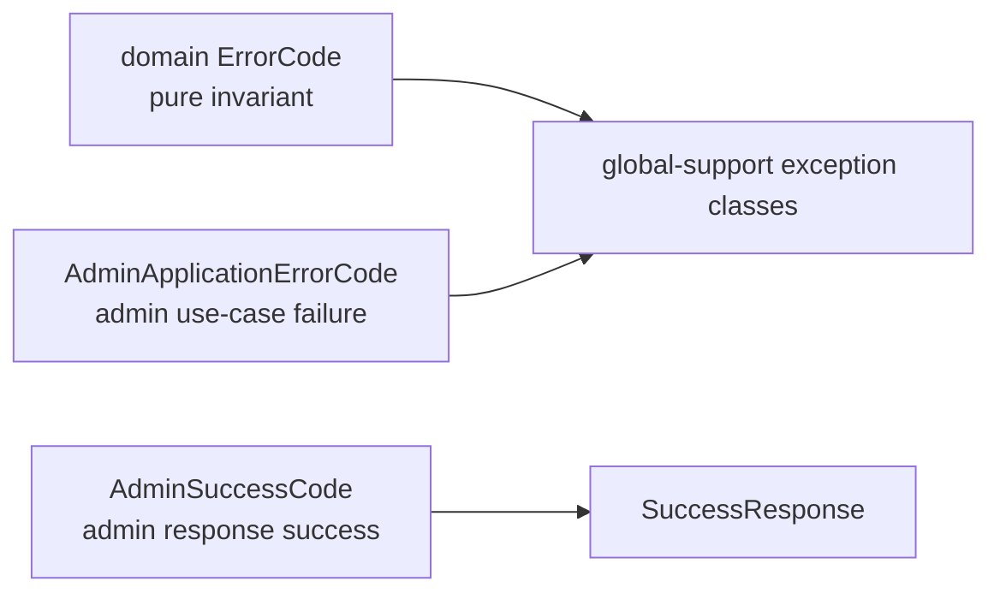

# admin module

`admin`은 BEAT의 **관리자/백오피스 HTTP executable module**입니다.
일반 사용자 API(`apis`)와 분리된 실행 모듈이며, 관리자 전용 인증·인가 정책, Swagger/OpenAPI, request/response DTO, 백오피스 유스케이스를 소유합니다.

> 핵심 원칙: `admin`은 관리자 HTTP 실행 경계입니다. Controller는 HTTP를, Facade는 scenario 진입을, ApplicationService는 use-case와 transaction을 소유합니다.

---

## 1. 한눈에 보는 위치



`admin`은 독립 실행 모듈입니다. root application이나 `apis`/`batch`의 application service를 우회해서 재사용하지 않습니다. 공유가 필요한 기능은 공개 bootstrap/config 또는 `module-contracts` port로 연결합니다.

---

## 2. 현재 모듈 계약

| 영역 | 현재 계약 |
| --- | --- |
| 실행 형태 | Spring Boot 관리자 HTTP executable module |
| Bootstrap | `AdminApplication`이 `@EnableGatewayServletSecurity`로 gateway 인증 bootstrap을 선택하고 `InfraConfig`, `ObservabilityModuleConfig`만 명시 import |
| Package | context 기준 `admin.user`, `admin.promotion` 분리 |
| Layer | `Controller -> Facade -> ApplicationService(command/query)` |
| DTO | admin 전용 request/response/result DTO 소유, domain/JPA type 직접 노출 금지 |
| SuccessCode | `admin.api.response.AdminSuccessCode`가 response boundary에서 소유 |
| ErrorCode | `admin.application.exception.AdminApplicationErrorCode`가 admin use-case 실패를 소유 |
| Persistence | domain repository contract / module-contract port를 사용하고, infra 구현 타입은 직접 노출하지 않음 |
| Scheduler | admin은 scheduler owner가 아니며 scheduling bridge를 소유하지 않음 |

---

## 3. 역할과 책임

`admin`이 소유하는 것:

- 관리자/백오피스 HTTP API entrypoint
- 관리자 전용 security, CORS, converter, Swagger/OpenAPI 정책
- 관리자 request/response DTO
- 관리자 use-case orchestration
- 관리자 application error/success response language
- 관리자 JSON compatibility test와 architecture guard

`admin`이 소유하지 않는 것:

- 사용자 API scenario와 response DTO
- batch job trigger/scheduler ownership
- JPA entity, Spring Data repository implementation, QueryDSL/JDSL query implementation
- domain invariant 자체
- external adapter 구현 세부사항

---

## 4. 의존성 규칙

### 허용 의존성

```kotlin
implementation(project(":module-contracts"))
implementation(project(":gateway"))
implementation(project(":domain"))
implementation(project(":infra"))
implementation(project(":global-support"))
implementation(project(":observability"))
```

### 금지 규칙

- `project(":")` root application 직접 의존 금지
- `apis`, `batch` 직접 의존 금지
- root bootstrap/import 금지
  - `com.beat.BeatApplication`
  - `com.beat.legacyroot.*`
  - root `SecurityConfig` / `WebConfig`
- infra 구현 세부 패키지 직접 import 금지
  - `infra.*.entity`
  - `infra.*.repository.impl`
  - `infra.*.repository.jpa`
  - `infra.external.*`
- gateway internal 구현 직접 import 금지
  - `gateway.annotation.*`
  - `gateway.jwt.internal.*`
  - `gateway.security.internal.*`
  - `gateway.filter.*`
  - `gateway.config.*`
- 허용되는 gateway 공개 표면은 `EnableGatewayServletSecurity`, `EnableGatewayConfig`, `GatewayConfigGroup`, `gateway.security.servlet.CurrentMember`로 제한하고 JWT/refresh token 계약은 `module-contracts`의 `com.beat.contracts.auth.*`를 사용
- transitional package 재도입 금지
  - `adapter/`
  - `controller/`
  - `port/in/`
  - root `admin/api/AdminController`
  - root `admin/facade/AdminFacade`
- API DTO에 Domain model, JPA entity, QueryDSL Q type, Redis document 직접 노출 금지

---

## 5. Bootstrap contract



현재 bootstrap:

```kotlin
@SpringBootApplication(scanBasePackageClasses = [AdminApplication::class])
@EnableGatewayServletSecurity
@Import(
    InfraConfig::class,
    ObservabilityModuleConfig::class,
)
class AdminApplication
```

규칙:

- broad `@ComponentScan`을 사용하지 않습니다.
- `AdminApplication` 자신의 package 아래만 component scan합니다.
- `EnableGatewayServletSecurity`는 공개 gateway servlet security bootstrap 경계이며 broad `com.beat.gateway` scan에 의존하지 않고 admin에는 refresh token store를 import하지 않습니다.
- `InfraConfig`는 admin이 필요한 infra group만 명시합니다.
- `ObservabilityModuleConfig`는 관측성 공개 bootstrap 경계입니다.
- `AdminSecurityConfig`는 `gatewaySecurityMdcLoggingFilter`를 JWT보다 먼저 배치해 모든 응답에 trace/request MDC와 `X-Request-ID`를 보장하고, 이후 `gatewayJwtAuthenticationFilter`가 인증 성공 시 MDC `userId`를 갱신합니다.
- gateway 내부 `SecurityMdcLoggingFilter` 클래스는 직접 import하지 않고 qualifier + `OncePerRequestFilter` 타입으로만 주입합니다.
- observability 내부 config는 직접 import하지 않고 `ObservabilityModuleConfig`만 사용합니다.
- `beat.scheduler.owner=false` 계약을 유지합니다.

---

## 6. 현재 패키지 구조

```text
admin/
  src/main/kotlin/com/beat/admin/
    AdminApplication.kt
    api/response/
      AdminSuccessCode.kt
    application/exception/
      AdminApplicationErrorCode.kt
    config/
      InfraConfig.kt

  src/main/java/com/beat/admin/
    config/
      AdminCorsConfig
      AdminSecurityConfig
      AdminWebConverterConfig
      converter/StringToEnumCustomConverterFactory
    handler/
      AdminGlobalExceptionHandler
    swagger/config/
      AdminSwaggerConfig
    user/
      api/
      facade/
      application/
    promotion/
      api/
      facade/
      application/
```

현재 context:

```text
com.beat.admin.user
com.beat.admin.promotion
```

---

## 7. Context 구조

### 7.1 user context

```text
com.beat.admin.user/
  api/
    AdminUserApi
    AdminUserController
  facade/
    AdminUserFacade
  application/
    service/query/AdminUserQueryService
    dto/response/UserFindAllResponse
```

역할:

- 관리자 유저 조회 API
- 관리자 actor 존재 검증
- user 목록 response 조립

현재 endpoint:

```text
GET /api/admin/users
```

### 7.2 promotion context

```text
com.beat.admin.promotion/
  api/
    AdminPromotionApi
    AdminPromotionController
  facade/
    AdminPromotionFacade
  application/
    service/command/AdminPromotionCommandService
    service/query/AdminPromotionQueryService
    dto/request/*
    dto/response/*
    dto/result/AdminPromotionResults
```

역할:

- 캐러셀/배너 presigned URL 발급
- 캐러셀 promotion 조회
- 캐러셀 promotion 생성/수정/삭제 orchestration

현재 endpoints:

```text
GET /api/admin/carousels/presigned-url
GET /api/admin/banner/presigned-url
GET /api/admin/carousels
PUT /api/admin/carousels
```

현재 presigned-url endpoint는 carousel/banner promotion asset 관리 흐름에 속하므로 `promotion` context가 소유합니다. 관리자 전역 파일 관리 유스케이스가 실제로 생길 때만 `admin.file` context를 새로 검토합니다.

---

## 8. Layer boundary



### Controller

- HTTP endpoint와 Swagger interface를 소유합니다.
- Facade만 호출합니다.
- ApplicationService, Repository, Domain model을 직접 호출하지 않습니다.
- `SuccessResponse`와 `AdminSuccessCode`로 HTTP response를 조립합니다.
- JSON field name과 기존 endpoint 호환성을 최우선으로 유지합니다.

### Facade

- 관리자 API scenario의 공식 진입점입니다.
- Controller 입력을 use-case 호출 단위로 정규화합니다.
- 여러 command/query service를 조합할 수 있습니다.
- transaction, repository, domain service를 직접 소유하지 않습니다.
- raw Domain model을 받거나 반환하지 않습니다.

### ApplicationService

- command/query service를 의미합니다.
- use-case와 transaction boundary를 소유합니다.
- 이 계층만 유스케이스 method 내부에서 Domain model을 조회/변경/정책 판단에 사용할 수 있습니다.
- Domain model은 이 계층 밖으로 반환하지 않습니다. 다른 ApplicationService에 raw Domain model을 반환하는 public helper method를 새로 만들지 않습니다.
- 순수 domain rule은 Entity/VO/DomainService에 위임합니다.
- repository lookup, actor validation, request/use-case validation은 admin application flow로 처리합니다.

---

## 9. CQRS rule

BEAT admin의 CQRS는 저장소나 DB를 물리적으로 분리한다는 뜻이 아닙니다.
우선 application service를 **변경 use-case(command)** 와 **조회 use-case(query)** 로 분리합니다.



규칙:

- command service는 상태 변경 흐름과 transaction을 소유합니다.
- query service는 admin-facing 조회와 response 조립을 소유합니다.
- command/query service 간 공유가 필요하면 raw Domain model이 아니라 primitive/value/result/read model을 반환합니다.
- 단순 조회는 domain repository contract를 사용할 수 있습니다.
- 목록/검색/정렬/통계/projection 조회가 커지면 domain repository를 키우지 않고 `module-contracts` read port/read model과 infra query adapter를 검토합니다.
- query service는 JPA Entity, QueryDSL Q type, EntityManager, infra persistence mapper를 직접 사용하지 않습니다.

---

## 10. DTO / Result rule



기본값:

```text
Controller -> Facade -> QueryService -> ResponseDTO
```

복합 scenario에서만 optional Result를 둡니다.

```text
Controller -> Facade -> QueryService A -> QueryResult A
                    -> CommandService B -> CommandResult B
                    -> Final ResponseDTO
```

규칙:

- RequestDTO, ResponseDTO, CommandResult, QueryResult는 Domain model을 필드로 담지 않습니다.
- DTO/Result public factory method는 Domain model을 인자로 받지 않습니다.
- Domain model에서 필요한 primitive/value 추출은 ApplicationService 내부 private method나 내부 assembler에서 끝냅니다.
- Result는 기본 계층이 아닙니다. Facade 조합이 필요하거나 같은 service output을 여러 response shape로 재사용할 때만 둡니다.
- Result도 raw Domain model, JPA Entity, infra projection row를 필드로 담지 않습니다.
- 다른 ApplicationService가 재사용해야 하는 출력이면 raw Domain model을 반환하지 말고 목적이 드러나는 Result 또는 ReadModel을 먼저 정의합니다.
- DTO 이름은 API/관리자 응답 shape임이 드러나야 합니다. 도메인 이름만 단독으로 쓰지 않습니다.

좋은 예:

```text
UserFindAllResponse
CarouselFindAllResponse
CarouselHandleAllResponse
AdminPromotionResults
```

피해야 할 예:

```text
Users
Promotions
PromotionResult  # context/용도 없이 너무 넓은 이름
```

---

## 11. ErrorCode / SuccessCode ownership



### ErrorCode

위치:

```text
admin.application.exception.AdminApplicationErrorCode
```

소유 대상:

- repository lookup 실패
- admin use-case input validation
- admin actor/permission 검증
- 관리자 flow 실패

Domain invariant 실패를 새로 만들 때는 domain ErrorCode를 검토합니다. admin application flow 실패를 domain ErrorCode로 표현하지 않습니다.

### SuccessCode

위치:

```text
admin.api.response.AdminSuccessCode
```

성공 응답 문구는 API response boundary가 소유합니다. Domain에는 SuccessCode를 추가하지 않습니다.

---

## 12. API compatibility rule

관리자 클라이언트 호환성은 migration 중 최우선 기준입니다.

- endpoint path 변경 금지
- HTTP method 변경 금지
- request field name 변경 금지
- response field name 변경 금지
- enum JSON value 변경 금지
- success/error status/message/code 의미 변경 금지
- DTO package 변경은 Java 내부 구조 변경일 뿐, JSON 계약 변경이 아니어야 합니다.

호환성은 `AdminDtoJsonContractTest`로 고정합니다.

---

## 13. Security / Swagger / Web config

| 구성 | 책임 |
| --- | --- |
| `AdminSecurityConfig` | 관리자 route whitelist, 인증/인가 filter chain |
| `AdminCorsConfig` | admin CORS 정책 |
| `AdminWebConverterConfig` | admin request converter 등록 |
| `StringToEnumCustomConverterFactory` | request enum 문자열 변환 |
| `AdminSwaggerConfig` | admin Swagger/OpenAPI 노출 정책 |
| `AdminGlobalExceptionHandler` | admin exception response handling |

규칙:

- gateway 내부 security 구현을 직접 import하지 않고 `EnableGatewayServletSecurity`, `EnableGatewayConfig`, `GatewayConfigGroup`, `gateway.security.servlet.CurrentMember` 같은 공개 contract만 사용합니다.
- admin route 정책은 admin config에서 관리합니다.
- Swagger/OpenAPI는 admin 실행 모듈의 문서화 경계입니다.

---

## 14. Guard rails

| Test | 고정하는 계약 |
| --- | --- |
| `AdminApplicationTest` | bootstrap import, broad component scan 금지, scheduler owner disabled |
| `AdminArchitectureGuardTest` | root dependency 금지, gateway public import allowlist, infra forbidden import 금지, transitional package 금지, DTO/domain boundary, SuccessCode 위치 |
| `AdminModuleContextBootTest` | context controller/facade/service bean boot smoke, scheduler bridge 미소유 |
| `AdminDtoJsonContractTest` | request enum 문자열, response JSON field 호환성 |
| `PromotionBoundaryTest` | promotion 경계에서 admin DTO coupling 재발 방지 |

검증 권장 명령:

```bash
./gradlew :admin:compileJava :admin:compileKotlin :admin:test --no-daemon
./gradlew check --no-daemon
```

---

## 15. Kotlin migration readiness checklist

Kotlin migration 전에 아래 조건을 유지합니다.

- [x] root bootstrap 직접 의존 없음
- [x] context별 package split 적용
- [x] Controller -> Facade -> ApplicationService 구조 적용
- [x] command/query service 분리
- [x] DTO domain import 제거
- [x] Domain model이 Facade/Controller/DTO/Result 밖으로 노출되지 않음
- [x] `AdminSuccessCode`가 API response boundary에 위치
- [x] architecture guard와 JSON compatibility test 존재
- [x] admin compile/test 통과

Kotlin migration 시 추가 규칙:

- 기존 endpoint와 JSON 계약을 먼저 테스트로 고정합니다.
- Java record DTO를 Kotlin data class로 옮길 때 Jackson field name과 enum value를 보존합니다.
- Lombok 제거는 Kotlin 전환 파일 단위로 처리합니다.
- migration 중 구조 변경과 언어 변경을 같은 커밋에 과하게 섞지 않습니다.

---

## 16. 새 admin 기능 추가 체크리스트

새 admin use-case를 추가할 때 확인합니다.

- [ ] 이 기능이 관리자 전용 HTTP use-case인가?
- [ ] 기존 `user` / `promotion` context에 자연스럽게 속하는가, 아니면 새 context가 필요한가?
- [ ] Controller는 Facade만 호출하는가?
- [ ] Facade가 repository/transaction/domain service를 직접 소유하지 않는가?
- [ ] ApplicationService가 command/query 역할에 맞게 배치되었는가?
- [ ] DTO/Result가 domain/JPA/infra type을 필드나 public factory 인자로 받지 않는가?
- [ ] JSON field name과 enum value 호환성을 테스트로 고정했는가?
- [ ] ErrorCode는 admin application flow와 domain invariant 중 올바른 위치에 있는가?
- [ ] SuccessCode는 `admin.api.response`에 있는가?
- [ ] architecture guard를 우회하는 package/import를 만들지 않았는가?
