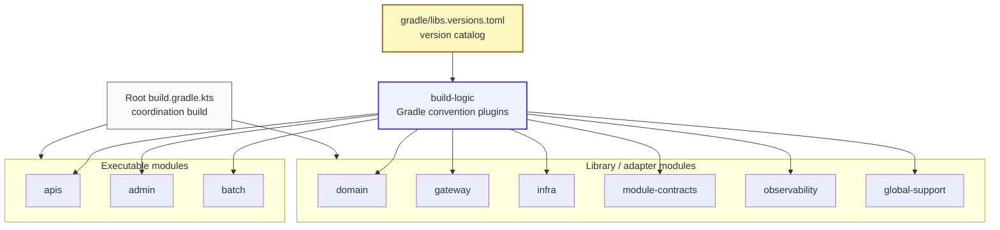
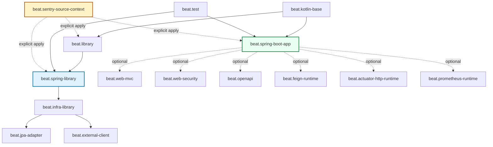
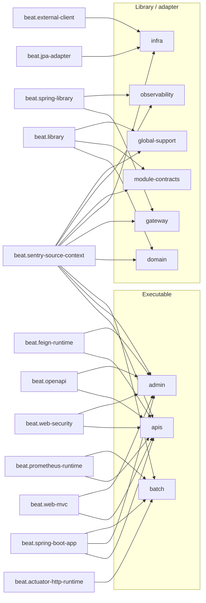
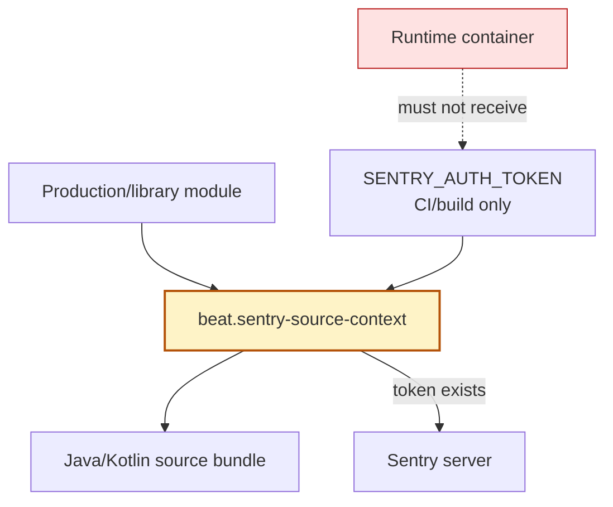

# build-logic module guide

`build-logic`은 BEAT 멀티모듈 Gradle 빌드의 **convention plugin 모듈**입니다.
제품 코드는 없고, 각 모듈이 필요한 빌드 capability를 짧고 명확하게 선택할 수 있도록 Gradle plugin을 제공합니다.

> 처음 보는 사람을 위한 한 줄 요약: `build-logic`은 `apis`, `admin`, `batch`, `domain`, `infra` 같은 제품 모듈이 직접 수십 줄의 Gradle 설정을 반복하지 않도록 만든 **빌드 정책 모듈**입니다.

---

## 1. 이 문서를 읽는 방법

새 dependency나 plugin을 추가하려면 먼저 아래 질문에 답합니다.

```text
1. 이 모듈은 실행 가능한 Spring Boot app인가?
2. HTTP API, Security, OpenAPI, Feign, Prometheus 중 어떤 capability가 필요한가?
3. infra/JPA/external-client adapter인가?
4. 이 설정이 runtime concern인가, compile concern인가, build/release concern인가?
5. 이미 build-logic에 목적에 맞는 convention plugin이 있는가?
```

답에 따라 위치가 달라집니다.

| 필요 | 먼저 볼 plugin |
| --- | --- |
| 실행 가능한 Spring Boot app | `beat.spring-boot-app` |
| Spring library / bean compile surface | `beat.spring-library` |
| HTTP Controller / MVC / Validation | `beat.web-mvc` |
| Security filter/config | `beat.web-security` |
| Swagger/OpenAPI UI | `beat.openapi` |
| Feign runtime | `beat.feign-runtime` |
| Actuator HTTP endpoint runtime만 필요 | `beat.actuator-http-runtime` |
| Prometheus scrape 대상 | `beat.prometheus-runtime` |
| JPA adapter 구현 | `beat.jpa-adapter` |
| External client compile surface | `beat.external-client` |
| Sentry source context upload | `beat.sentry-source-context` |

---

## 2. 전체 빌드 구조에서 build-logic의 위치



### 레이어별 책임

| Layer | 책임 | 금지 |
| --- | --- | --- |
| `gradle/libs.versions.toml` | dependency/plugin version catalog | 사용처 없는 alias 방치 |
| `build-logic` | 반복되는 Gradle 정책을 convention plugin으로 제공 | 제품 모듈/런타임 코드 의존 |
| root `build.gradle.kts` | coordination/test/verification task | subprojects vendor 설정 주입 |
| executable modules | 실제 app runtime 조합 선택 | build policy 직접 복붙 |
| library/adapter modules | 필요한 compile/runtime capability만 선택 | god convention에 기대기 |

---

## 3. 핵심 원칙

```text
모듈은 필요한 capability를 직접 고른다.
build-logic은 capability를 작게 제공한다.
root build는 제품 runtime이나 vendor 세부사항을 모른다.
```

### 좋은 예

```kotlin
plugins {
    id("beat.spring-boot-app")
    id("beat.web-mvc")
    id("beat.web-security")
    id("beat.openapi")
    id("beat.feign-runtime")
    id("beat.sentry-source-context")
}
```

### 피해야 할 예

```kotlin
plugins {
    id("beat.web-app") // Web + Security + OpenAPI + Feign을 한 번에 주는 god convention
}
```

`beat.web-app`과 `beat.jpa-infra` 같은 wrapper/god convention은 제거된 상태입니다. 다시 만들지 않습니다.

---

## 4. 현재 plugin 구조

```text
build-logic/
  build.gradle.kts                 # plugin marker dependency 조립
  settings.gradle.kts              # root version catalog 재사용
  src/main/kotlin/
    beat.kotlin-base.gradle.kts
    beat.library.gradle.kts
    beat.spring-library.gradle.kts
    beat.spring-boot-app.gradle.kts
    beat.test.gradle.kts

    beat.web-mvc.gradle.kts
    beat.web-security.gradle.kts
    beat.openapi.gradle.kts
    beat.feign-runtime.gradle.kts
    beat.actuator-http-runtime.gradle.kts
    beat.prometheus-runtime.gradle.kts

    beat.infra-library.gradle.kts
    beat.jpa-adapter.gradle.kts
    beat.external-client.gradle.kts

    beat.sentry-source-context.gradle.kts
```

---

## 5. Plugin dependency map



> 점선은 자동 상속이 아니라 “필요한 모듈이 명시적으로 같이 적용한다”는 의미입니다.

---

## 6. Plugin catalog

### Base plugins

| Plugin | 제공하는 것 | 주의 |
| --- | --- | --- |
| `beat.kotlin-base` | Kotlin JVM, Java 25 toolchain, JVM 25 bytecode, `-Xjsr305=strict` | 단독으로 쓰기보다 `beat.library`, `beat.spring-boot-app`을 통해 사용 |
| `beat.library` | `java-library` + `beat.kotlin-base` | 순수 library 기본값 |
| `beat.spring-library` | `beat.library`, `beat.test`, Spring dependency-management, Kotlin Spring plugin | Spring bean/type compile surface가 있는 library용 |
| `beat.spring-boot-app` | Spring Boot app, dependency-management, Kotlin Spring, Log4j2, Lombok, test starter, CVE constraints | 실행 모듈 기본값. Web/Security/OpenAPI/Feign은 별도 선택 |
| `beat.test` | 모든 `Test` task에 `useJUnitPlatform()` 적용 | Java/JUnit과 future Kotest/MockK의 공통 실행 계약 |

### Web / runtime capability plugins

| Plugin | 제공하는 것 | 대표 사용처 |
| --- | --- | --- |
| `beat.web-mvc` | `spring-boot-starter-web`, validation | `apis`, `admin` |
| `beat.web-security` | Spring Security starter | `apis`, `admin` |
| `beat.openapi` | Springdoc OpenAPI UI | `apis`, `admin` |
| `beat.feign-runtime` | Spring Cloud BOM + OpenFeign runtime | `apis`, `admin` |
| `beat.actuator-http-runtime` | `spring-boot-starter-web`을 `runtimeOnly`로 제공 | `batch` health endpoint |
| `beat.prometheus-runtime` | Prometheus registry를 `runtimeOnly`로 제공 | `apis`, `batch` |

### Infra capability plugins

| Plugin | 제공하는 것 | 대표 사용처 |
| --- | --- | --- |
| `beat.infra-library` | `beat.spring-library` + Spring Boot core | infra family 기반 |
| `beat.jpa-adapter` | `beat.infra-library`, Kotlin JPA plugin, Spring Boot persistence, JPA compile surface | `infra` |
| `beat.external-client` | Spring Cloud BOM, Spring Web/OpenFeign compile surface | `infra` |

### Build / release capability plugins

| Plugin | 제공하는 것 | 대표 사용처 |
| --- | --- | --- |
| `beat.sentry-source-context` | Sentry Gradle plugin, source context bundle, optional upload, Sentry SDK alignment | production/library modules 전체 |

---

## 7. 모듈별 적용 현황



| Module | 적용 plugin |
| --- | --- |
| `apis` | `beat.spring-boot-app`, `beat.web-mvc`, `beat.web-security`, `beat.openapi`, `beat.feign-runtime`, `beat.sentry-source-context`, `beat.prometheus-runtime` |
| `admin` | `beat.spring-boot-app`, `beat.web-mvc`, `beat.web-security`, `beat.openapi`, `beat.feign-runtime`, `beat.sentry-source-context` |
| `batch` | `beat.spring-boot-app`, `beat.actuator-http-runtime`, `beat.sentry-source-context`, `beat.prometheus-runtime` |
| `domain` | `beat.library`, `beat.test`, `beat.sentry-source-context` |
| `gateway` | `beat.spring-library`, `beat.sentry-source-context` |
| `infra` | `beat.jpa-adapter`, `beat.external-client`, `beat.sentry-source-context` |
| `module-contracts` | `beat.library`, `beat.sentry-source-context` |
| `observability` | `beat.spring-library`, `beat.sentry-source-context` |
| `global-support` | `beat.library`, `beat.sentry-source-context` |

---

## 8. Capability 선택 예시

### `apis` / `admin`

사용자/관리자 HTTP API 모듈입니다.

```kotlin
plugins {
    id("beat.spring-boot-app")
    id("beat.web-mvc")
    id("beat.web-security")
    id("beat.openapi")
    id("beat.feign-runtime")
    id("beat.sentry-source-context")
}
```

`apis`만 Prometheus scrape 대상이므로 `beat.prometheus-runtime`을 추가합니다.

### `batch`

사용자 API는 없지만 health endpoint runtime은 필요합니다.

```kotlin
plugins {
    id("beat.spring-boot-app")
    id("beat.actuator-http-runtime")
    id("beat.sentry-source-context")
    id("beat.prometheus-runtime")
}
```

`beat.web-mvc`를 쓰지 않는 이유는 batch가 Controller/MVC compile API를 소유하지 않기 때문입니다.

### `infra`

JPA persistence adapter와 external client adapter를 소유합니다.

```kotlin
plugins {
    id("beat.jpa-adapter")
    id("beat.external-client")
    id("beat.sentry-source-context")
}
```

Feign annotation/compile surface는 `infra`가 알고, Feign runtime은 실행 모듈이 `beat.feign-runtime`으로 선택합니다.

### `domain`

순수 domain module입니다.

```kotlin
plugins {
    id("beat.library")
    id("beat.test")
    id("beat.sentry-source-context")
}
```

Spring Boot app이나 Spring library convention을 적용하지 않습니다.

---

## 9. Version catalog usage rule

`build-logic`은 root `gradle/libs.versions.toml`을 재사용합니다.

```kotlin
val libs = extensions.getByType<VersionCatalogsExtension>().named("libs")
implementation(libs.findLibrary("spring-boot-starter-web").get())
implementation(libs.findBundle("boot-app-core").get())
```

이 문자열 기반 lookup은 IDE가 unused catalog alias로 오탐할 수 있습니다. 실제 unused 판단은 CI checker가 기준입니다.

```bash
python3 .github/scripts/check_unused_version_catalog_aliases.py
```

---

## 10. Sentry source context rule



Sentry runtime dependency는 `observability`가 소유합니다.
`beat.sentry-source-context`는 runtime dependency가 아니라 build/release concern입니다.

- `includeSourceContext=true`
- `SENTRY_AUTH_TOKEN`이 있을 때만 source bundle auto upload
- `autoInstallation=false`
- Sentry SDK version alignment
- dependency-analysis와 Sentry generated resource task edge 보정

`SENTRY_AUTH_TOKEN`은 CI/build 전용입니다. Runtime container 환경변수 계약으로 추가하지 않습니다.

---

## 11. CVE constraint ownership

`beat.spring-boot-app`은 실행 모듈 boot jar에 영향을 주는 보안 constraint를 소유합니다.

현재 constraint 대상:

- Tomcat embed artifacts
- Jackson 3 artifacts
- Commons FileUpload
- Netty DNS artifacts
- Bouncy Castle provider

이 constraint는 코드 import 사용 여부가 아니라 **runtime transitive dependency 보안 보정**입니다. 제거하려면 먼저 Trivy/GitHub security report와 Spring Boot managed baseline을 확인합니다.

---

## 12. 금지 규칙

- `build-logic`에서 제품 모듈을 의존하지 않습니다.
- 제품 runtime class를 import하지 않습니다.
- root `build.gradle.kts`의 `subprojects { ... }`로 vendor/build 정책을 주입하지 않습니다.
- Web, Security, OpenAPI, Feign, Persistence를 한 convention에 다시 묶지 않습니다.
- 실행 모듈에 직접 starter dependency를 추가하기 전에 목적별 convention을 먼저 확인합니다.
- CI/build 전용 secret을 runtime container contract로 문서화하지 않습니다.

---

## 13. Guard rails

- `RootRetirementContractTest`
  - root build가 executable/runtime dependency를 다시 소유하지 않는지 검증
  - Sentry vendor wiring이 root `subprojects` block으로 돌아오지 않는지 검증
  - catalog alias residue가 재도입되지 않는지 검증
- `SharedBoundaryContractTest`
  - web/infra convention split 유지
  - `beat.web-app`, `beat.jpa-infra` 같은 wrapper/god convention 재도입 방지
  - module-contracts / gateway / observability dependency boundary 검증
- CI
  - `python3 .github/scripts/check_unused_version_catalog_aliases.py`
  - `./gradlew buildHealth` advisory report
  - `./gradlew check verifyModuleBootJars --parallel --build-cache`

---

## 14. 검증 명령

`build-logic` 또는 convention plugin을 수정했다면 최소 아래를 실행합니다.

```bash
python3 .github/scripts/check_unused_version_catalog_aliases.py
./gradlew :build-logic:check --no-daemon --console=plain
./gradlew :test --tests 'com.beat.RootRetirementContractTest' --tests 'com.beat.SharedBoundaryContractTest' --no-daemon --console=plain
./gradlew check verifyModuleBootJars --parallel --build-cache --no-daemon --console=plain -Dorg.gradle.jvmargs='-Xmx3g -XX:MaxMetaspaceSize=1g'
git diff --check
```

`buildHealth`는 dependency-analysis가 많은 classpath를 분석하므로 로컬 기본 heap이 작으면 아래처럼 실행합니다.

```bash
./gradlew buildHealth --no-daemon --console=plain -Dorg.gradle.jvmargs='-Xmx3g -XX:MaxMetaspaceSize=1g'
```

---

## 15. To-Be direction

```text
build-logic/src/main/kotlin/
  beat.<base>.gradle.kts              # 언어/toolchain/test 기반
  beat.<capability>.gradle.kts        # web/security/openapi/feign/prometheus 등 선택형 기능
  beat.<adapter-family>.gradle.kts    # infra/jpa/external-client 같은 adapter family
  beat.<vendor-build>.gradle.kts      # Sentry source context처럼 build/release concern
```

새 convention은 다음 조건을 만족할 때만 추가합니다.

- 두 개 이상 모듈에서 반복되는 빌드 정책이 있다.
- 단일 모듈이라도 capability 이름이 직접 dependency보다 의도를 더 명확히 한다.
- root build나 제품 모듈에 vendor/build-system 세부사항이 새는 것을 막는다.
- 기존 convention에 넣으면 책임이 넓어져 god convention으로 회귀할 위험이 있다.
