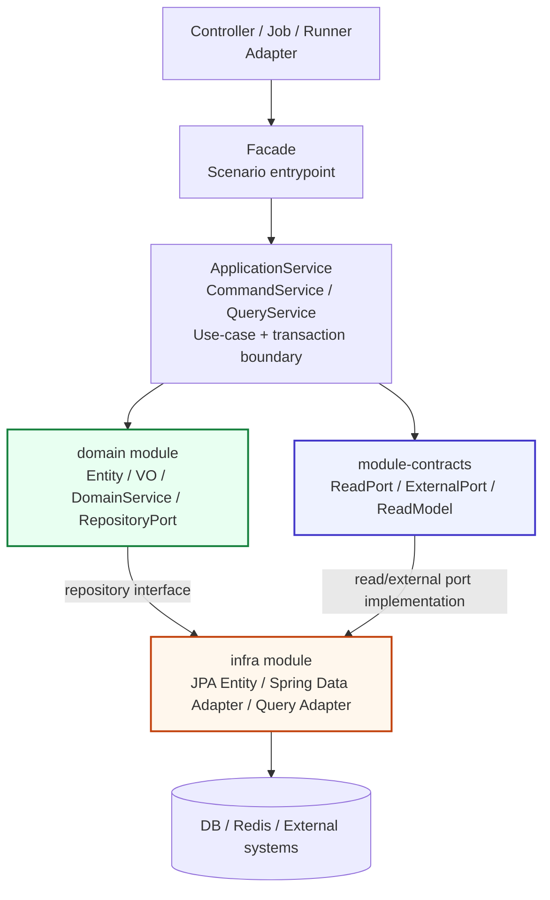
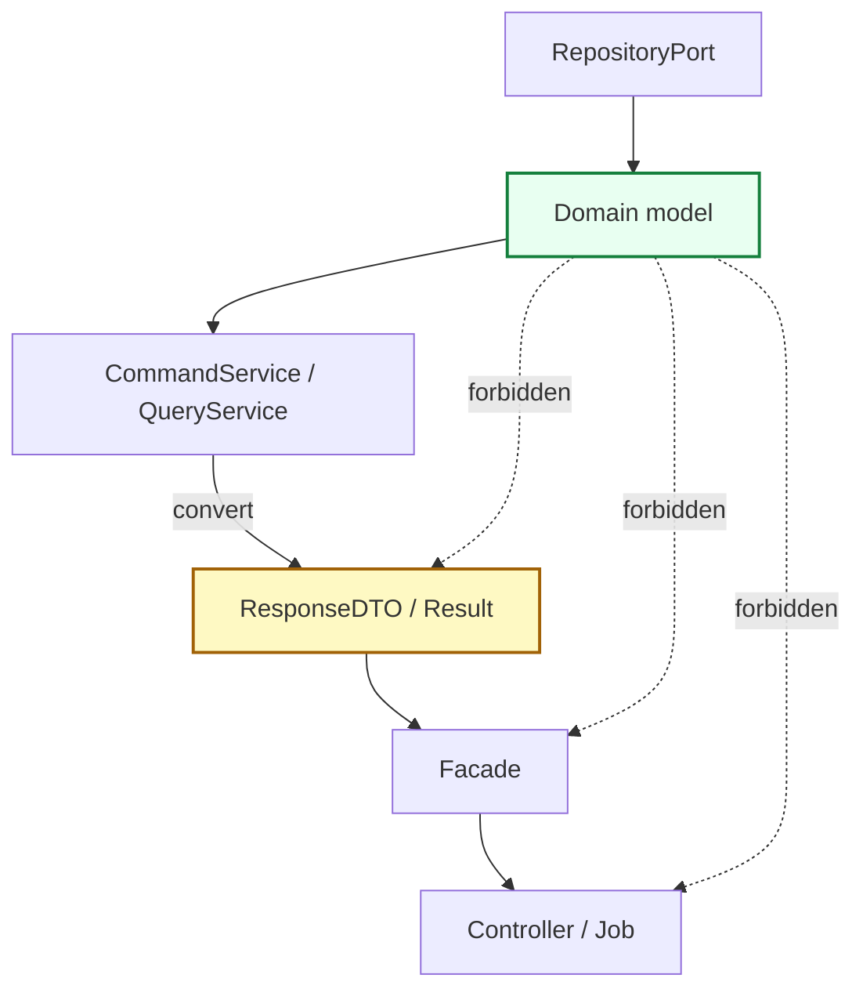
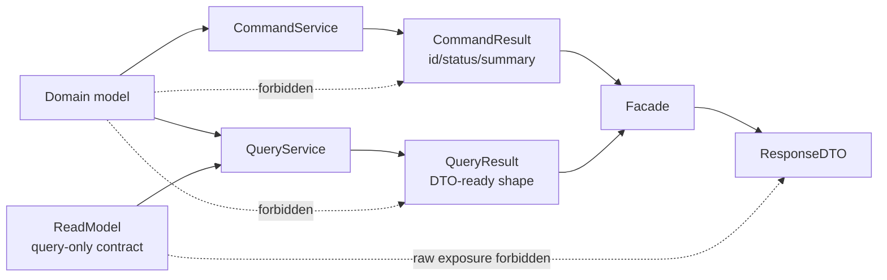
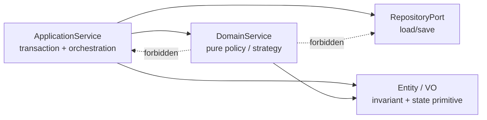
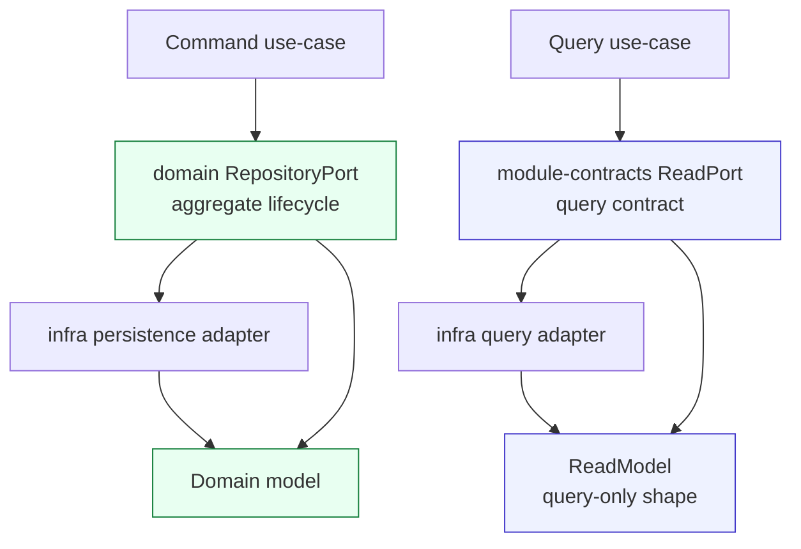
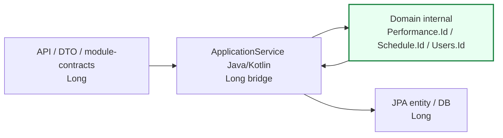
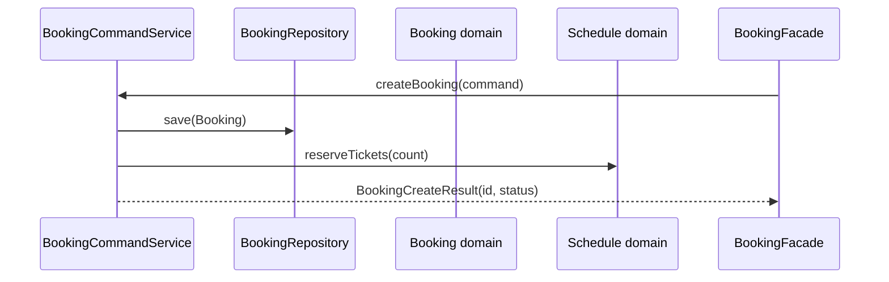
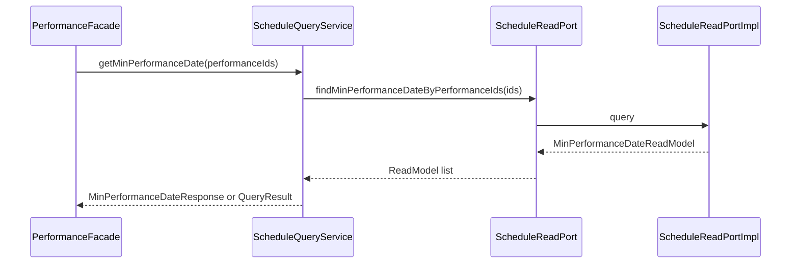

# domain module guide

`domain`은 BEAT의 **순수 도메인 모듈**입니다.
이 모듈은 비즈니스 개념, 도메인 불변식, 도메인 정책, 저장소 계약을 표현합니다.

`domain`은 아래 구현 세부사항을 모릅니다.

- HTTP / Controller / ResponseDTO
- Batch Job / Runner
- Spring Transaction
- JPA Entity / Spring Data Repository
- QueryDSL / Kotlin JDSL query implementation
- Redis / 외부 API / 파일 저장소
- API 화면 조회용 projection

> 핵심 원칙: `domain/src/main`에는 persistence concern을 두지 않습니다.

---

## 1. 이 문서를 읽는 방법

이 문서는 domain 모듈에 새 코드를 추가하거나 기존 코드를 이동할 때 보는 기준서입니다.

먼저 아래 질문에 답합니다.

```text
1. 이것은 비즈니스 규칙인가?
2. 이것은 도메인 객체의 상태나 불변식인가?
3. 이것은 조회 화면을 위한 projection인가?
4. 이것은 API 응답 shape인가?
5. 이것은 JPA/DB/외부 시스템 구현 세부사항인가?
```

답에 따라 위치가 달라집니다.

| 질문 | 위치 |
| --- | --- |
| 도메인 상태, 불변식, 상태 변경 | `domain/<aggregate>/model` |
| Entity 하나에 넣기 어려운 순수 도메인 정책 | `domain/<context>/service` |
| command/lifecycle 저장소 계약 | `domain/<context>/repository` |
| 조회 전용 shape / 화면 projection | `module-contracts` read model + `infra` query adapter |
| API 요청/응답 shape | `apis` / `admin` / `batch` 실행 모듈 |
| JPA entity / Spring Data / QueryDSL 구현 | `infra` |

---

## 2. 전체 레이어에서 domain의 위치



### 레이어별 책임

| Layer | 책임 | 금지 |
| --- | --- | --- |
| Controller / Job | 요청/트리거를 받는 adapter | repository, domain service 직접 호출 |
| Facade | 실행 모듈의 공식 진입점, 여러 use-case 결과 조합 | transaction, repository, domain service 직접 소유 |
| ApplicationService | use-case 실행, transaction, 조회/저장 순서, domain 호출 | API 응답 shape에 종속된 복잡한 화면 조회 비대화 |
| Domain | 도메인 상태, 불변식, 정책, 저장소 계약 | Spring/JPA/DTO/query 구현 |
| Module-contracts | 모듈 간 read/external contract | domain model 직접 노출 |
| Infra | persistence/external adapter 구현 | service layer 소유 |

---

## 3. domain이 소유하는 것

| 소유 대상 | 위치 | 설명 |
| --- | --- | --- |
| Domain model | `domain/<aggregate>/model` | Aggregate Root, enum, identifier, 상태 변경 primitive |
| Value Object | `domain/<aggregate>/vo` | 값 자체가 의미를 갖는 불변 객체. 필요할 때만 생성 |
| DomainService | `domain/<aggregate>/service` | Entity/VO 하나에 넣기 어려운 순수 정책/전략 |
| RepositoryPort | `domain/<aggregate>/repository` | Aggregate Root lifecycle에 필요한 저장소 interface |
| Exception/ErrorCode | `domain/<aggregate>/exception` | 순수 domain 규칙 위반을 표현하는 코드 |

현재 context:

```text
booking
member
performance
promotion
schedule
user
```

`PerformanceImage`는 `performance` 하위 타입이 아니라 독립 context입니다.

---

## 4. domain이 소유하지 않는 것

| 금지 대상 | 이유 | 소유 위치 |
| --- | --- | --- |
| JPA Entity / `@MappedSuperclass` | persistence model은 domain model이 아님 | `infra` |
| Spring Data Repository | adapter 구현체 | `infra` |
| QueryDSL/JDSL query implementation | 조회 최적화 구현 | `infra` query adapter |
| API Request/Response DTO | transport shape | `apis`, `admin` |
| Batch result DTO | batch output shape | `batch` |
| `Page`, `Pageable`, `Sort` | Spring Data 타입 | 실행 모듈 query 또는 infra adapter |
| `HttpStatus`, `ResponseEntity` | Web 타입 | 실행 모듈 |
| `GrantedAuthority` | Security adapter 타입 | `gateway` 또는 실행 모듈 |
| Redis document / external API DTO | 외부 구현 shape | `infra`, `module-contracts` |

허용 의존성은 원칙적으로 다음뿐입니다.

```text
Kotlin/JDK standard library
```

다른 project module 의존은 두지 않습니다. 도메인 실패 타입도 `domain` 내부의 HTTP/framework-neutral 계약을 사용합니다. 사용자 문구 결합은 6절의 전환 부채를 따릅니다.

---

## 5. 패키지 구조

```text
domain/
  src/main/kotlin/com/beat/domain/
    <aggregate>/
      model/       # Aggregate Root, enum, identifier
      service/     # Kotlin pure domain service; 실제 정책이 있을 때만
      repository/  # Aggregate Root용 technology-neutral repository interface
      exception/   # 순수 domain rule ErrorCode
      vo/          # aggregate 전용 value object; 필요할 때만
    sharedkernel/
      model/       # AggregateRoot 같은 최소 공통 domain contract
      vo/          # 둘 이상의 aggregate가 공유하는 진짜 공통 VO/enum
```

### 패키지 규칙

- `dao/` package는 사용하지 않습니다.
- `port/in/` package는 사용하지 않습니다.
- application use-case port를 domain에 두지 않습니다.
- 저장소 계약은 Aggregate Root에만 제공하고 `repository/` 아래 interface로만 둡니다.
- repository 구현체, Spring Data repository, JPA entity, mapper는 `infra`가 소유합니다.
- `sharedkernel`은 편의성 공통 패키지가 아닙니다. 둘 이상의 aggregate가 같은 의미와 변경 이유로 공유하는 타입만 둡니다.
- 빈 `event`, `service`, `vo` package를 미리 만들지 않습니다.

---

## 6. Domain ErrorCode / Exception 소유권

`domain/<context>/exception`에는 Entity, VO, DomainService가 직접 판단할 수 있는 **순수 도메인 규칙 위반 코드**만 둡니다.

허용:

- aggregate 생성/수정 중 깨지면 안 되는 invariant
- ticket count, sold count처럼 domain model 자체가 보장해야 하는 값 규칙
- repository, 인증 사용자, HTTP request, 외부 port 없이 판단 가능한 domain policy

금지:

- repository lookup 실패: `*_NOT_FOUND`, `NO_*_FOUND`
- request DTO / use-case input validation
- actor, owner, permission, role 검증
- external adapter 실패를 API 언어로 번역한 코드
- API/admin/batch 응답 성공 메시지

`SuccessCode`는 domain 소유가 아닙니다. 성공 응답 문구는 실행 모듈 response boundary가 소유합니다.

클라이언트 입력이나 현재 상태에 따라 정상적으로 발생할 수 있는 도메인 규칙 실패는 `DomainException(DomainErrorCode)`으로 표현합니다. 프로그래머 계약을 검사하는 `require`/`IllegalArgumentException`과 구분하며, 후자는 클라이언트 오류로 일괄 변환하지 않고 예상하지 못한 500으로 처리해 내부 message를 숨깁니다. `DomainErrorCode`는 안정적인 `code`, 의미 기반 `type`, 안전한 `message`만 소유하고 HTTP status, Spring, `ErrorResponse`, `ApplicationErrorCode`를 알지 않습니다. `INVALID_INPUT`/`STATE_CONFLICT`를 HTTP status로 바꾸는 책임은 `apis`/`admin` handler에 있습니다. 따라서 `domain`은 `global-support`에 의존하지 않습니다.

`DomainErrorCode.message`는 현재 기존 응답 계약에 쓰이는 안전한 기본 문구입니다. v1 `{status, message}` 응답에는 stable code를 노출하지 않으므로 클라이언트가 message를 분기 기준으로 사용해서는 안 됩니다. 향후 code를 노출하려면 별도 API version과 소비자 전환이 필요합니다. 다국어·채널별 문구가 필요해질 때 web adapter의 message catalog로 분리합니다. 소셜 ID UNIQUE 경쟁은 Member 전체에서 보장해야 하는 유일성 규칙이므로 `member.exception.DuplicateSocialIdentityException`으로 표현하고 application service만 복구합니다.

ApplicationService가 repository 조회 실패, 인증/권한, idempotency 같은 유스케이스 실패를 판단하면 실행 모듈의 Application ErrorCode/Exception을 사용합니다. request DTO 검증은 API boundary에 둡니다. 예외 종류가 아니라 **실패를 판단하는 계층**이 소유권을 결정합니다.

현재 domain ErrorCode allowlist는 `BookingErrorCode`, `PerformanceErrorCode`, `PromotionErrorCode`, `ScheduleErrorCode`입니다. `PromotionErrorCode`는 조회 실패가 아니라 캐러셀 최대 개수라는 순수 정책 위반만 소유합니다. 기존 `{status, message}` 응답 envelope는 클라이언트 호환을 위해 유지합니다. RFC 9457 `ProblemDetail` 전환은 API 계약 버전을 분리하고 모든 소비자를 확인한 뒤 진행하며, domain에 HTTP 필드를 추가하는 방식으로 도입하지 않습니다.

---

## 7. Domain model은 어디까지 올라갈 수 있는가



### BEAT project convention

아래 범위 제한은 DDD의 보편적 강제 규칙이 아니라, domain model의 transport 노출과 service-to-service 결합을 막기 위해 BEAT가 선택한 공개 경계입니다.

- RepositoryPort는 Domain model을 반환하고 저장할 수 있습니다.
- ApplicationService는 유스케이스 method 내부에서 Domain model을 조회/변경/저장/정책 판단에 사용할 수 있습니다.
- 여기서 말하는 ApplicationService 내부는 해당 use-case method의 실행 범위입니다. 다른 ApplicationService에 raw Domain model을 반환하는 public helper method를 새로 만들지 않습니다.
- Domain model은 ApplicationService 밖으로 반환하지 않습니다. ApplicationService 간 공유가 필요하면 primitive/value/result/read model을 반환하거나, 공통 도메인 판단은 DomainService로 이동합니다.
- Facade, Controller, Job/Runner는 Domain model을 받거나 반환하지 않습니다.
- RequestDTO, ResponseDTO, CommandResult, QueryResult는 Domain model을 필드로 담지 않습니다.
- RequestDTO, ResponseDTO, CommandResult, QueryResult의 public factory method는 Domain model을 인자로 받지 않습니다.
- Domain model에서 필요한 primitive/value를 추출하는 작업은 ApplicationService 내부에서 수행합니다.
- 실행 모듈 간에 Domain model을 직접 전달하지 않습니다.
- 새 ApplicationService public method는 raw Domain model을 반환하지 않습니다. 기존 legacy helper도 수정할 때 result/read model 반환으로 수렴시킵니다.

즉, Domain model의 최대 범위는 ApplicationService 내부입니다.

```text
허용:
RepositoryPort -> ApplicationService 내부 -> Domain method 호출

금지:
ApplicationService -> Facade -> Controller 로 Domain model 반환
OtherApplicationService.getDomainModel(...) 로 service-to-service raw Domain model 공유
ResponseDTO.from(DomainModel)
QueryResult.from(DomainModel)
ApplicationResult.from(DomainModel)
```

---

## 8. ApplicationService 반환 규칙

ApplicationService는 domain model을 그대로 반환하지 않습니다.
이 규칙은 Facade/Controller로 나가는 반환뿐 아니라 다른 ApplicationService가 호출하는 public method에도 적용합니다.
반환값은 use-case 결과를 표현하는 **application result**여야 합니다.



Application result와 ResponseDTO는 domain model을 직접 변환하지 않습니다.
Domain model에서 필요한 값 추출은 ApplicationService 내부 private method나 실행 모듈 내부 assembler에서 끝내고, result/response에는 primitive/value/result만 전달합니다.
다른 ApplicationService와 공유해야 하는 값도 raw Domain model이 아니라 목적이 드러나는 result/read model로 전달합니다.

### CommandService 반환

CommandService는 상태 변경 use-case를 실행합니다.

권장 반환:

```text
createdId
updatedId
status
void
CommandResult
```

예:

```java
record BookingCreateResult(Long bookingId, BookingStatus status) {}
record PerformanceModifyResult(Long performanceId) {}
```

금지:

```java
Booking createBooking(...)     // Domain model 반환 금지
Performance modify(...)        // Domain model 반환 금지
```

### QueryService 반환

QueryService는 조회 use-case를 실행합니다.

권장 반환:

```text
QueryResult
Application DTO
ResponseDTO-ready result
```

QueryService는 다음 중 하나를 선택합니다.

| 상황 | 반환 위치 |
| --- | --- |
| 단일 QueryService 결과가 그대로 API 응답이 됨 | QueryService가 ResponseDTO 또는 QueryResult 조립 가능 |
| 여러 QueryService/CommandService 결과를 조합해야 함 | Facade가 최종 ResponseDTO 조립 |
| infra query adapter가 반환한 read model이 있음 | QueryService가 ReadModel을 API/application shape로 변환 |

금지:

```java
List<MinPerformanceDateReadModel> getMinDates(...) // Controller/Facade로 raw ReadModel 노출 금지
List<Schedule> getSchedules(...)                   // Domain model 반환 금지
Promotion findPromotionForHome(...)                // 다른 ApplicationService에 raw Domain model 반환 금지
```

허용 예:

```java
MinPerformanceDateResponse getMinPerformanceDate(...)
MakerTicketListResponse getMakerTickets(...)
```

또는:

```java
MinPerformanceDateQueryResult getMinPerformanceDate(...)
MakerTicketListQueryResult getMakerTickets(...)
```

### Facade 반환

Facade는 Controller/Job-facing 경계입니다.

Facade는 다음 경우 최종 ResponseDTO를 조립할 수 있습니다.

- 여러 CommandService/QueryService 결과를 조합해야 할 때
- API scenario에 맞는 최종 응답 shape가 필요할 때
- 사용자 API와 admin API가 같은 use-case 결과를 서로 다른 응답으로 보여줘야 할 때

Facade가 직접 하면 안 되는 것:

- repository 조회/저장
- transaction 소유
- DomainService 직접 호출
- Domain model 상태 변경

---

## 9. Entity / VO / DomainService 책임



### Entity / VO

Entity와 VO는 자기 자신의 불변식과 상태 변경 primitive를 소유합니다.

예:

- 상태 전이
- 수량 증감
- 값 검증
- 한 aggregate 안에서 끝나는 소유권 검증
- 생성/수정 시 깨지면 안 되는 hard invariant

### Aggregate Root

Aggregate는 JPA 연관관계나 함께 조회되는 객체 묶음이 아니라 **하나의 transaction에서 반드시 일관되어야 하는 변경 경계**입니다.

- 외부 변경은 Aggregate Root의 domain method로만 수행합니다. 내부 Entity나 collection을 직접 수정 가능하게 노출하지 않습니다.
- Aggregate 내부 Entity는 Root가 lifecycle을 소유합니다. 독립 lifecycle과 일관성 경계가 확인되기 전에는 별도 RepositoryPort를 만들지 않습니다.
- RepositoryPort로 직접 저장되는 모델은 순수 `AggregateRoot` marker를 구현합니다. marker에는 framework 동작이나 event 저장소를 넣지 않습니다.
- Aggregate 사이에는 객체 그래프보다 typed ID 참조를 우선합니다. ApplicationService가 필요한 Aggregate를 조회하고 호출 순서를 조율합니다.
- 한 Aggregate의 invariant는 DomainService나 event listener로 우회하지 않습니다.
- `Schedule`은 총 티켓 수, 할당 수, 예약 가능 수량의 invariant와 `reserveTickets`/`releaseTickets`를 소유합니다. 별도 identity와 lifecycle이 없는 `Inventory` Aggregate를 만들지 않습니다.
- 현재 `Booking`, `Member`, `Performance`, `Promotion`, `Schedule`, `Users`가 전용 RepositoryPort를 가진 Aggregate Root입니다.
- `Cast`/`Staff`/`PerformanceImage`는 공연 생성·수정·삭제와 lifecycle을 함께하는 `Performance` 내부 Entity입니다. 전용 RepositoryPort가 없으며 외부 변경은 `Performance.replaceContent(...)`를 거쳐 `PerformanceRepository`로 저장합니다.

### DomainService

`DomainService`는 Entity/VO 하나에 자연스럽게 넣기 어려운 순수 도메인 정책/전략을 둡니다.

BEAT project convention:

DDD 자체는 repository port를 사용하는 DomainService도 허용합니다. BEAT는 transaction과 I/O 순서를 ApplicationService 한 곳에서 보이게 하고 순수 정책 테스트를 단순화하기 위해 DomainService의 repository 의존을 금지합니다. 예외가 필요하면 문서와 architecture test를 먼저 변경해 경계와 이유를 명시합니다.

- class suffix는 `*DomainService`를 사용합니다.
- `Policy` suffix는 기본 규칙으로 쓰지 않습니다.
- 빈 placeholder class를 만들지 않습니다.
- CRUD wrapper나 repository delegation을 만들지 않습니다.
- repository, transaction, Spring annotation, DTO, external/module-contract port, JPA/QueryDSL type을 알지 않습니다.
- 이미 조회된 Entity/VO/primitive를 입력으로 받아 domain primitive/value/result를 반환합니다.
- 구현체 variation이 실제로 생기기 전까지 interface를 먼저 만들지 않습니다.
- DomainService는 Spring annotation이 없는 일반 Kotlin class로 유지합니다. `object`나 static utility로 숨기지 않고, 사용하는 실행 모듈의 composition root(`@Configuration`)가 `@Bean`으로 생성하며 ApplicationService는 constructor injection으로 받습니다. 그래서 domain은 Spring을 모르면서도 의존성은 명시적이고 테스트에서 교체할 수 있습니다.
- ApplicationService가 `new *DomainService()` 또는 `*DomainService()`로 직접 생성하지 않습니다. 생성 책임은 실행 모듈 config에만 둡니다.

처음에는 변경 이유가 같은 정책만 하나의 cohesive service로 시작합니다. context 이름을 그대로 붙인 catch-all service는 만들지 않습니다.

```text
ScheduleSequenceDomainService
PromotionCarouselDomainService
PromotionEligibilityDomainService
```

호출 유스케이스, 입력/출력, 변경 이유 중 하나가 독립되면 역할별로 분리합니다. 현재 Promotion의 캐러셀 정렬과 노출 자격은 이 기준으로 분리돼 있습니다. Schedule 회차 배정은 domain policy인 `ScheduleSequenceDomainService`에 남기고, D-day 산술은 조회 표현 규칙이므로 `apis.schedule.application`의 top-level `calculateDueDate`(`DueDate.kt`)가 소유하며, 빈 목록 정렬 sentinel은 그 정책을 사용하는 `apis.performance.application`의 `nearestDueDate`(`PerformancePresentation.kt`)가 소유합니다.

```text
BookingRefundDomainService
BookingCancellationDomainService
```

### 실패 모델과 Kotlin Result

BEAT는 실패 성격에 따라 표현을 구분합니다.

| 실패 성격 | 표현 |
| --- | --- |
| Entity/VO/DomainService가 판단한 규칙 위반 | `DomainException(DomainErrorCode)` |
| 실패가 아닌 정상적인 복수 domain 결과 | 목적이 드러나는 `sealed interface` |
| 외부 API의 복구 가능한 기술 실패 | adapter/application 경계에서 제한적인 `kotlin.Result<T>` |
| DB 장애, 예상하지 못한 결함 | 예외 번역 후 전파 |

- Domain method와 RepositoryPort의 기본 반환형을 `Result<T>`로 바꾸지 않습니다. Kotlin `Result`의 실패는 임의의 `Throwable`이라 domain 실패 종류를 타입으로 제한하지 못합니다.
- `runCatching`은 모든 `Throwable`을 포획하므로 transactional command 전체나 domain invariant를 감싸지 않습니다.
- `getOrNull`/`getOrDefault`로 핵심 실패를 조용히 성공으로 바꾸지 않습니다.
- 코루틴 경계에서 포획한 `CancellationException`은 반드시 다시 던집니다.
- `BookingCreateResult` 같은 application output의 `Result` suffix와 `kotlin.Result<T>`는 서로 다른 개념입니다.

### Domain event와 application event

BEAT는 event-driven domain을 기본값으로 강제하지 않습니다.

- 같은 transaction에서 반드시 성공해야 하는 상태 전이, 티켓 할당/반환, 금액 계산은 ApplicationService가 Aggregate method를 명시적으로 호출합니다.
- 현재 `BookingCreatedEvent`, `MemberRegisteredEvent`, `TicketPaymentConfirmedEvent`처럼 실행 모듈이 후속 알림을 위해 발행하는 타입은 application event입니다.
- Aggregate의 상태 전이와 business fact 생성을 반드시 함께 보장해야 할 때만 Spring 비의존 domain event를 `domain`에 추가합니다.
- ApplicationService는 Aggregate 저장 후 event를 발행합니다. 유실을 허용하는 부수 효과는 `AFTER_COMMIT`, 전달 보장이 필요한 결제·정산·외부 메시지는 transactional outbox를 사용합니다.
- 순수 domain/JPA entity 분리를 유지하므로 Spring Data `AbstractAggregateRoot`를 상속하지 않습니다.

---

## 10. RepositoryPort vs ReadModel



### RepositoryPort

Domain repository는 aggregate lifecycle과 command에 필요한 저장/수정/단순 조회 언어만 소유합니다.

허용 예:

```java
Optional<Booking> findById(Long id);
Booking save(Booking booking);
void deleteAll(List<Booking> bookings);
```

금지 후보:

- 화면 목록 조회
- 검색/필터/정렬
- 통계
- API ResponseDTO projection
- `Page`, `Pageable`, `Sort`
- QueryDSL/JDSL projection

### ReadModel / ReadPort

ReadModel은 Domain model이 아닙니다. 저장 대상도 아닙니다. 조회 결과를 빠르게 만들기 위한 query-only shape입니다.

규칙:

- `module-contracts`가 ReadPort와 ReadModel contract를 소유합니다.
- ReadModel class suffix는 `*ReadModel`을 사용합니다.
- ReadModel은 `@ReadModel` marker를 붙입니다.
- ReadModel은 domain type을 import하지 않습니다.
- infra query adapter가 ReadPort를 구현합니다.
- 실행 모듈 QueryService가 ReadModel을 받아 API ResponseDTO 또는 application result로 조립합니다.

예:

```text
module-contracts
  com.beat.contracts.schedule.ScheduleReadPort
  com.beat.contracts.schedule.readmodel.MinPerformanceDateReadModel

infra
  infra.persistence.schedule.repository.query.ScheduleReadPortImpl
```

---

## 11. Domain identity rule

Domain model 내부에서는 raw `Long`을 그대로 흘리지 않고 aggregate-owned typed ID를 사용할 수 있습니다.



규칙:

- Domain model 내부 identity는 aggregate-owned typed ID를 사용할 수 있습니다.
  - 예: `Performance.Id`, `Schedule.Id`, `Booking.Id`, `Users.Id`
- 다른 aggregate를 참조할 때는 객체 그래프가 아니라 ID로 참조합니다.
  - 예: `Schedule`은 `Performance` 객체가 아니라 `Performance.Id`를 보유합니다.
- Java-facing factory/getter/rehydrate는 기존 application/infra interop을 위해 `Long`/`long` bridge를 유지합니다.
- Repository interface, JPA entity, DTO, module-contracts, ReadModel은 scalar `Long`을 유지합니다.
- 외부 시스템 identity는 domain aggregate ID와 섞지 않습니다.
  - 예: `Member.socialId`는 `Users.Id`가 아니라 social provider의 외부 ID입니다.
- 저장된 Entity(`id != null`)의 `equals`/`hashCode`는 ID만 사용합니다. 같은 ID의 다른 immutable snapshot은 같은 Entity입니다.
- transient Entity(`id == null`)는 같은 인스턴스일 때만 같습니다. 두 ID가 모두 `null`이라는 이유나 전체 상태가 같다는 이유로 같은 Entity로 보지 않습니다.
- VO는 식별자가 없으므로 모든 구성 값에 대한 구조적 equality를 유지합니다.
- 위 규칙은 순수 domain model 계약입니다. JPA entity equality는 proxy와 generated-ID lifecycle을 고려해 `MIGRATION.md`의 별도 규칙을 따릅니다.

예:

```kotlin
class Booking private constructor(
    private val bookingId: Id?,
    private val linkedScheduleId: Schedule.Id,
    private val linkedUserId: Users.Id,
) : AggregateRoot {
    fun getId(): Long? = bookingId?.value
    fun getScheduleId(): Long = linkedScheduleId.value
    fun getUserId(): Long = linkedUserId.value

    override fun equals(other: Any?): Boolean {
        if (this === other) return true
        if (other !is Booking) return false
        return bookingId != null && bookingId == other.bookingId
    }

    override fun hashCode(): Int = bookingId?.hashCode() ?: System.identityHashCode(this)
}
```

---

## 12. Kotlin domain model 작성 규칙

현재 domain model은 JPA entity가 아니라 순수 immutable domain snapshot에 가깝게 사용합니다. DDD가 Kotlin 키워드를 강제하지는 않지만,
BEAT는 identity 기반 모델과 값 기반 모델의 의미를 코드에서 즉시 구분하기 위해 아래 규약을 고정합니다.

규칙:

- VO는 값 전체가 동등성을 결정하므로 `data class private constructor` + companion factory를 우선 사용합니다.
- DDD Entity/Aggregate Root는 일반 `class`로 선언합니다. Aggregate Root는 프로젝트 소유의 순수 `AggregateRoot` marker를 구현합니다.
- Entity/Aggregate Root는 generated 전체 상태 equality, 공개 `copy`, destructuring을 제공하는 `data class`로 선언하지 않습니다.
- 저장된 Entity(`id != null`)의 `equals`/`hashCode`는 ID만 사용하고 transient Entity는 같은 인스턴스일 때만 같습니다.
- Entity의 생성자를 `private`으로 두어 factory/rehydrate를 강제하고, 상태 변경은 의미가 드러나는 domain method가 새 인스턴스를 반환합니다.
- 개인정보·계좌·인증 값을 가진 Entity는 안전한 `toString()`을 명시하고 로그에는 필요한 ID만 남깁니다.
- 외부 생성은 `create(...)`, persistence 재구성은 `rehydrate(...)`로 분리합니다.
- Java call-site 호환이 필요한 companion factory에는 `@JvmStatic`을 유지합니다.
- Aggregate Root의 상태 변경에 `copy(...)`를 노출하지 않습니다.
- hard invariant는 생성/수정 경계에서 검증합니다.
- `rehydrate(...)` 검증은 기존 DB row 조회 장애를 만들 수 있으므로 데이터 audit 후 보수적으로 추가합니다.
- 위 규칙은 순수 domain model에만 적용합니다. `infra`의 JPA entity에는 Hibernate proxy, no-arg, persistence lifecycle 규칙을 별도로 적용합니다.
- domain model은 JPA annotation, Spring annotation, QueryDSL type을 갖지 않습니다.

---

## 13. 예시: 올바른 변환 경계

### Command 예시



CommandService는 `Booking`을 직접 반환하지 않고 `BookingCreateResult` 같은 결과만 반환합니다.

### Query 예시



QueryService는 ReadModel을 그대로 밖으로 노출하지 않고 응답에 필요한 shape로 변환합니다.

---

## 14. 현재 migration 완료 상태

Issue #420 이후 `domain`은 다음 상태로 수렴했습니다.

- [x] JPA entity 제거
- [x] Spring Data repository adapter 제거
- [x] QueryDSL APT/build surface 제거
- [x] `BaseTimeEntity` infra 이동
- [x] Lombok 의존 제거
- [x] application use-case `port/in` 제거
- [x] `repository/dto` read projection 제거
- [x] `TicketRepository` command/query 혼재 제거
- [x] `PerformanceImage` 독립 context 분리
- [x] internal typed ID / external Long bridge 규칙 도입
- [x] aggregate-first `model` package와 순수 `AggregateRoot` marker 도입
- [x] Aggregate Root 일반 `class` / VO `data class` 규칙 도입

Persistence 구현은 `infra`가 소유합니다.

```text
infra.persistence.<context>.entity            # JPA entity
infra.persistence.<context>.repository        # Spring Data + repository implementation
infra.persistence.<context>.mapper            # domain <-> JPA mapping
infra.persistence.<context>.repository.query  # read/query adapter
```

---

## 15. Module-contracts boundary

Issue `#426` 이후 `module-contracts/src/main`은 domain type을 직접 import하지 않습니다. 실행 모듈 간 공유 contract는 다음 원칙을 따릅니다.

- Domain model, domain enum/value object, JPA entity, API ResponseDTO를 필드나 반환 타입으로 담지 않습니다.
- 필요한 값은 contract-local enum/value/read model로 끊고, domain type과의 변환은 실행 모듈 application boundary에서 수행합니다.
- 예: social auth contract는 `SocialLoginType`, 회차 조회 계약은 `ScheduleAvailabilityReadModel`을 사용합니다.
- 추가 query/read-model 최적화, Kotlin JDSL 전환, contract-local DTO 분리는 별도 후속 이슈에서 다룹니다.

---

## 16. 빠른 체크리스트

새 domain 코드를 추가할 때 아래를 확인합니다.

- [ ] 이 타입이 진짜 domain concept인가?
- [ ] JPA/Spring/Web/QueryDSL/Redis/external DTO import가 없는가?
- [ ] ErrorCode가 repository lookup, request validation, actor/owner/permission, response success message를 표현하지 않는가?
- [ ] DomainException/ErrorCode에 HTTP status, Spring 또는 global-support 의존이 없는가?
- [ ] Entity/VO에 둘 수 있는 invariant를 ApplicationService에 절차 코드로 두지 않았는가?
- [ ] DomainService가 repository나 transaction을 소유하지 않는가?
- [ ] DomainService 이름이 context catch-all이 아니라 하나의 정책과 변경 이유를 드러내는가?
- [ ] Aggregate 변경이 Root method를 통하고, Aggregate 간 참조는 필요한 ID로 제한되는가?
- [ ] RepositoryPort가 있는 모델은 `AggregateRoot`를 구현하며, Root가 아닌 모델에 RepositoryPort를 만들지 않았는가?
- [ ] Aggregate Root는 일반 `class`, VO는 값 동등성이 필요한 `data class`로 의미가 구분되는가?
- [ ] 새 domain 파일의 실제 경로와 package가 `<aggregate>/{model,vo,repository,service,exception}` 규칙과 일치하는가?
- [ ] Entity는 ID equality, transient instance equality를 사용하고 VO는 구조적 equality를 사용하는가?
- [ ] Entity/VO의 `toString()`이나 객체 전체 로그가 개인정보·계좌·비밀번호를 노출하지 않는가?
- [ ] 복잡 조회/검색/정렬/통계를 domain repository에 넣지 않았는가?
- [ ] ReadModel이 필요하다면 `module-contracts` `*ReadPort` / `*ReadModel`로 분리했는가?
- [ ] ApplicationService가 Domain model을 밖으로 반환하지 않는가?
- [ ] Facade가 repository/domain service/transaction을 직접 소유하지 않는가?
- [ ] transactional command나 Domain/RepositoryPort를 `runCatching`/`Result<T>`로 감싸 실패와 rollback을 숨기지 않았는가?
- [ ] 같은 transaction의 invariant를 event listener로 지연하지 않았는가?
- [ ] Java/API/JPA boundary에 Kotlin inline ID를 직접 노출하지 않았는가?

### 외부 근거

- [Microsoft DDD-oriented microservice](https://learn.microsoft.com/en-us/dotnet/architecture/microservices/microservice-ddd-cqrs-patterns/ddd-oriented-microservice): domain layer의 순수성, application layer의 orchestration, Entity 불변식 경계
- [Eric Evans DDD Reference](https://www.domainlanguage.com/ddd/reference/): Entity, Value Object, Service의 전술적 패턴
- [Kotlin data classes](https://kotlinlang.org/docs/data-classes.html): primary constructor 전체 상태로 생성되는 기본 `equals`/`hashCode`
- [Kotlin 2.3.20](https://kotlinlang.org/docs/whatsnew2320.html): `kotlin.plugin.jpa`의 JPA `all-open`/`no-arg` preset
- [Spring Data object mapping](https://docs.spring.io/spring-data/jpa/reference/data-commons/object-mapping.html): infra persistence model과 Kotlin materialization을 비교할 때의 참고자료이며, 순수 domain model 선택 근거는 아님
- [Hibernate ORM 7](https://docs.jboss.org/hibernate/orm/7.2/introduction/pdf/Hibernate_Introduction.pdf): entity proxy와 `equals`/`hashCode`, generated ID 제약
- [JetBrains Kotlin/JPA pitfalls](https://blog.jetbrains.com/idea/2026/01/how-to-avoid-common-pitfalls-with-jpa-and-kotlin/): JPA entity의 final class, lazy association, generated method 주의사항
- [Spring MVC error responses](https://docs.spring.io/spring-framework/reference/web/webmvc/mvc-ann-rest-exceptions.html): adapter의 `ProblemDetail`/`ErrorResponse`와 RFC 9457 지원
- [Spring Data JPA transactionality](https://docs.spring.io/spring-data/jpa/reference/jpa/transactions.html): 여러 repository를 묶는 service/facade 단위의 트랜잭션 경계
- [Kotlin `runCatching`](https://kotlinlang.org/api/core/kotlin-stdlib/kotlin/run-catching.html): 모든 `Throwable`을 failure로 포획하는 표준 라이브러리 계약
- [Kotlin cancellation](https://kotlinlang.org/docs/cancellation-and-timeouts.html): `CancellationException` 재전파와 structured concurrency 규칙
- [Spring transaction rollback](https://docs.spring.io/spring-framework/reference/data-access/transaction/declarative/rolling-back.html): exception 기반 기본 rollback 규칙
- [Spring transaction-bound events](https://docs.spring.io/spring-framework/reference/data-access/transaction/event.html): `@TransactionalEventListener` phase와 transaction 경계
- [Spring Data aggregate events](https://docs.spring.io/spring-data/jpa/reference/repositories/core-domain-events.html): `@DomainEvents`/`AbstractAggregateRoot` 방식의 참고자료이며 BEAT의 기본 구현은 아님
- [Toss Tech Kotlin Result](https://toss.tech/article/kotlin-result): 외부 서비스 실패 처리 위임 사례이며 BEAT에서는 adapter 경계로 적용 범위를 제한
