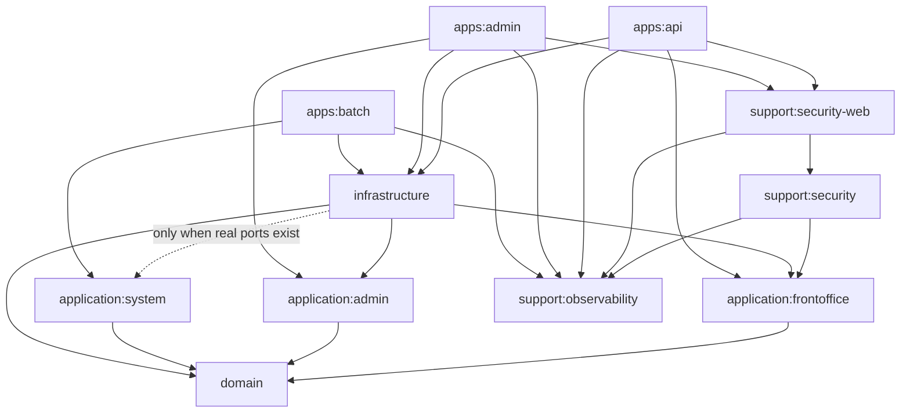

# BEAT-SERVER Architecture v4

**Status:** Final / Adopted Architecture
**Architecture baseline date:** 2026-08-25
**Target repository:** TEAM-BEAT/BEAT-SERVER
**Primary branch:** develop
**Architecture style:** Pragmatic Clean Architecture + Ports & Adapters + CQRS
**Decision:** 11 product modules freeze
**Audience:** Backend engineers, reviewers, AI coding agents

## 0. Executive Verdict

BEAT-SERVER는 11개 Product Module에서 멈춘다.

핵심 의존성 원칙은 다음과 같다.

```
domain
    -> (없음)

application:frontoffice
    -> domain

application:admin
    -> domain

application:system
    -> domain

support:security
    -> application:frontoffice
    -> support:observability

support:security-web
    -> support:security
    -> support:observability
    # TokenAuthenticationResult 등 3개 타입이 application:frontoffice에 있어 security-web도 frontoffice를 간접적으로 보게 되나, 직접 의존은 security에만 둔다

support:observability
    -> (없음)

infrastructure
    -> domain
    -> application:frontoffice
    -> application:admin
    -> application:system     # 실제 Port가 생길 때만 사용

apps:api
    -> application:frontoffice
    -> infrastructure
    -> support:security-web
    -> support:observability
    -> domain                 # test scope only

apps:admin
    -> application:admin
    -> infrastructure
    -> support:security-web
    -> support:observability
    -> domain                 # test scope only

apps:batch
    -> application:system
    -> infrastructure
    -> support:observability
    -> domain                 # test scope only
```

이 구조는 다음을 달성한다.

- Domain은 완전 독립
- Application은 Domain만 의존
- Application은 Infrastructure / Security 구현을 모름
- Security는 Application-owned Port를 구현하는 바깥 adapter
- Web Security는 별도 module로 분리
- Infrastructure는 Persistence / Redis / External adapter를 소유
- apps:*는 Inbound Adapter + Composition Root
- 전체 Gradle graph는 DAG
- lane 직접 의존은 금지
- runtime/transitive classpath 완전 격리는 현재 목표가 아님
- CQRS는 business intent로 분류
- Command/Aggregate/Decision persistence는 JPA
- View Query는 jOOQ

## 1. Architecture Goal

BEAT의 목표는 "책에 가장 가까운 module 수"가 아니다.

목표는 다음 세 가지의 균형이다.

1. Dependency Direction
2. Compile-time Boundary Enforcement
3. Team Simplicity

따라서 다음 철학을 채택한다.

안쪽 정책은 바깥 구현을 모른다.
바깥 구현이 안쪽 Port를 구현한다.
하지만 독립 배포/재사용 실익이 없는 경계까지 Gradle module로 쪼개지는 않는다.

BEAT는 순수한 textbook Clean Architecture보다 Pragmatic Clean Architecture를 선택한다.

## 2. Product Module Freeze

최종 Product Module은 11개다.

```
apps
├── api
├── admin
└── batch

application
├── frontoffice
├── admin
└── system

domain
infrastructure

support
├── security
├── security-web
└── observability
```

build-logic은 included build이며 Product Module 수에 포함하지 않는다.

다음 module은 현재 만들지 않는다.

```
support:security-core
adapter:security
infrastructure:security
bootstrap:api
bootstrap:admin
bootstrap:batch
module-contracts
```

이들은 실제 독립 경계가 필요해질 때만 검토한다.

## 3. Rule 0 — Gradle Graph Must Be a DAG

모든 Gradle project dependency는 DAG여야 한다.

금지:

```
A -> B -> A
A -> B -> C -> A
```

허용:

```
A -> B -> C
A -> C
```

직접 cycle과 간접 cycle 모두 금지한다.

verifyTargetModuleGraph는 최소 다음을 검증해야 한다.

- target project set
- allowed direct dependencies
- cycle absence
- forbidden cross-lane direct dependency

DAG 검증과 lane isolation 검증은 별개다.

## 4. Clean Architecture Dependency Rule

정본 방향:

```
Outer Adapter
      ↓
Application
      ↓
Domain
```

Runtime flow와 compile dependency는 같을 필요가 없다.

예:

Runtime

```
ApplicationService
    -> TokenIssuer
    -> JwtTokenProvider
```

compile dependency는:

```
support:security
    -> application:frontoffice
```

이다.

Application이 Security implementation을 import하지 않는다.

이것이 Dependency Inversion이다.

## 5. Final Dependency Matrix

### 5.1 Domain

```
domain -> (없음)
```

Domain은 모든 BEAT module로부터 독립적이다.

금지:

```
domain -> application
domain -> infrastructure
domain -> support
domain -> apps
```

### 5.2 Application

```
application:frontoffice -> domain
application:admin       -> domain
application:system      -> domain
```

Application은 오직 Domain만 의존한다.

금지:

```
application:* -> infrastructure
application:* -> support:security
application:* -> support:security-web
application:* -> support:observability
application:* -> apps:*
application lane -> another application lane
```

### 5.3 Support Security

```
support:security
    -> application:frontoffice
    -> support:observability
```

support:security는 Web-independent Security Capability + Security Outbound Adapter다.

즉 이 module은 Application이 소유한 security-related Port를 구현한다.

예:

```
application:frontoffice
└── TokenIssuer
└── RefreshTokenAuthenticator
└── PasswordHasher / PasswordVerifier

support:security
└── JwtTokenProvider
└── BCryptPasswordHasher
```

핵심은:

```
support:security -> application:frontoffice
```

이며,

```
application:frontoffice -> support:security
```

는 금지한다.

### 5.4 Support Security Web

```
support:security-web
    -> support:security
    -> support:observability
```

역할:

```
JwtAuthenticationFilter
SecurityMdcLoggingFilter
CurrentMember
CurrentMemberArgumentResolver
MemberAuthentication
AdminAuthentication
AuthenticationEntryPoint
AccessDeniedHandler
Spring Security / Servlet bootstrap
```

금지:

```
security-web -> application:* 직접 의존
security-web -> infrastructure
security-web -> apps:*
```

### 5.5 Observability

```
support:observability -> (없음)
```

소유:

```
logging
MDC
tracing
metrics
request correlation
OpenTelemetry/Sentry support
```

금지:

```
business rule
application use case
repository
security policy
domain dependency
```

### 5.6 Infrastructure

```
infrastructure
    -> domain
    -> application:frontoffice
    -> application:admin
    -> application:system   # 실제 Port가 있을 때만
```

Infrastructure는 Application/Domain Port를 구현하는 driven adapter module이다.

소유:

```
Persistence
Redis
External API
Storage
SMS
jOOQ Query adapter
Spring Data implementation
```

Security implementation을 Infrastructure로 옮기는 것은 현재 채택하지 않는다.

### 5.7 Apps

```
apps:api
    -> application:frontoffice
    -> infrastructure
    -> support:security-web
    -> support:observability

apps:admin
    -> application:admin
    -> infrastructure
    -> support:security-web
    -> support:observability

apps:batch
    -> application:system
    -> infrastructure
    -> support:observability
```

test scope에서는 Domain fixture/assertion을 위해 domain 의존을 허용할 수 있다.

## 6. Why support:security -> application:frontoffice Is Correct

이 의존은 Clean Architecture 위반이 아니다.

Application이 Port를 소유하고 Security가 구현하기 때문이다.

예:

```kotlin
// application:frontoffice
interface TokenIssuer {
    fun issueAccessToken(...)
    fun issueRefreshToken(...)
}

// support:security — TokenIssuer 구현체는 public으로 둔다 (application이 Port를 소유하므로 internal이면 주입 불가)
class JwtTokenProvider(
    ...
) : TokenIssuer
```

source dependency는:

```
support:security
    -> application:frontoffice
```

이다.

즉:

```
Outer Implementation
    -> Inner Port
```

으로 정확한 Dependency Inversion이다.

## 7. Why Security Is Not in Infrastructure

BEAT에서 infrastructure는 다음 역할로 고정한다.

```
Persistence
Redis
External API
Storage
External driven adapters
```

Security를 infrastructure/security에 두는 것은 Clean Architecture상 가능하지만 필수는 아니다.

BEAT는 Security를 별도 Support Capability로 유지한다.

이유:

1. Security는 DB/Redis/External과 다른 cross-cutting capability다.
2. Web Security와 Web-independent Security를 별도 module로 관리하기 쉽다.
3. 현재 구조로 이미 Dependency Inversion이 달성된다.
4. Infrastructure로 옮겨도 의존 방향은 달라지지 않는다.
5. 팀이 Security ownership을 더 명확하게 이해할 수 있다.

따라서 v4에서는 다음을 명시적으로 채택한다.

```
support:security
support:security-web
```

그리고 다음은 채택하지 않는다.

```
infrastructure/security
```

## 8. Why We Stop at 11 Modules

12번째 support:security-core를 추가하면 다음 구조가 가능하다.

```
support:security-core
    -> (없음)

support:security
    -> application:frontoffice
    -> security-core

support:security-web
    -> security-core
```

그러면 security-core는 JWT signer/parser 같은 primitive만 가진 독립 library가 된다.

그러나 현재 BEAT에서는 이 실익이 작다.

현재 11개 구조에서 이미 달성한 것:

- application -> security 금지
- application -> infrastructure 금지
- application -> domain only
- security adapter -> application Port
- Web Security 분리
- DAG
- direct lane isolation

12번째 module이 새로 주는 핵심 이득은:

- security primitive의 BEAT dependency 0
- 독립 artifact화
- 타 서비스 재사용
- 독립 lifecycle/versioning

이다.

현재 BEAT에는 이 요구가 없다.

따라서:

> Module Purity보다 Team Simplicity를 우선한다.

## 9. Deferred Option — Future security-core

다음 조건 중 하나가 실제 발생할 때만 12번째 module을 검토한다.

1. JWT/password primitive를 다른 서비스에서 재사용
2. Security primitive를 독립 artifact로 배포
3. security primitive와 BEAT adapter의 release lifecycle 분리 필요
4. independent versioning 필요
5. security module build/test cost가 독립 경계로 분리할 가치가 생김

그 전에는 만들지 않는다.

즉:

```
support:security-core
```

는 Future Target이 아니라 Deferred Option이다.

## 10. Transitive Dependency Policy

현재 구조에는 다음 transitive path가 존재할 수 있다.

```
apps:admin
    -> support:security-web
    -> support:security
    -> application:frontoffice
```

또한:

```
apps:admin
    -> infrastructure
    -> application:frontoffice
```

도 가능하다.

이것은 v4에서 의도적으로 허용한다.

중요:

BEAT의 목표는 runtime classpath의 완전한 lane isolation이 아니다.

대신 다음을 엄격히 금지한다.

```
apps:admin source
    -> application:frontoffice 직접 사용

application:admin
    -> application:frontoffice

apps:api
    -> application:admin
```

즉 보호 대상은:

- Direct source dependency
- Direct Gradle dependency
- Package-level dependency

이다.

## 11. Enforcement Strategy

BEAT의 architecture enforcement는 3단계다.

1. Gradle project dependency allowlist
2. Kotlin internal / module visibility
3. ArchUnit package dependency rules

예:

```
apps:admin
    -> security-web
```

때문에 transitive classpath에 Frontoffice type이 존재하더라도,

```
apps:admin source -> frontoffice package
```

는 ArchUnit으로 금지한다.

따라서 runtime classpath와 source ownership을 구분한다.

## 12. Composition Root

apps:*는 두 역할을 동시에 가진다.

1. Inbound Adapter
2. Composition Root

따라서:

```
apps:api -> infrastructure
```

는 허용한다.

이 dependency는 wiring 목적이다.

금지:

```kotlin
@RestController
class BookingController(
    private val repository: BookingJpaRepository,
)
```

허용:

```
Controller
 -> Facade
 -> Application
```

Infrastructure implementation을 Controller/Facade가 직접 사용하지 않는다.

## 13. Facade

현재 Controller -> Facade 구조를 유지한다.

Facade 역할:

- HTTP Request -> Application input mapping
- Application Result -> HTTP Response mapping
- thin HTTP-level orchestration

금지:

- transaction
- business invariant
- business authorization
- repository access
- JPA
- jOOQ
- Redis

Facade는 architectural layer가 아니라 delivery helper다.

## 14. Application Layer

Application은 Use Case orchestration layer다.

허용:

- @Service
- @Transactional
- Spring DI
- Clock
- Domain Repository
- Application-owned Port
- Domain orchestration
- transaction boundary

금지:

- JPA Entity
- Spring Data Repository
- EntityManager
- DSLContext
- jOOQ generated type
- RedisTemplate
- AWS SDK
- Spring Security
- SecurityContext
- Servlet
- HTTP DTO

## 15. Application Ownership

기본 package ownership:

```
Capability
 -> Actor
   -> command / query
```

예:

```
application/frontoffice
├── booking/booker/{command,query}
├── performance/booker/query
├── performance/maker/{command,query}
├── schedule/booker/query
├── home/booker/query
├── ticket/maker/{command,query}
├── member
└── auth
```

admin, system은 lane 자체가 actor/execution context이므로 불필요한 actor package를 중복하지 않는다.

## 16. Domain Layer

Domain은 가장 안쪽 Business Policy다.

포함:

- Aggregate
- Entity
- Value Object
- Domain Service
- Invariant
- Business behavior

금지:

- Spring
- JPA
- jOOQ
- Redis
- Security
- HTTP
- External Client
- Application Service

Domain Service는 pure domain logic이어야 한다.

## 17. Port Ownership

Port는 consumer가 소유한다.

예:

```
application:frontoffice
├── TokenIssuer
├── RefreshTokenAuthenticator
├── PasswordHasher
├── RefreshTokenStore
└── GuestSessionStore
```

구현:

```
support:security
├── JwtTokenProvider
└── BCryptPasswordHasher

infrastructure
├── RedisRefreshTokenAdapter
└── RedisGuestSessionAdapter
```

핵심:

> Consumer owns Port.
> Adapter depends on Port owner.

## 18. Security Responsibility

Security를 세 책임으로 구분한다.

### 18.1 Business Authentication Workflow

소유:

- application:frontoffice

예:

- login
- logout
- refresh
- guest credential workflow

### 18.2 Web-independent Security Mechanism + Adapter

소유:

- support:security

예:

- JwtTokenProvider
- JwtTokenIssuer
- JwtTokenParser
- JwtSigningKeyHolder
- BCryptPasswordHasher
- TokenSubject
- TokenAuthenticationResult

Application-owned Port 구현체를 포함할 수 있다.

### 18.3 Web Security

소유:

- support:security-web

예:

- JwtAuthenticationFilter
- CurrentMember
- ArgumentResolver
- Authentication
- EntryPoint
- AccessDeniedHandler
- SecurityMdcLoggingFilter

## 19. Authentication vs Authorization

세 층으로 구분한다.

- **Authentication** "누구인가?" -> support:security + security-web
- **Coarse Authorization** "ROLE_ADMIN인가?" "로그인 route인가?" -> apps:* + security-web
- **Business Authorization** "이 Maker가 이 Performance를 소유하는가?" "이 Booking이 취소 가능한가?" -> application + domain

Business authorization을 Spring Security annotation으로 대체하지 않는다.

## 20. Route Policy Ownership

다음은 security-web이 소유하지 않는다.

- /api/admin/**
- public whitelist
- swagger whitelist
- actuator whitelist

각 runtime이 소유한다.

```
apps:api/config/*SecurityConfig
apps:admin/config/*SecurityConfig
```

## 21. CQRS Classification

Command / Query는 SQL verb가 아니라 business intent로 분류한다.

Read는 세 종류다.

- Aggregate Read
- Decision Read
- View Read

## 22. Aggregate Read

Command 수행을 위해 authoritative Aggregate를 로드한다.

- Command Side
- JPA

## 23. Decision Read

Command correctness를 위해 authoritative fact를 읽는다.

예:

- ownership
- membership
- availability
- existence

- Command Side
- JPA 기본

SELECT라고 해서 Query Side가 아니다.

## 24. View Read

Consumer-facing projection이다.

- Query Side
- jOOQ
- ReadModel

예:

- home
- booking history
- maker dashboard
- admin view
- cross-table projection

## 25. CQRS Persistence Strategy

기본 선택:

- Command / Aggregate / Decision persistence = JPA
- View Query                                = jOOQ

모든 SELECT를 jOOQ로 바꾸지 않는다.

## 26. Command Correctness

Command correctness는 다음에 의존하면 안 된다.

- Presentation ReadModel
- Replica
- Eventual Cache
- Search Projection

Command response는:

- changed Aggregate
- authoritative fact
- CommandResult

에서 생성한다.

Query Side read-after-write는 기본 패턴이 아니다.

## 27. ReadModel

ReadModel != HTTP Response

Application:

- BookingHistoryReadModel

Apps:

- BookingHistoryResponse

Query identity는 endpoint가 아니라 semantic use case 기준이다.

## 28. Query Naming

View Read:

- *QueryService
- *Reader
- *ReadPort
- *ReadModel
- *Projection
- *Queries

Decision Read:

- *Provider
- *Availability
- *Membership
- *Ownership
- *Policy

기존 이름이 Query-style이어도 semantic을 우선한다.

## 29. Infrastructure Persistence Target

```
infrastructure/persistence
├── booking
├── performance
├── cast
├── staff
├── performanceimage
├── schedule
├── promotion
├── member
├── user
└── query
    ├── booking/booker
    ├── performance/booker
    ├── performance/maker
    ├── schedule/booker
    ├── home/booker
    └── ticket/maker
```

persistence/query는 SELECT 모음이 아니다.

View Read / jOOQ Query Side 전용이다.

## 30. jOOQ Boundary

다음 타입은 Infrastructure 밖으로 나가면 안 된다.

- DSLContext
- generated Table
- generated Record
- Condition
- Select*
- jOOQ Result

Infrastructure 안에서 즉시 Application-owned ReadModel로 변환한다.

## 31. Aggregate Ownership vs Persistence Package

Domain Aggregate boundary와 persistence package nesting을 동일시하지 않는다.

예:

```
Performance
├── Cast
├── Staff
└── PerformanceImage
```

이들이 독립 Aggregate가 아니어도 persistence package는 sibling일 수 있다.

```
persistence
├── performance
├── cast
├── staff
└── performanceimage
```

Package가 sibling이라는 이유로 독립 Domain Repository/Application Port를 만들지 않는다.

Authoritative lifecycle은 Aggregate Repository adapter가 소유한다.

## 32. Application Lane Policy

직접 lane cross dependency는 금지한다.

```
application:frontoffice -> application:admin    X
application:admin -> application:frontoffice    X
application:system -> application:frontoffice   X

apps:api -> application:admin                   X
apps:admin -> application:frontoffice           X
apps:batch -> application:frontoffice           X
```

단, shared outer module을 통한 transitive classpath는 현재 허용한다.

## 33. Infrastructure Fan-in Policy

Infrastructure는 여러 Application lane Port를 구현할 수 있다.

```
infrastructure
 -> frontoffice
 -> admin
 -> system
```

그러나 실제 구현이 없으면 dependency를 추가하지 않는다.

특히:

```
infrastructure -> application:system
```

은 System Port 구현이 생길 때만 활성화한다.

미래 확장성만으로 dependency를 넣지 않는다.

## 34. Test-only Domain Dependency

Apps module의 test source가 Domain fixture 또는 architecture assertion을 위해 Domain을 참조하는 것은 허용한다.

그러나 main source는 Domain을 직접 사용하지 않는다.

```
apps:* main -> domain       X
apps:* test -> domain       O
```

## 35. Architecture Guard Requirements

Gradle:

- [ ] product module count = 11
- [ ] graph is DAG
- [ ] domain dependency = 0
- [ ] application:* -> domain only
- [ ] no direct application lane crossing
- [ ] support:security -> frontoffice + observability only
- [ ] security-web -> security + observability only
- [ ] infrastructure -> apps/security-web 금지
- [ ] apps:* direct dependency는 자신의 application lane만
- [ ] batch -> security-web 금지

ArchUnit:

- [ ] Application -> infrastructure import 금지
- [ ] Application -> support.security import 금지
- [ ] Application -> JPA/jOOQ/Redis/Security/Servlet 금지
- [ ] Domain -> Spring/JPA/Web/Security 금지
- [ ] Controller/Facade -> infrastructure implementation 직접 import 금지
- [ ] apps:admin -> frontoffice package 직접 import 금지
- [ ] apps:api -> admin/system application package 직접 import 금지
- [ ] jOOQ generated type Infrastructure 밖 유출 금지

## 36. AI Agent Placement Rule

새 코드를 만들기 전에:

- Business invariant? -> domain
- Use Case / transaction / consumer-owned Port? -> application:<lane>
- HTTP DTO / Controller / OpenAPI / route policy? -> apps:<runtime>
- JWT/password Web-independent implementation? -> support:security
- Spring Security Filter / CurrentMember / Servlet integration? -> support:security-web
- DB/Redis/S3/SMS/external implementation? -> infrastructure
- logging / MDC / tracing / metrics? -> support:observability

애매하면 기술 이름이 아니라 Port consumer와 runtime responsibility를 기준으로 결정한다.

## 37. Non-Goals

현재 선도입하지 않는다.

- 12번째 security-core module
- infrastructure/security
- adapter:security
- bootstrap:* module
- module-contracts
- Aggregate별 Gradle module
- capability별 infrastructure module
- Command/Query DB 물리 분리
- 모든 SELECT의 jOOQ 전환
- Application에서 Spring annotation 완전 제거

## 38. Final Compile Dependency Diagram



이 diagram은 compile/source dependency를 표현한다.

Runtime flow가 아니다.

## 39. Runtime Flow

일반 API:

```
HTTP
 ↓
support:security-web
 ↓
support:security
 ↓
apps Controller / Facade
 ↓
application
 ↓
Port
 ↓ runtime dispatch
infrastructure / security adapter
 ↓
DB / Redis / External
```

로그인:

```
AuthenticationCommandService
 ↓
TokenIssuer Port
 ↑ implements
support:security/JwtTokenProvider
```

## 40. Clean Architecture Verdict

| 항목 | 판정 |
|---|---|
| Domain independence | PASS |
| Application -> Domain only | PASS |
| Dependency inversion | PASS |
| Application -> Security 금지 | PASS |
| Application -> Infrastructure 금지 | PASS |
| Security/Web responsibility split | PASS |
| Direct lane isolation | PASS |
| DAG | MUST PASS |
| Runtime classpath full lane isolation | Not a goal |
| 12-module security primitive purity | Deferred |
| Team complexity | Optimized for BEAT |

## 41. Final Rules

- RULE 0: Gradle graph는 반드시 DAG다.
- RULE 1: domain은 BEAT project dependency 0이다.
- RULE 2: application:*은 domain만 의존한다.
- RULE 3: Port는 consumer가 소유한다.
- RULE 4: support:security는 frontoffice-owned Security Port를 구현하는 Web-independent adapter다.
- RULE 5: support:security-web은 Spring Security/Servlet integration을 소유한다.
- RULE 6: Application은 security/security-web/infrastructure를 의존하지 않는다.
- RULE 7: Infrastructure는 Persistence/Redis/External Port 구현을 소유한다.
- RULE 8: Security를 infrastructure/security로 옮기지 않는다.
- RULE 9: apps:*는 Inbound Adapter + Composition Root다.
- RULE 10: apps:* -> infrastructure는 wiring 목적으로 허용한다.
- RULE 11: Controller/Facade가 Infrastructure 구현을 직접 사용하지 않는다.
- RULE 12: 직접 application lane crossing은 금지한다.
- RULE 13: shared outer module로 인한 transitive runtime classpath는 현재 허용한다.
- RULE 14: source/package-level lane crossing은 Gradle + Kotlin internal + ArchUnit으로 차단한다.
- RULE 15: Command/Aggregate/Decision persistence는 JPA를 기본으로 한다.
- RULE 16: View Query는 jOOQ를 기본으로 한다.
- RULE 17: SELECT라는 이유만으로 Query Side로 분류하지 않는다.
- RULE 18: View Read만 persistence/query에 둔다.
- RULE 19: Aggregate ownership과 persistence package nesting을 동일시하지 않는다.
- RULE 20: 12번째 security-core는 독립 재사용/배포 실익이 생길 때만 검토한다.
- RULE 21: 미래 확장성만으로 module/dependency를 추가하지 않는다.

## 42. One-line Architecture Definition

BEAT-SERVER v4는 Domain을 완전 독립시키고, Application이 Domain과 consumer-owned Port만 소유하며, Security/Infrastructure 같은 바깥 adapter가 Application Port를 구현하고, Web Security를 별도 support module로 분리하며, apps:*가 Composition Root로 전체 runtime을 조립하는 11-module Pragmatic Clean Architecture다.
