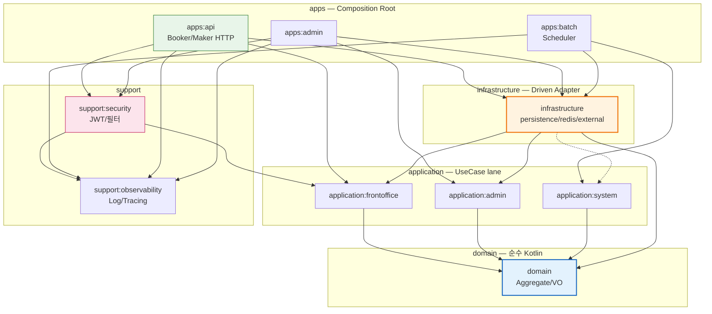

# BEAT-SERVER Architecture — SSOT

**Status:** Adopted  
**Decision Baseline:** 2026-08-18  
**Last Verified:** 2026-08-24  
**Verified Ref:** `develop@0a1d733ffb56b522ec870b3f3e77a47965e0dbb4`  
**Scope:** `TEAM-BEAT/BEAT-SERVER` `develop` 0→1 Target + Incremental Migration  
**Enforcement:** 실제로 CI가 검증하는 것만이 정본이다. `Gradle`(`verifyTargetModuleGraph` `allowed+required` in `beat.root-verification`)이 1차, `Kotlin internal`이 2차, `ArchUnit`이 3차. `./gradlew check`가 모두 실행한다. prose는 집행 수단이 아니다

> **같은 이유로 변경되는 코드는 하나의 소유 경계로 수렴시킨다.**
> `Booking 정책 -> domain/booking` · `Maker workflow -> application:frontoffice/performance/maker` · `JPA/Redis 구현 -> infrastructure` · `HTTP 응답 변경 -> apps`
>
> *하나의 Capability를 이해하려면 4개 물리 레이어를 함께 봐야 하므로, 수직 슬라이스(`CreateBooking`이 4층을 건드리는 것)는 의도된 비용이다. 물리 모듈 10개는 컴파일 경계, 논리 Capability는 변경 소유 경계다.*
>
> 처음 보는 사람 순서: 1) Module Map에서 10개 중 어디에 속하는지 찾고, 2) Dependency Direction에서 의존 가능한지 확인하고, 3) Where New Code Goes 표에서 정확한 패키지를 찾는다. 이 3단계면 충분하다.

---

## 1. Module Map — 물리 경계 10개 고정, 승격은 측정 후

### 1.1 Gradle Project

```kotlin
// settings.gradle.kts
rootProject.name = "beat-server"
include(
    "apps:api", "apps:admin", "apps:batch",
    "application:frontoffice", "application:admin", "application:system",
    "domain", "infrastructure",
    "support:security", "support:observability",
)
```

Product subproject 10개. 숫자는 목표가 아니다.

| Module | Type | `bootJar` | 역할 |
|---|---|---|---|
| `apps:api` `apps:admin` `apps:batch` | Spring Boot executable | `true` | Inbound Adapter + Composition Root. Controller, DTO, Validation, OpenAPI, Security wiring만 소유 |
| `application:frontoffice` `application:admin` `application:system` | Spring library | `false` | Use Case, 트랜잭션, Output Port 소유. `frontoffice=Booker+Maker`, `admin=Admin`, `system=Batch` lane |
| `domain` | Kotlin library | `false` | Aggregate, Entity/VO, DomainService, Domain Event/Failure, Domain-language Repository, 불변식만. Spring, JPA, Web 의존 금지 |
| `infrastructure` | Spring adapter library | `false` | `persistence + redis + external + config` Driven Adapter. 단일 모듈로 유지 |
| `support:security` `support:observability` | Spring library | `false` | JWT/필터, Logging/Metrics/Tracing plumbing |

`domain`은 `Kotlin library`, `application/infrastructure/support`는 `Spring library`, `apps`만 `Spring Boot`로 구분한다.

### 1.2 Build Logic

`build-logic` included build + convention plugin으로 공통 설정을 제공한다.

```
beat.kotlin-library, beat.spring-library, beat.spring-boot-app,
beat.jpa-adapter, beat.web, beat.security, beat.observability
```

`allprojects {}` / `subprojects {}` 형태의 거대 cross-project 설정을 금지한다. Convention plugin도 실제 capability가 있을 때만 생성한다.

### 1.3 생성 금지 / 승격 조건

**처음부터 만들지 않는다:**

`module-contracts` 중앙 계약 모듈, `CQRS별 Gradle 모듈`, `capability별 domain/application/infra 모듈 폭발`, `모든 의존성을 Port로 감싸기`, `UseCase-per-interface`, `support:web` 선제 생성, `test-common` dumping ground, `Kafka/EventSourcing/Outbox` 선제 도입

**새 Gradle module은 실익이 측정될 때만 만든다:**

```
compile isolation / dependency isolation / change isolation / test isolation /
build isolation / runtime·배포 격리 / stable reusable technical boundary 중 하나 이상
```

> **미래 예시:** `infrastructure:read`, `application:booker|maker`, `apps:booker-api|maker-api` 분리는 현재 존재하지 않는 예시이다. 단순히 폴더가 커졌다는 이유만으로 모듈을 만들지 않으며, `compile isolation / test isolation` 같은 실익이 측정될 때만 검토한다.

---

## 2. Dependency Direction — Business 역전은 Port로, 기술 plumbing은 직접 허용

### 2.1 전체 방향 — 한눈에 보는 의존 지도

> 읽기법: 화살표는 `의존한다`다. `A -> B`면 A가 B를 안다. 역방향은 금지다.



텍스트로 보면 (실선=필수, 점선=허용/선택) — 순혈 BP:

```
application:frontoffice ──> domain
application:admin       ──> domain
application:system      ──> domain
                         ▲
support:security ──> application:frontoffice + observability  // Port 구현, DIP 역전
infrastructure ──> domain + frontoffice, admin (필수) ─┘
         -.-> application:system (허용, Port 생기면 추가)   // DIP
apps:api      ──> frontoffice + infra + security + observability
apps:admin    ──> admin + infra + security + observability
apps:batch    ──> system + infra + observability
support:observability ──> (BEAT 프로젝트 의존 없음)
```

**허용/금지 — 10개 전체, 실제 `beat.root-verification` `allowedProjectDependencies`와 1:1 (CI가 그대로 검증) — 순혈 BP**

| 모듈 | 허용 (`allowed`, 모든 configuration) | 필수 (`required`, main) | 금지 시 CI |
|---|---|---|---|
| `domain` | 없음 | 없음 | BEAT 프로젝트 의존 시 실패 |
| `application:frontoffice` | `domain` | 없음 | `security`, `admin/system/infra/apps` 의존 시 실패 (Port 소유) |
| `application:admin` | `domain` | 없음 | `frontoffice/system/infra/apps` 의존 시 실패 |
| `application:system` | `domain` | 없음 | `frontoffice/admin/infra/apps` 의존 시 실패 |
| `infrastructure` | `domain`, `frontoffice`, `admin`, `system` | `domain`, `frontoffice`, `admin` | `system`은 허용이나 필수는 아님, `apps` 의존 시 실패 |
| `support:security` | `application:frontoffice`, `support:observability` | 없음 | `domain`, `admin/system`, `infrastructure`, `apps` 의존 시 실패 (Port 구현) |
| `support:observability` | 없음 | 없음 | BEAT 프로젝트 의존 시 실패 |
| `apps:api` | `frontoffice`, `infra`, `security`, `observability`, `domain(test)` | `frontoffice` | `admin/system` lane 의존 시 실패, `domain`은 main에서 금지 |
| `apps:admin` | `admin`, `infra`, `security`, `observability`, `domain(test)` | `admin` | `frontoffice/system` lane 의존 시 실패 |
| `apps:batch` | `system`, `infra`, `observability`, `domain(test)` | `system` | `frontoffice/admin` lane 의존 시 실패 |

* `support:security`는 JWT 파싱, 검증, 필터, principal 처리를 소유한다. `Maker가 Performance owner인가` 같은 업무적 권한 검사는 `application/domain`이 소유한다 — `security`에 두면 ArchUnit에서 차단된다.
* `support:observability`는 Logging, MDC, Metrics, Tracing을 소유한다. `domain`에 의존하지 않는다.
* `support:web`은 초기에는 생성하지 않는다. `apps:api`와 `apps:admin`이 공유하는 HTTP representation 정책이 독립된 변경축으로 성장했을 때만 추출한다. (현재 미생성)

### 2.2 금지 의존 — CI가 즉시 실패시키는 것

```
domain          X-> Spring, Application, Infrastructure, Apps, Web/JPA/Redis
apps:api        X-> apps:admin, apps:batch          (lane 간 격리)
application:frontoffice X-> application:admin, system (lane 격리)
Application     X-> JpaEntity/EntityManager/RedisDocument/Http DTO
Infrastructure  X-> Apps
support:security     X-> domain, application:*, infrastructure, apps
support:observability X-> domain, application:*, infrastructure, apps, security
```

`Port를 만든다는 이유로 다른 Capability의 영속화 표현을 Command에서 임의로 우회하지 않는다.` 예를 들어 `Booking Command가 Performance 테이블을 직접 조회`하는 것이 항상 정답은 아니다. `Performance`가 해당 불변식의 진짜 소유자라면 명시적인 협업 경계가 필요하다. Query에서는 소비자 projection을 위한 cross-capability join을 허용한다.

---

## 3. Module Ownership — 논리는 Capability, 물리는 Layer

### 3.1 논리 1차축 = Business Capability

변경 소유권을 판단하는 1차 기준이다.

**현재 존재하는 Capability (코드에 이미 있음):** `booking`, `performance`, `ticket`, `schedule`, `member`, `promotion`, `user`
**미래 예시 (아직 없으며, 설계 시 소유권 질문만 던져둠):** `payment`, `settlement` — `ticketPrice` 소유자나 정산 경계가 확정되면 그때 `domain`에 추가한다

```
apps/api/.../booking  application/frontoffice/.../booking  domain/.../booking  infrastructure/.../booking
```

하나의 Capability를 이해하려면 4개 물리 레이어를 함께 봐야 한다. 의도된 trade-off는 `Capability-first가 Capability별 Gradle 모듈을 의미하지 않는다`는 점이다. Capability는 논리 소유 단위, Gradle 모듈은 컴파일 격리 단위이다.

### 3.2 물리 1차축 = Dependency Responsibility

`apps(Delivery) / application(Use Case) / domain(Business Rule) / infrastructure(Driven Adapter)` — 컴파일과 의존 책임을 나누는 기준이다.

### 3.3 소유 규칙

| 구분 | 소유 | 예 |
|---|---|---|
| **Aggregate Repository** | Domain 언어로 `Booking aggregate collection`을 표현하면 `domain`이 소유한다 | `BookingRepository { findById, save }` |
| **Application Output Port** | 특정 UseCase가 외부 capability를 필요로 하면, 그 UseCase를 소유한 `application`이 Port를 소유한다 | `PaymentAuthorizer`, `BookingNotificationSender`, `PerformanceContentOwnershipReader` |
| **Query Reader** | 기본적으로 `Query Application`이 소유한다. 단 같은 capability의 Command가 상태 판단 없이 출력 조립에만 동일 projection을 소비하는 경우에만 `capability root`의 좁은 `*ReadPort`로 승격할 수 있다. Command의 correctness는 authoritative Repository/Port만 참조한다 | `MakerTicketReader(@PresentationReadModel)`, `BookingHistoryReadPort`(예외적으로 capability root) |

### 3.4 Port는 6문항을 통과할 때만 생성한다

```
1. 어떤 구체적인 변동성을 숨기는가?
2. 그 변동성을 Application에서 격리할 가치가 있는가?
3. 소비자 언어에서 의미 있는 capability인가?
4. 구현보다 충분히 깊은 인터페이스인가?
5. 다른 Capability의 Domain 지식을 복제하고 있지 않은가?
6. 삭제 시 복잡도가 실제 소비자/구현체로 퍼지는가?
```

단순 forwarding 계층이라면 만들지 않는다.

### 3.5 Granularity

```
CreateBookingStore / CancelBookingStore 같은 UseCase-per-interface는 금지한다.
-> BookingRepository 하나가 자연스러우면 하나가 맞다.

PaymentAuthorizer vs BookingNotificationSender 처럼 외부 capability가 다르면 분리한다.
```

Port의粒度는 UseCase 수가 아닌 `change axis`를 따른다.

### 3.6 Public API 최소화

Public으로 남길 후보는 `Inbound UseCase 진입점`, `UseCase 입출력 타입`, `Infrastructure가 구현해야 할 Output Port`, `의도적으로 공개된 Capability API` 뿐이다. 그 외 `assembler`, `orchestration detail`, `policy helper` 등은 `internal`을 기본으로 한다. `assembler`나 `orchestration detail`은 `internal @Component`로 둔다.

### 3.7 Capability는 Authoritative State를 소유한다

* 각 Capability는 자신의 authoritative state를 소유한다. Command에서 다른 Capability의 상태를 임의로 우회하지 않는다.
* Domain Service는 `Aggregate나 Value Object가 자연스럽게 소유할 곳이 없을 때만` 생성한다. `RefundCalculator`, `SettlementPolicy`는 좋은 예이며, 단순히 여러 메서드를 모으기 위한 `XxxDomainService`는 만들지 않는다.
* 아키텍처가 도메인 모델을 대신 결정하지 않는다. 특히 아래 소유권은 코드에 반영하기 전에 먼저 검증해야 한다 (현재 미확정, 미래 예시):
  ```
  [미확정] ticketPrice의 소유자는 Performance인가 Schedule인가 Booking snapshot인가?
  [미확정] inventory 불변식의 소유자는 Schedule인가 별도 Inventory인가?
  [미확정] payment와 booking의 트랜잭션 경계는 어디인가?
  ```

---

## 4. Frontoffice Capability → Actor → CQRS

### 4.1 Application Layer 경계

`Application은 Spring을 알 수 있지만 infrastructure나 delivery를 알아서는 안 된다.`

| 허용 | 금지 |
|---|---|
| `@Service`, `@Transactional`, Spring Tx 추상화, `java.time.Clock` | `@RestController`, `ResponseEntity`, `JpaRepository`, `EntityManager`, `RedisTemplate`, `FeignClient`, `S3Client`, `JDSL/QueryDSL 구현체`, `HTTP DTO`, `JPA Entity` |

### 4.2 Service 경계 — 5단계 판정

| 구분 | 책임 | 허용 | 금지 |
|---|---|---|---|
| **Domain Method** | 하나의 Aggregate나 Value Object가 소유하는 상태 전이와 불변식 | 값과 시간 검증, 계산, 상태 변경, Domain failure/event 생성 | Repository, Spring, transaction, 외부 I/O |
| **DomainService** | 자연스러운 단일 소유자가 없는 순수 업무 규칙 | 여러 Domain 객체의 계산, 배치, 순서, 정책 판단 | Repository/Port 호출, 상태 저장, transaction, event 발행 |
| **ApplicationService** | Actor가 실행하는 하나의 use case와 트랜잭션 | load/lock/save, Port 선택, Domain 호출, 실패 정책, event 발행 | HTTP/JPA/Redis DTO, 다른 concrete `@Service` 호출 |
| **Internal Component** | 같은 capability 내에서 재사용되는 세부 협력자 | `internal @Component`, Port wrapping, translator | public UseCase API, 독립 transaction |

**판정 순서:**
1. 하나의 Aggregate 내부 상태로 결정할 수 있으면 Domain Method
2. 여러 Domain 객체를 사용하지만 순수 계산이면 DomainService
3. Repository, Port, transaction이 필요하면 ApplicationService
4. ApplicationService 둘 이상이 재사용하지만 독립 use case가 아니면 Internal Component
5. `public ApplicationService가 다른 public ApplicationService를 호출하지 않는다`

예: `Schedule.reserveTickets`(Domain Method), `PromotionCarouselDomainService`(DomainService), `GuestBookingCommandService`(ApplicationService)

### 4.3 Frontoffice 구조

`frontoffice`는 Domain 용어가 아니라 물리 lane 이름이다. Actor는 인증 상태가 아닌 `행위 주체`로 정의한다.

```
Booker = 공연을 탐색하고 회차를 선택하며 예매하는 행위 주체 (회원/게스트와 다른 개념)
Maker  = 공연과 회차를 생성하고 관리하는 행위 주체
```

**기본 순서: `Capability -> Actor -> Command / Query`**

```text
application/frontoffice/com.beat.application.frontoffice
├── booking/booker/command|query
├── performance/booker/query
│              /maker/command|query
├── schedule/booker/query
├── ticket/maker/command|query
├── home/booker/query
├── member/command
└── auth/command          // Booker/Maker 공통 identity는 Actor-neutral 예외
```

한 Actor만 존재해도 패키지를 생략하지 않는다. 생략 근거는 `공통 capability`일 때만 허용한다. `application:admin`과 `application:system`은 lane 자체가 Actor이므로 하위에 `admin/system`을 반복하지 않는다.

> **미래 예시 (현재는 단일 `frontoffice`로 유지):** Booker와 Maker의 의존성이나 라이프사이클이 실제로 갈라질 때만 `application:booker|maker` 또는 `apps:booker-api|maker-api` 분리를 검토한다. 지금은 예시일 뿐 생성하지 않는다.

### 4.4 CQRS

```
Command = 상태 전이 + 업무적 correctness (authoritative state로 판단)
Query   = 소비자별 read 최적화 (projection, 여러 테이블 join 허용, replica/cache 가능)
```

별도 DB, Event Sourcing, Kafka, Gradle 모듈, 대칭 Repository가 CQRS의 필수 요건은 아니다.

**Command Side**

```
Controller/Trigger -> Application Command UseCase -> Authoritative Repository/Port -> Domain -> Infrastructure -> Primary DB
```

`Command는 read를 할 수 있다.` 다만 `eventually-consistent cache`, `read replica`, `presentation projection`, `@ReadModel`을 `money`, `inventory`, `authorization`, `state transition`, `ownership` 같은 correctness 판단의 입력으로 사용해서는 안 된다.

```kotlin
// 위험: CreateBooking -> PerformanceSummaryReadPort(@ReadModel) -> ticketPrice
// 해결: authoritative Port를 둔다
interface BookingTermsProvider { fun getTerms(performanceId: PerformanceId): BookingTerms }
data class BookingTerms(val ticketPrice: Money, val paymentDestination: PaymentDestination)
```

이처럼 `BookingTermsProvider`는 authoritative consistency를 요구하는 계약이다.

**Query Side**

```
Controller -> Application Query UseCase -> Consumer-specific Reader (*Reader, *ReadPort) -> JDSL/SQL -> Primary/Replica/Cache -> Projection
```

`BookingHistoryReadPort`, `MakerPerformanceReader`가 예시이다. 여러 테이블을 join해 소비자 projection을 직접 구성하며, Domain Aggregate를 억지로 hydrate하지 않는다.

**Transaction**

`Application Command`가 `@Transactional`을 소유한다. Domain은 transaction을 모른다. Repository adapter가 전체 UseCase 트랜잭션을 소유하지 않는다. Query는 필요 시 `readOnly` 트랜잭션을 사용할 수 있다.

**정확한 Command 규칙:**

`Command가 Query 패키지를 참조하지 않는다`는 틀린 규칙이다. 정확한 규칙은 `Command는 authoritative state를 읽을 수 있지만, presentation이나 read-optimized 추상화를 correctness 판단에 사용해서는 안 된다`이다.

---

## 5. Composition Root 규칙 — `apps`는 배선만 한다

### 5.1 `apps` 소유/금지

| App | 소유 | 금지 |
|---|---|---|
| `apps:api` (Booker/Maker) | Controller, Request/Response DTO, Validation, OpenAPI, ControllerAdvice, `ApiApplication` bootstrap, **Adapter Facade (필요 시, HTTP↔Application 변환이 복잡할 때만)** | `JPA Repository`, `EntityManager`, `RedisTemplate`, `JDSL`, `Domain invariant` |
| `apps:admin` | Admin Controller/DTO/Validation/Security wiring/bootstrap | Admin workflow는 `application:admin`에 둔다 |
| `apps:batch` | `@Scheduled`, Spring Batch Job/Cron, `BatchApplication` bootstrap | Business workflow는 `application:system`에 둔다 |

흐름 (Facade는 표준 경로이나 필수는 아님):

```
HTTP -> BookingController -> BookingFacade(있으면) -> CreateBooking(Application)
      -> BookingController -> CreateBooking(Application)  // 단순 위임이면 직접 호출도 허용
```

*Controller는 `Infrastructure`나 `internal Application`을 직접 참조하지 않으며, `public Application API` 또는 `adapter-local Facade`를 통해서만 진입한다.* Facade의 존재 자체를 강제하지 않고 의존 방향을 강제한다.

### 5.2 `infrastructure` 구조 — 현재와 미래 구분

단일 Gradle project로 유지한다. 현재 코드 기준 구조:

### 현재 구조 (실제 코드, CI가 검증함)

```text
infrastructure                          // 단일 모듈, 현재 3개 중 2개 lane만 의존
├── persistence
│   ├── booking, schedule, promotion, member, user
│   ├── performance                      // Aggregate Root
│   │   ├── entity(PerformanceJpaEntity 등)
│   │   ├── cast/entity, repository, mapper        // Performance 자식 (현재 최상위 분리되어 있으나 Target은 하위)
│   │   ├── staff/entity, repository, mapper
│   │   └── performanceimage/entity, repository, mapper
│   └── query/{capability}/{actor}/  -- 미완료: 현재는 persistence/*/*/query에 분산, Target은 query로 집약
├── redis/auth, cache
├── external/{storage(s3), notification(sms,slack), social(kakao)}  // 현재 존재
└── config/{JpaConfig, RedisCacheConfig, ExternalClientConfig, AsyncConfig}
```

현재 `infrastructure`는 `domain + application:frontoffice,admin`만 의존한다. `application:system` Port가 아직 없어 의존하지 않는 것이 오히려 올바르며 CI `required = {domain, frontoffice, admin}`로 검증한다.

### 목표 구조 (Adopted Target, 아직 미완료)

```text
infrastructure                          // 단일 모듈 유지
├── persistence
│   ├── booking, schedule, promotion, member, user
│   ├── performance                      // 하위에 cast/staff/performanceimage 포함 (테이블이 있다고 Capability가 아니다)
│   └── query/{capability}/{actor}/  -- 소비자 projection 집약
├── redis/auth, cache
├── external/{storage(s3), notification(sms,slack), social(kakao), payment}  // payment는 미래 예시
└── config/{JpaConfig, RedisCacheConfig, ExternalClientConfig, AsyncConfig}
```

의존 관계 목표는 `infrastructure -> domain + 필요한 application lane`이다. `application:system`은 Port가 생기면 그때 추가한다. `contracts:frontoffice|admin|system` 분리는 컴파일 비용이 실증될 때만 검토하는 미래 예시다.

> `cast`, `staff`, `performanceimage`의 최상위 분리는 `domain:Performance`가 `AggregateRoot`인 사실과 모순되므로 Target에서는 `performance` 하위로 이동한다.

### 5.3 Visibility

```kotlin
internal class JpaBookingRepository(...)
internal class BookerBookingQueries(...) // Query projection도 internal
internal class RedisGuestSessionAdapter(...)
```

public으로 남길 수 있는 것은 `필요한 Spring configuration`, `bootstrap marker`, `factory` 뿐이다. `InfraPersistenceConfig`와 `AuthRedisConfig`는 `apps`에서 직접 `Import`하므로 public이 정상이다.

### 5.4 `apps -> infrastructure` 배선

```
apps ─┬─> application
      └─> infrastructure ─> application  // cycle이 아니다 (DIP)
```

`apps.*.config`가 `infrastructure`의 설정을 import하는 것만 허용한다. `apps.*.web`이 `infrastructure` 구현체를 직접 참조하는 것은 `ArchUnit`으로 차단한다. `apps`가 `infrastructure`를 의존하는 것은 Composition Root이므로 정상이다.

### 5.5 Support

* `support:security`는 JWT 파싱, 검증, 필터, principal 처리를 소유한다. `Maker가 Performance owner인가` 같은 업무적 권한 검사는 `application`이나 `domain`이 소유한다.
* `support:observability`는 Logging, MDC, Metrics, Tracing을 소유한다. `domain`에 의존하지 않는다.
* `support:web`은 초기에는 생성하지 않는다. `apps:api`와 `apps:admin`이 공유하는 HTTP representation 정책이 독립된 변경축으로 성장했을 때만 추출한다.

### 5.6 Spring Modulith

`Gradle`이 거시적 물리 경계를 담당하고, `Spring Modulith`와 `ArchUnit`은 `application` 프로젝트 내부의 논리적 capability를 보조 검증하는 역할만 한다. Modulith을 아키텍처의 주인으로 만들지 않는다.

---

## 6. Existing Architecture Guards — 실제로 CI가 집행하는 것만 적는다

> 현재 CI는 `./gradlew check` 실행 시 `build-logic/beat.root-verification`의 `verifyTargetModuleGraph`, `verifyModuleBootJars`, `verifyMainResourceTestProfiles`, `verifyMockFrameworkIsNotGlobalDefault` 4개와 각 모듈의 `*ArchitectureTest`를 실행한다. 문서에 적고 CI가 안 돌리면 거짓 정본이므로, 아래 표는 실제 코드에 존재하는 Guard만 나열한다.
> Enforcement Level: `[CI]=Gradle/ArchUnit 자동, [COMPILER]=Kotlin internal, [REVIEW]=코드리뷰/도메인 모델링, [TARGET]=채택됐으나 migration 미완료`

**Gradle이 막는 것 (`beat.root-verification` — PR에서 즉시 실패) [CI]**

| Guard | 실제 검증 위치 | 위반 예 |
|---|---|---|
| `domain`이 다른 BEAT 프로젝트를 의존하지 않는다 | `verifyTargetModuleGraph` | `domain`이 `support:security`를 `implementation` |
| `domain`이 `Spring/Web/JPA/Redis` 외부 모듈을 직접 의존하지 않는다 | `verifyTargetModuleGraph` | `domain`에 `spring-context` 추가 |
| `application` lane 간 격리 (`frontoffice`가 `admin`/`system`/`infrastructure`/`apps` 의존 금지) | `verifyTargetModuleGraph` | `frontoffice`가 `application:admin` import |
| `infrastructure`가 `apps`를 의존하지 않는다 | `verifyTargetModuleGraph` | `infrastructure`가 `apps:api` import |
| `support:security`는 `support:observability`만 허용, `domain`/`application`/`infrastructure`/`apps` 의존 금지 | `verifyTargetModuleGraph` | `security`가 `domain` import |
| `support:observability`는 BEAT 프로젝트 의존 불가 | `verifyTargetModuleGraph` | `observability`가 `support:security` import |
| `apps:api`는 `application:frontoffice`를, `apps:admin`은 `application:admin`을 반드시 의존 | `verifyTargetModuleGraph` | `apps:api`가 `application:frontoffice` 없이 빌드 |
| `apps` 라이브러리(`domain`, `application:*` 등)는 `bootJar` 비활성 | `verifyModuleBootJars` | `application:frontoffice`에 `bootJar` 활성화 |

**ArchUnit이 막는 것 (각 모듈 `src/test/...ArchitectureTest` — `./gradlew :<module>:test`에서 실패) [CI]**

| Guard | 실제 검증 위치 | 위반 예 |
|---|---|---|
| `domain`이 `Spring/Application/Infrastructure/Apps/Web/JPA/Redis`를 참조하지 않는다 | `domain/src/test/...DomainServiceArchitectureTest` | `domain`에 `@Entity` import |
| `Application`이 `JpaEntity`, `EntityManager`, `RedisDocument`, `Http DTO`를 참조하지 않는다 | `application:frontoffice/src/test/...FrontofficeArchitectureTest` `application:admin/...` `application:system/...` | `application`이 `BookingJpaEntity` import |
| `Application Service`가 다른 Capability의 concrete `@Service`를 참조하지 않는다 | 동위 | `CreateBooking`이 `GetPerformanceUseCase` 직접 호출 |
| `DomainService`가 `Repository`나 `Port`를 참조하지 않는다 | `domain/src/test/...` | `DomainService`가 `BookingRepository` 호출 |
| `support:security`가 `application`/`infrastructure`를 참조하지 않는다 | `support:security/src/test/...SupportSecurityArchitectureTest` | `security`에 `BookingRepository` import |
| `Web Adapter`가 `Infrastructure` 구현체를 참조하지 않는다 | `apps:api/src/test/...ApisArchitectureGuardTest` `apps:admin/...AdminArchitectureGuardTest` | Controller가 `JpaBookingRepository` 주입 |

**아직 CI가 안 막는 것 (문서에 적지 않거나 `TODO`로만 둔다)**

`infrastructure/persistence`의 `home/ticket` phantom 최상위 금지, `query/{capability}/{actor}` 규칙 — 현재 `verifyTargetModuleGraph`는 모듈 그래프까지만 검증하며 패키지 레벨 `PersistenceArchitectureTest`는 아직 존재하지 않는다. 이 규칙은 다음 PR에서 `infrastructure/src/test/...PersistenceArchitectureTest`로 추가할 예정이다. 문서에 Enforcement라고 쓰고 CI가 안 돌리면 신뢰를 잃으므로, 여기서는 `계획 중`으로 명확히 구분한다.

**Kotlin-first**

`Kotlin nullability`, `property`, `default argument`, `value class`를 원칙으로 한다. 불필요한 `@JvmStatic`, `@JvmOverloads`, `java.util.Optional` 사용을 감사한다. `BootJar`는 `apps:*`만 `true`이며 나머지는 `false`이다.

**Event**

`Domain Event(업무적 사실)`, `Internal Event(프로세스 내 협업)`, `Integration Event(외부 계약)`을 구분한다. `Kafka`, `Outbox`, `DLQ`는 delivery 보장이 실제로 요구될 때만 도입한다. CQRS를 이유로 Event-driven을 선제 도입하지 않는다.

**Error**

`application`은 `BookingClosed`, `SoldOut`, `MemberNotFound` 같은 도메인 실패 언어를 사용한다. `ApiApplicationException`이나 `HttpStatus`를 `application`에서 직접 사용하지 않는다. `apps`의 `ControllerAdvice`가 `409`, `404` 등으로 번역한다.

**NOT TO DO**

`module-contracts` 성급 생성, `core:application` 거대 모듈, `CQRS별 Gradle 모듈`, `capability별 모듈 폭발`, `모든 의존성을 Port로 감싸기`, `Application Service 체이닝`, `Command에서 ReadModel을 correctness로 사용`, `Domain에 Spring 누수`, `support:web` 선제 생성, `test-common` dumping ground 등을 금지한다.

---

## 7. Where New Code Goes — 신규 코드 배치 사전

### 7.1 배치 표

| 신규 기능 | 둘 곳 | 금지 |
|---|---|---|
| 예매 정책 변경 `CancelBooking` | `domain/booking` 또는 `application/frontoffice/booking/booker/command` | `apps`에 도메인 로직을 두거나 `infrastructure`에 불변식을 두지 않는다 |
| Maker 공연 생성/수정 `PerformanceModify` | `application:frontoffice/performance/maker/command/PerformanceModifyCommandService` + `PerformanceContentOwnershipReader`(Command Port, authoritative) — `infrastructure/persistence/performance/repository/`에 유지, `query/`로 이동하지 않는다 | `SELECT`라 해서 `query/`로 오분류하지 않는다 |
| Booker 홈/예매내역/공연상세 조회 | `application/frontoffice/{capability}/booker/query`의 Port(`@PresentationReadModel`) + `infrastructure/persistence/query/{capability}/{actor}/` 구현 | `home`, `ticket`을 `persistence` 최상위의 authoritative 형제로 신설하지 않는다 |
| Admin 승인/정산/통계 | `application:admin/performance|settlement|statistics` | `application:frontoffice`를 재사용하지 않는다. 공통 불변식은 `domain`으로 공유한다 |
| Batch 정리 `CleanupExpiredBookings` | `application:system/booking/command` + `apps:batch`의 `@Scheduled` 트리거 | `infrastructure`에 스케줄러를 배치하지 않는다 |
| JPA/JDSL/Redis 구현 변경 | `infrastructure/persistence/{capability}/`, `infrastructure/redis/`, `infrastructure/external/{storage/sms/social}` | `application`에 `EntityManager`나 `RedisTemplate`을 노출하지 않는다 |
| HTTP 응답/에러 매핑 변경 | `apps:api`나 `apps:admin`의 ControllerAdvice | `application`에 `HttpStatus`나 `ResponseEntity`를 노출하지 않는다 |
| 슬랙/SMS/카카오/S3 | `infrastructure/external/notification|social|storage`의 `internal @Component` | `application`에 `FeignClient`나 `S3Client`를 직접 의존하지 않는다 |

### 7.2 `infrastructure/persistence` 정석 구조

```text
infrastructure/persistence
├── booking/entity(BookingJpaEntity,RefundAccountJpaValue), BookingJpaRepository(internal), BookingRepositoryImpl(internal), mapper
├── performance                            // Aggregate Root
│   ├── entity(PerformanceJpaEntity,PaymentAccountJpaValue,PerformancePeriodJpaValue), PerformanceRepositoryImpl, mapper
│   ├── cast/entity(CastJpaEntity), CastJpaRepository(internal), mapper              // 자식 Entity
│   ├── staff/entity(StaffJpaEntity), StaffJpaRepository(internal), mapper
│   └── performanceimage/entity(PerformanceImageJpaEntity), PerformanceImageJpaRepository(internal), mapper
├── schedule/entity(ScheduleJpaEntity), ScheduleRepositoryImpl, mapper
├── promotion/entity(PromotionJpaEntity), PromotionRepositoryImpl, mapper
├── member/entity(MemberJpaEntity), MemberRepositoryImpl, mapper
├── user/entity(UsersJpaEntity), UsersRepositoryImpl, mapper
├── common/BaseTimeEntity, exception/PersistenceMappingException
└── query/{capability}/{actor}/  -- 소비자 projection만, authoritative read는 제외
    ├── booking/booker/BookerBookingQueries (BookingHistoryReadPort는 capability root 예외로 booking에 잔류 가능)
    ├── home/booker/HomeProjectionQueries
    ├── performance/booker/ScheduleAvailabilityQueries
    ├── performance/maker/MakerPerformanceListQueries, PerformanceEditFormQueries
    └── ticket/maker/MakerTicketQueries
```

* `home`, `ticket` 같은 최상위 phantom aggregate는 `query/`로만 배치한다.
* `PerformanceContentOwnershipReader`는 Command의 `ownership` correctness 판단이므로 `performance/repository/`에 남긴다. `ScheduleAvailabilityQueries`는 소비자 projection이므로 `query/performance/booker/`로 이동한다.
* 트랜잭션 — Command는 `application`의 `@Transactional`이 소유하고 Domain은 모른다. Query는 `readOnly`로 둘 수 있다. `@Modifying`에 `@Transactional`을 `JpaRepository`에 두지 말고 서비스에 위임한다.

### 7.3 마이그레이션/테스트 관례

* **Slice 단위 Strangler** — `Characterize -> Target boundary -> Migrate one slice -> Compile -> Focused tests -> Integration -> Delete legacy -> Next slice` 순서로 진행한다. Big Bang rewrite를 금지한다.
* **Reference Slice** — `CreateBooking`, `CancelBooking`, `GetMyBookings`, `GetBookingDetail`을 `apps:api -> application:frontoffice -> domain <- infrastructure` 수직 슬라이스로 먼저 검증한다.
* **PR 전략** — `모듈별`이나 `API별`로 고정 분할하지 않는다. `독립적인 architecture invariant 개선 + 리뷰 가능한 크기 + 롤백 가능 + behavior 검증 가능`을 만족하는 `Capability slice`, `Runtime lane`, `Physical module` 중 최적을 선택한다.
* **테스트** — `domain`은 pure unit, `application`은 fake 우선으로 `MockK`는 경계에서만 사용, `infrastructure`는 MySQL과 Redis Testcontainers, `apps`는 MockMvc와 `@BeatAcceptanceTest`를 사용한다. `Clock.fixed`를 주입하고 `NOW` 상수에서 파생하며, `Kotest FunSpec`은 한국어 서술형을 따른다. Fixture는 capability-local로 두고 3곳 이상 조립 시 공유 factory로 추출한다.

---

> **변경 절차:** `apps/application/domain/infrastructure` 의존 그래프와 6장의 Guard를 먼저 갱신하고 본 문서를 수정한다. prose 수정만으로 아키텍처가 바뀌지 않는다.
