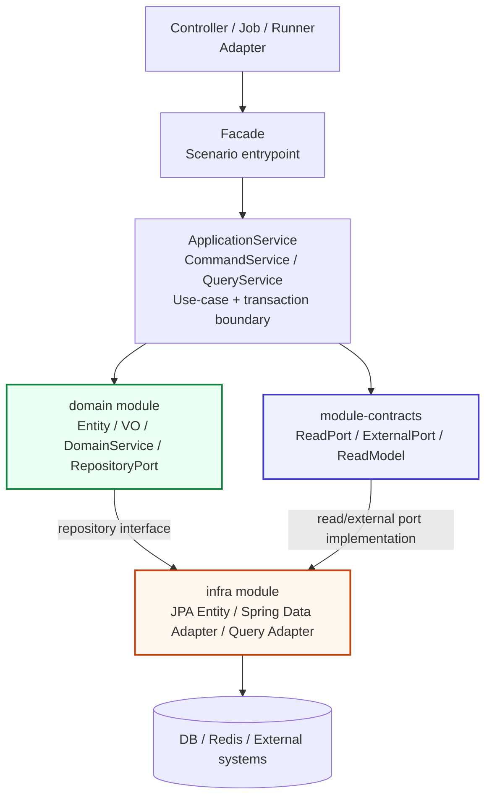
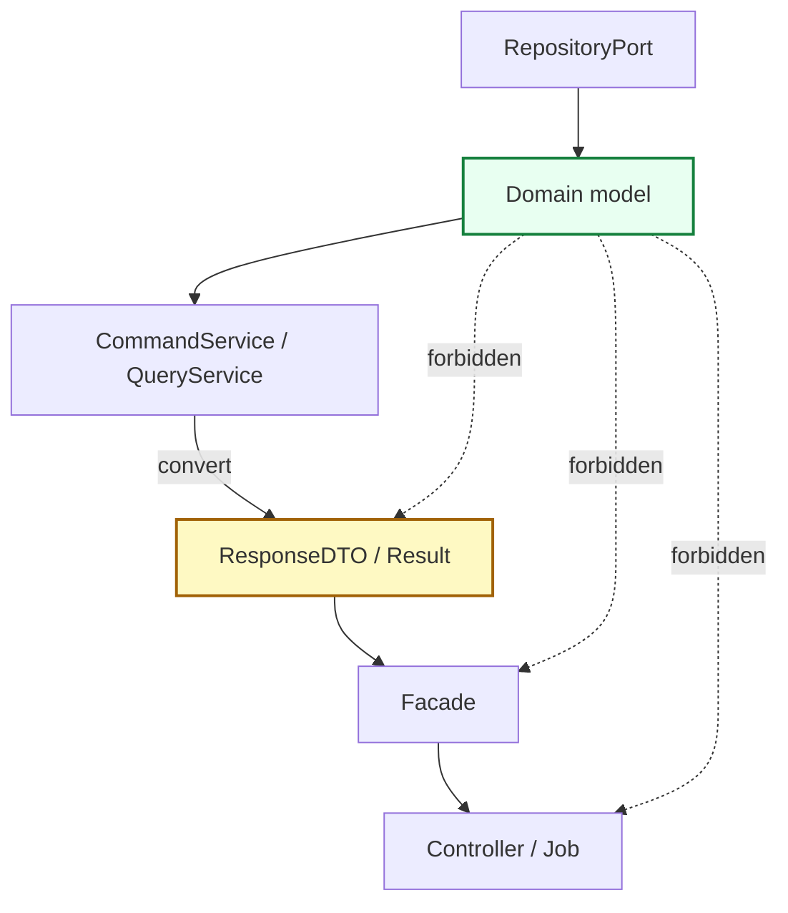
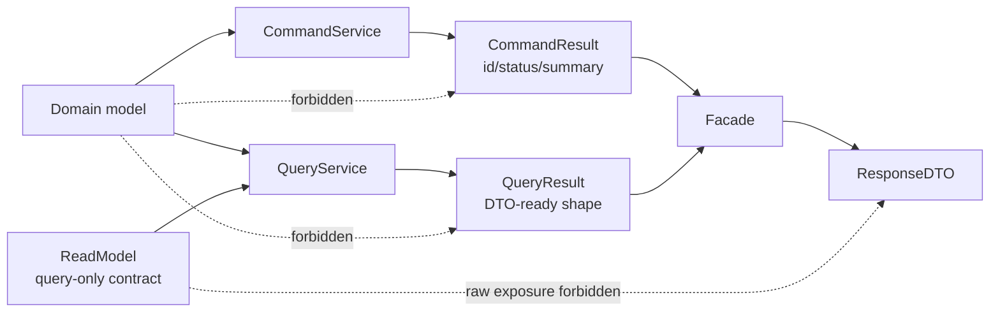
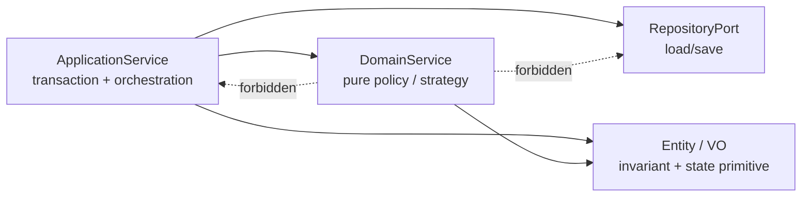
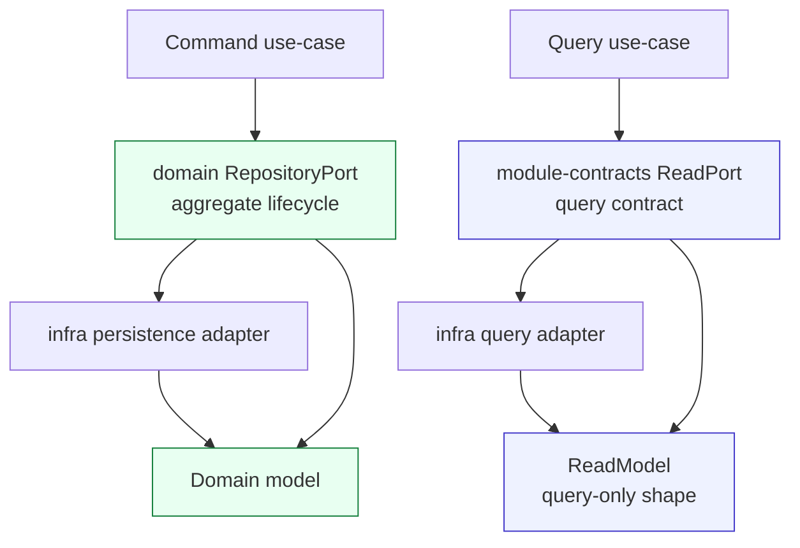
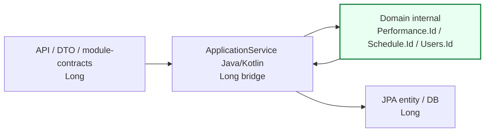
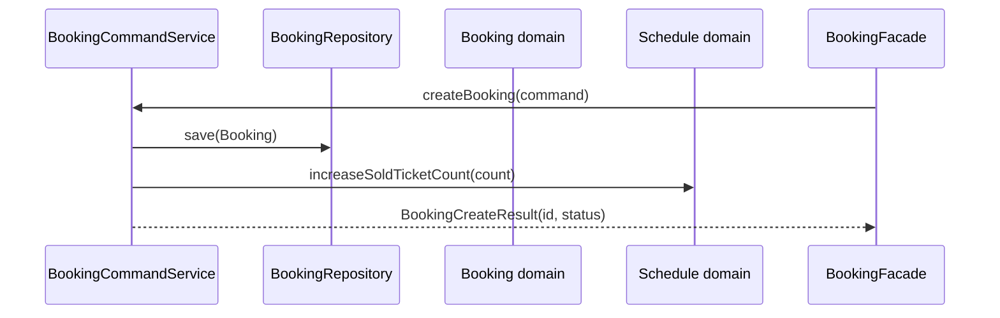
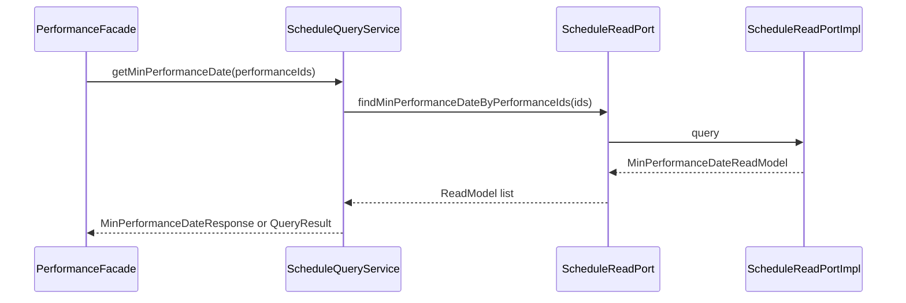

# domain module guide

`domain`은 BEAT의 **순수 도메인 모듈**입니다.
이 모듈은 비즈니스 개념, 도메인 불변식, 도메인 정책, 저장소 계약을 표현합니다.

`domain`은 아래 구현 세부사항을 모릅니다.

- HTTP / Controller / ResponseDTO
- Batch Job / Runner
- Spring Transaction
- JPA Entity / Spring Data Repository
- QueryDSL / Kotlin JDSL query implementation
- Redis / 외부 API / 파일 저장소
- API 화면 조회용 projection

> 핵심 원칙: `domain/src/main`에는 persistence concern을 두지 않습니다.

---

## 1. 이 문서를 읽는 방법

이 문서는 domain 모듈에 새 코드를 추가하거나 기존 코드를 이동할 때 보는 기준서입니다.

먼저 아래 질문에 답합니다.

```text
1. 이것은 비즈니스 규칙인가?
2. 이것은 도메인 객체의 상태나 불변식인가?
3. 이것은 조회 화면을 위한 projection인가?
4. 이것은 API 응답 shape인가?
5. 이것은 JPA/DB/외부 시스템 구현 세부사항인가?
```

답에 따라 위치가 달라집니다.

| 질문 | 위치 |
| --- | --- |
| 도메인 상태, 불변식, 상태 변경 | `domain/<context>/domain` |
| Entity 하나에 넣기 어려운 순수 도메인 정책 | `domain/<context>/service` |
| command/lifecycle 저장소 계약 | `domain/<context>/repository` |
| 조회 전용 shape / 화면 projection | `module-contracts` read model + `infra` query adapter |
| API 요청/응답 shape | `apis` / `admin` / `batch` 실행 모듈 |
| JPA entity / Spring Data / QueryDSL 구현 | `infra` |

---

## 2. 전체 레이어에서 domain의 위치



### 레이어별 책임

| Layer | 책임 | 금지 |
| --- | --- | --- |
| Controller / Job | 요청/트리거를 받는 adapter | repository, domain service 직접 호출 |
| Facade | 실행 모듈의 공식 진입점, 여러 use-case 결과 조합 | transaction, repository, domain service 직접 소유 |
| ApplicationService | use-case 실행, transaction, 조회/저장 순서, domain 호출 | API 응답 shape에 종속된 복잡한 화면 조회 비대화 |
| Domain | 도메인 상태, 불변식, 정책, 저장소 계약 | Spring/JPA/DTO/query 구현 |
| Module-contracts | 모듈 간 read/external contract | domain model 직접 노출 |
| Infra | persistence/external adapter 구현 | service layer 소유 |

---

## 3. domain이 소유하는 것

| 소유 대상 | 위치 | 설명 |
| --- | --- | --- |
| Domain model | `domain/<context>/domain` | aggregate, domain entity, enum, identifier, 상태 변경 primitive |
| Value Object | `domain/<context>/vo` | 값 자체가 의미를 갖는 불변 객체. 필요할 때만 생성 |
| DomainService | `domain/<context>/service` | Entity/VO 하나에 넣기 어려운 순수 정책/전략 |
| RepositoryPort | `domain/<context>/repository` | command/lifecycle에 필요한 저장소 interface |
| Exception/ErrorCode | `domain/<context>/exception` | 순수 domain 규칙 위반을 표현하는 코드 |

현재 context:

```text
booking
cast
member
performance
performanceimage
promotion
schedule
staff
user
```

`PerformanceImage`는 `performance` 하위 타입이 아니라 독립 context입니다.

---

## 4. domain이 소유하지 않는 것

| 금지 대상 | 이유 | 소유 위치 |
| --- | --- | --- |
| JPA Entity / `@MappedSuperclass` | persistence model은 domain model이 아님 | `infra` |
| Spring Data Repository | adapter 구현체 | `infra` |
| QueryDSL/JDSL query implementation | 조회 최적화 구현 | `infra` query adapter |
| API Request/Response DTO | transport shape | `apis`, `admin` |
| Batch result DTO | batch output shape | `batch` |
| `Page`, `Pageable`, `Sort` | Spring Data 타입 | 실행 모듈 query 또는 infra adapter |
| `HttpStatus`, `ResponseEntity` | Web 타입 | 실행 모듈 |
| `GrantedAuthority` | Security adapter 타입 | `gateway` 또는 실행 모듈 |
| Redis document / external API DTO | 외부 구현 shape | `infra`, `module-contracts` |

허용 의존성은 원칙적으로 다음뿐입니다.

```text
global-utils
Kotlin/JDK standard library
```

---

## 5. 패키지 구조

```text
domain/
  src/main/java/com/beat/domain/<context>/
    domain/       # Java enum / legacy Java domain surface
    repository/   # technology-neutral repository interface
    exception/    # 순수 domain rule ErrorCode

  src/main/kotlin/com/beat/domain/<context>/
    domain/       # Kotlin pure domain model
    service/      # Kotlin pure domain service
    vo/           # value object, 필요할 때만 생성
```

### 패키지 규칙

- `dao/` package는 사용하지 않습니다.
- `port/in/` package는 사용하지 않습니다.
- application use-case port를 domain에 두지 않습니다.
- 저장소 계약은 `repository/` 아래 interface로만 둡니다.
- repository 구현체, Spring Data repository, JPA entity, mapper는 `infra`가 소유합니다.

---

## 6. Domain ErrorCode 소유권

`domain/<context>/exception`에는 Entity, VO, DomainService가 직접 판단할 수 있는 **순수 도메인 규칙 위반 코드**만 둡니다.

허용:

- aggregate 생성/수정 중 깨지면 안 되는 invariant
- ticket count, sold count처럼 domain model 자체가 보장해야 하는 값 규칙
- repository, 인증 사용자, HTTP request, 외부 port 없이 판단 가능한 domain policy

금지:

- repository lookup 실패: `*_NOT_FOUND`, `NO_*_FOUND`
- request DTO / use-case input validation
- actor, owner, permission, role 검증
- external adapter 실패를 API 언어로 번역한 코드
- API/admin/batch 응답 성공 메시지

`SuccessCode`는 domain 소유가 아닙니다. 성공 응답 문구는 실행 모듈 response boundary가 소유합니다.

#421은 위 기준에 따라 domain/application ErrorCode와 SuccessCode 소유권을 분리하는 follow-up입니다. 이동 전 inventory는 root `MIGRATION.md`와 `docs/migration/domain-application-errorcode-inventory.md`를 기준으로 합니다.

---

## 7. Domain model은 어디까지 올라갈 수 있는가



### 규칙

- RepositoryPort는 Domain model을 반환하고 저장할 수 있습니다.
- ApplicationService는 유스케이스 내부에서 Domain model을 사용할 수 있습니다.
- Domain model은 ApplicationService 밖으로 반환하지 않습니다.
- Facade, Controller, Job/Runner는 Domain model을 받거나 반환하지 않습니다.
- RequestDTO, ResponseDTO, CommandResult, QueryResult는 Domain model을 필드로 담지 않습니다.
- 실행 모듈 간에 Domain model을 직접 전달하지 않습니다.

즉, Domain model의 최대 범위는 ApplicationService 내부입니다.

```text
허용:
RepositoryPort -> ApplicationService 내부 -> Domain method 호출

금지:
ApplicationService -> Facade -> Controller 로 Domain model 반환
```

---

## 8. ApplicationService 반환 규칙

ApplicationService는 domain model을 그대로 반환하지 않습니다.
반환값은 use-case 결과를 표현하는 **application result**여야 합니다.



### CommandService 반환

CommandService는 상태 변경 use-case를 실행합니다.

권장 반환:

```text
createdId
updatedId
status
void
CommandResult
```

예:

```java
record BookingCreateResult(Long bookingId, BookingStatus status) {}
record PerformanceModifyResult(Long performanceId) {}
```

금지:

```java
Booking createBooking(...)     // Domain model 반환 금지
Performance modify(...)        // Domain model 반환 금지
```

### QueryService 반환

QueryService는 조회 use-case를 실행합니다.

권장 반환:

```text
QueryResult
Application DTO
ResponseDTO-ready result
```

QueryService는 다음 중 하나를 선택합니다.

| 상황 | 반환 위치 |
| --- | --- |
| 단일 QueryService 결과가 그대로 API 응답이 됨 | QueryService가 ResponseDTO 또는 QueryResult 조립 가능 |
| 여러 QueryService/CommandService 결과를 조합해야 함 | Facade가 최종 ResponseDTO 조립 |
| infra query adapter가 반환한 read model이 있음 | QueryService가 ReadModel을 API/application shape로 변환 |

금지:

```java
List<MinPerformanceDateReadModel> getMinDates(...) // Controller/Facade로 raw ReadModel 노출 금지
List<Schedule> getSchedules(...)                   // Domain model 반환 금지
```

허용 예:

```java
MinPerformanceDateResponse getMinPerformanceDate(...)
MakerTicketListResponse getMakerTickets(...)
```

또는:

```java
MinPerformanceDateQueryResult getMinPerformanceDate(...)
MakerTicketListQueryResult getMakerTickets(...)
```

### Facade 반환

Facade는 Controller/Job-facing 경계입니다.

Facade는 다음 경우 최종 ResponseDTO를 조립할 수 있습니다.

- 여러 CommandService/QueryService 결과를 조합해야 할 때
- API scenario에 맞는 최종 응답 shape가 필요할 때
- 사용자 API와 admin API가 같은 use-case 결과를 서로 다른 응답으로 보여줘야 할 때

Facade가 직접 하면 안 되는 것:

- repository 조회/저장
- transaction 소유
- DomainService 직접 호출
- Domain model 상태 변경

---

## 9. Entity / VO / DomainService 책임



### Entity / VO

Entity와 VO는 자기 자신의 불변식과 상태 변경 primitive를 소유합니다.

예:

- 상태 전이
- 수량 증감
- 값 검증
- 한 aggregate 안에서 끝나는 소유권 검증
- 생성/수정 시 깨지면 안 되는 hard invariant

### DomainService

`DomainService`는 Entity/VO 하나에 자연스럽게 넣기 어려운 순수 도메인 정책/전략을 둡니다.

규칙:

- class suffix는 `*DomainService`를 사용합니다.
- `Policy` suffix는 기본 규칙으로 쓰지 않습니다.
- 빈 placeholder class를 만들지 않습니다.
- CRUD wrapper나 repository delegation을 만들지 않습니다.
- repository, transaction, Spring annotation, DTO, external/module-contract port, JPA/QueryDSL type을 알지 않습니다.
- 이미 조회된 Entity/VO/primitive를 입력으로 받아 domain primitive/value/result를 반환합니다.
- 구현체 variation이 실제로 생기기 전까지 interface를 먼저 만들지 않습니다.

처음에는 context 단위 cohesive service 하나로 시작합니다.

```text
ScheduleDomainService
BookingDomainService
PerformanceDomainService
```

정책이 커지고 변경 이유가 갈라질 때만 역할별로 분리합니다.

```text
BookingRefundDomainService
BookingCancellationDomainService
PerformanceModificationDomainService
```

---

## 10. RepositoryPort vs ReadModel



### RepositoryPort

Domain repository는 aggregate lifecycle과 command에 필요한 저장/수정/단순 조회 언어만 소유합니다.

허용 예:

```java
Optional<Booking> findById(Long id);
Booking save(Booking booking);
void deleteAll(List<Booking> bookings);
```

금지 후보:

- 화면 목록 조회
- 검색/필터/정렬
- 통계
- API ResponseDTO projection
- `Page`, `Pageable`, `Sort`
- QueryDSL/JDSL projection

### ReadModel / ReadPort

ReadModel은 Domain model이 아닙니다. 저장 대상도 아닙니다. 조회 결과를 빠르게 만들기 위한 query-only shape입니다.

규칙:

- `module-contracts`가 ReadPort와 ReadModel contract를 소유합니다.
- ReadModel class suffix는 `*ReadModel`을 사용합니다.
- ReadModel은 `@ReadModel` marker를 붙입니다.
- ReadModel은 domain type을 import하지 않습니다.
- infra query adapter가 ReadPort를 구현합니다.
- 실행 모듈 QueryService가 ReadModel을 받아 API ResponseDTO 또는 application result로 조립합니다.

예:

```text
module-contracts
  com.beat.contracts.schedule.ScheduleReadPort
  com.beat.contracts.schedule.readmodel.MinPerformanceDateReadModel

infra
  infra.persistence.schedule.repository.query.ScheduleReadPortImpl
```

---

## 11. Domain identity rule

Domain model 내부에서는 raw `Long`을 그대로 흘리지 않고 aggregate-owned typed ID를 사용할 수 있습니다.



규칙:

- Domain model 내부 identity는 aggregate-owned typed ID를 사용할 수 있습니다.
  - 예: `Performance.Id`, `Schedule.Id`, `Booking.Id`, `Users.Id`
- 다른 aggregate를 참조할 때는 객체 그래프가 아니라 ID로 참조합니다.
  - 예: `Schedule`은 `Performance` 객체가 아니라 `Performance.Id`를 보유합니다.
- Java-facing factory/getter/rehydrate는 기존 application/infra interop을 위해 `Long`/`long` bridge를 유지합니다.
- Repository interface, JPA entity, DTO, module-contracts, ReadModel은 scalar `Long`을 유지합니다.
- 외부 시스템 identity는 domain aggregate ID와 섞지 않습니다.
  - 예: `Member.socialId`는 `Users.Id`가 아니라 social provider의 외부 ID입니다.

예:

```kotlin
data class Booking private constructor(
    private val bookingId: Id?,
    private val linkedScheduleId: Schedule.Id,
    private val linkedUserId: Users.Id,
) {
    fun getId(): Long? = bookingId?.value
    fun getScheduleId(): Long = linkedScheduleId.value
    fun getUserId(): Long = linkedUserId.value
}
```

---

## 12. Kotlin domain model 작성 규칙

현재 domain model은 JPA entity가 아니라 순수 immutable domain snapshot에 가깝게 사용합니다.

규칙:

- `data class private constructor` + companion factory를 사용할 수 있습니다.
- 외부 생성은 `create(...)`, persistence 재구성은 `rehydrate(...)`로 분리합니다.
- Java call-site 호환이 필요한 companion factory에는 `@JvmStatic`을 유지합니다.
- `copy(...)` 기반 update는 domain method 안에서만 호출합니다.
- hard invariant는 생성/수정 경계에서 검증합니다.
- `rehydrate(...)` 검증은 기존 DB row 조회 장애를 만들 수 있으므로 데이터 audit 후 보수적으로 추가합니다.
- domain model은 JPA annotation, Spring annotation, QueryDSL type을 갖지 않습니다.

---

## 13. 예시: 올바른 변환 경계

### Command 예시



CommandService는 `Booking`을 직접 반환하지 않고 `BookingCreateResult` 같은 결과만 반환합니다.

### Query 예시



QueryService는 ReadModel을 그대로 밖으로 노출하지 않고 응답에 필요한 shape로 변환합니다.

---

## 14. 현재 migration 완료 상태

#420 이후 `domain`은 다음 상태로 수렴했습니다.

- [x] JPA entity 제거
- [x] Spring Data repository adapter 제거
- [x] QueryDSL APT/build surface 제거
- [x] `BaseTimeEntity` infra 이동
- [x] Lombok 의존 제거
- [x] application use-case `port/in` 제거
- [x] `repository/dto` read projection 제거
- [x] `TicketRepository` command/query 혼재 제거
- [x] `PerformanceImage` 독립 context 분리
- [x] internal typed ID / external Long bridge 규칙 도입

Persistence 구현은 `infra`가 소유합니다.

```text
infra.persistence.<context>.entity            # JPA entity
infra.persistence.<context>.repository        # Spring Data + repository implementation
infra.persistence.<context>.mapper            # domain <-> JPA mapping
infra.persistence.<context>.repository.query  # read/query adapter
```

---

## 15. Transitional exceptions

신규 코드는 이 예외를 선례로 삼지 않습니다.

- 일부 `module-contracts` contract는 historical 이유로 domain-coupled type을 가질 수 있습니다.
- 새 contract는 domain model을 필드/반환 타입으로 담지 않습니다.
- 추가 query/read-model 최적화, Kotlin JDSL 전환, contract-local DTO 분리는 별도 후속 이슈에서 다룹니다.

---

## 16. 빠른 체크리스트

새 domain 코드를 추가할 때 아래를 확인합니다.

- [ ] 이 타입이 진짜 domain concept인가?
- [ ] JPA/Spring/Web/QueryDSL/Redis/external DTO import가 없는가?
- [ ] ErrorCode가 repository lookup, request validation, actor/owner/permission, response success message를 표현하지 않는가?
- [ ] Entity/VO에 둘 수 있는 invariant를 ApplicationService에 절차 코드로 두지 않았는가?
- [ ] DomainService가 repository나 transaction을 소유하지 않는가?
- [ ] 복잡 조회/검색/정렬/통계를 domain repository에 넣지 않았는가?
- [ ] ReadModel이 필요하다면 `module-contracts` `*ReadPort` / `*ReadModel`로 분리했는가?
- [ ] ApplicationService가 Domain model을 밖으로 반환하지 않는가?
- [ ] Facade가 repository/domain service/transaction을 직접 소유하지 않는가?
- [ ] Java/API/JPA boundary에 Kotlin inline ID를 직접 노출하지 않았는가?
