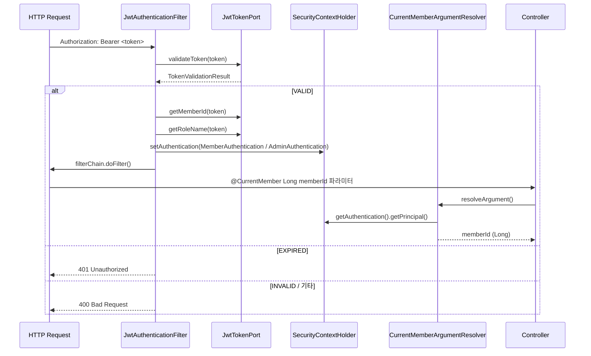
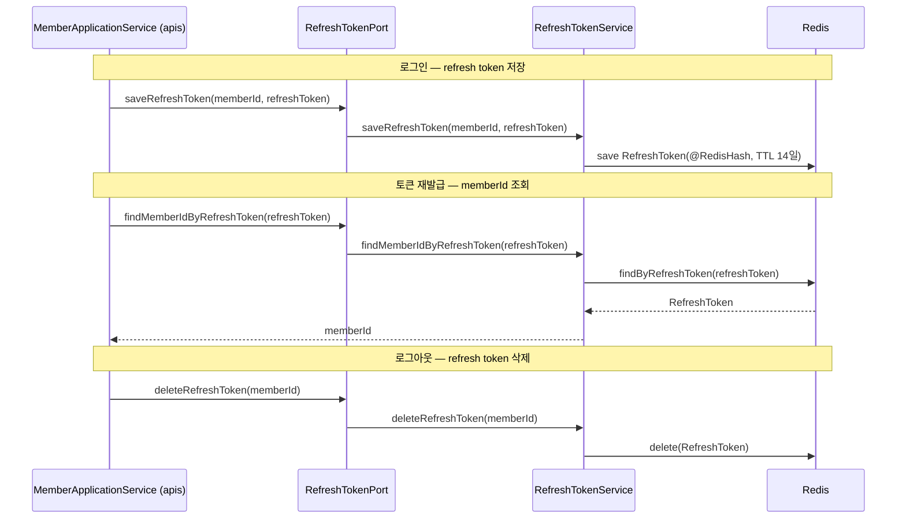

# gateway module

`gateway`는 BEAT의 **인증/인가 공유 모듈**입니다.
JWT 발급/검증, refresh token 저장, 인증 필터, 인가 실패 처리, 현재 사용자 principal 변환처럼
여러 실행 모듈이 공통으로 필요한 보안 primitive를 소유합니다.

`gateway`는 아래 구현 세부사항을 모릅니다.

- 비즈니스 규칙, UseCase, ApplicationService
- JPA Entity / Spring Data Repository
- 외부 API adapter (Kakao, Slack, S3, SMS)
- 배치 잡 / 스케줄러

> 핵심 원칙: 실행 모듈은 `gateway`의 내부 구현 패키지를 직접 import하지 않습니다.
> 공개 표면 (`EnableGatewayConfig`, `GatewayConfigGroup`, `CurrentMember`, `module-contracts auth port`) 만을 통해 인증 경계를 사용합니다.

---

## 1. 이 문서를 읽는 방법

새 보안 코드를 추가하거나 기존 코드를 이동할 때 아래 질문에 먼저 답합니다.

```text
1. 이것은 JWT 생성/검증 primitive인가?
2. 이것은 인증 필터 또는 인가 실패 처리인가?
3. 이것은 현재 사용자 identity를 controller에 전달하기 위한 것인가?
4. 이것은 refresh token 저장소인가?
5. 이것은 route whitelist 또는 역할 기반 라우팅 정책인가?
```

| 질문 | 위치 |
| --- | --- |
| JWT 발급/검증 구현 | `gateway.jwt.internal` |
| 인증 필터, 인가 핸들러, principal resolver | `gateway.security.internal.servlet` |
| Refresh token Redis store | `gateway.jwt.internal.store` |
| JWT/refresh token 계약 정의 | `module-contracts.contracts.auth` |
| Route whitelist, 역할 기반 접근 정책 | 각 실행 모듈 security config (`apis`, `admin`) |
| 비즈니스 로그인/로그아웃 흐름 | 실행 모듈 application service |

---

## 2. 전체 레이어에서 gateway의 위치

```mermaid
flowchart TB
    Apis[apis / admin<br/>실행 모듈]
    GatewayPublic[gateway 공개 표면<br/>EnableGatewayConfig · GatewayConfigGroup<br/>CurrentMember annotation]
    Contracts[module-contracts<br/>JwtTokenPort · RefreshTokenPort]
    GatewayInternal[gateway 내부 구현<br/>JwtTokenProvider · RefreshTokenService<br/>JwtAuthenticationFilter · CurrentMemberArgumentResolver]
    Redis[(Redis<br/>refresh token store)]
    ModuleSecurityConfig[실행 모듈 security config<br/>route whitelist · role-based access]

    Apis -->|@EnableGatewayConfig 선택| GatewayPublic
    Apis -->|auth port 주입| Contracts
    Apis --> ModuleSecurityConfig
    GatewayPublic -->|DeferredImportSelector| GatewayInternal
    Contracts -->|implements| GatewayInternal
    GatewayInternal --> Redis

    style GatewayPublic fill:#e8fff1,stroke:#15803d,stroke-width:2px
    style Contracts fill:#eef2ff,stroke:#4338ca,stroke-width:2px
    style GatewayInternal fill:#fff7ed,stroke:#c2410c,stroke-width:2px
    style ModuleSecurityConfig fill:#fef9c3,stroke:#a16207,stroke-width:2px
```

### 레이어별 책임

| Layer | 책임 | 금지 |
| --- | --- | --- |
| 실행 모듈 | `@EnableGatewayConfig`로 필요한 group 선택, route/role 정책 소유 | gateway internal 직접 import |
| gateway 공개 표면 | 선택 가능한 config group, `@CurrentMember` annotation | 내부 구현 노출 |
| module-contracts | JWT/refresh token 계약 정의 | 실행 모듈 DTO, domain model 포함 |
| gateway 내부 구현 | JWT 구현, 인증 필터, Redis store | 비즈니스 정책, repository, domain service |

---

## 3. Bootstrap 구조

실행 모듈은 `@EnableGatewayConfig`로 필요한 config group만 선택합니다.
`GatewayConfigImportSelector` (`DeferredImportSelector`)가 선택된 group에 해당하는 내부 config만 로드합니다.

```mermaid
flowchart TB
    ModuleGatewayConfig["모듈별 GatewayConfig<br/>@EnableGatewayConfig(groups...)"]
    Selector["GatewayConfigImportSelector<br/>DeferredImportSelector"]

    subgraph SERVLET_SECURITY["GatewayConfigGroup.SERVLET_SECURITY"]
        ServletSecurityConfig["GatewayServletSecurityConfig"]
        JwtConfig["GatewayJwtConfig<br/>→ JwtTokenProvider"]
        SecurityConfig["GatewaySecurityServletConfig<br/>→ JwtAuthenticationFilter<br/>→ CustomAccessDeniedHandler<br/>→ CustomJwtAuthenticationEntryPoint"]
        WebMvcConfig["GatewayWebMvcConfig<br/>→ CurrentMemberArgumentResolver (직접 생성)<br/>→ ArgumentResolver 등록"]
    end

    subgraph REFRESH_TOKEN_STORE["GatewayConfigGroup.REFRESH_TOKEN_STORE"]
        RefreshTokenConfig["GatewayRefreshTokenConfig"]
        RedisConfig["GatewayRedisConfig<br/>@EnableRedisRepositories"]
        RefreshTokenService["RefreshTokenService<br/>implements RefreshTokenPort"]
    end

    ModuleGatewayConfig -->|@Import| Selector
    Selector --> SERVLET_SECURITY
    Selector --> REFRESH_TOKEN_STORE
    ServletSecurityConfig --> JwtConfig
    ServletSecurityConfig --> SecurityConfig
    ServletSecurityConfig --> WebMvcConfig
    RefreshTokenConfig --> RedisConfig
    RefreshTokenConfig --> RefreshTokenService
```

### 실행 모듈별 선택

| 모듈 | SERVLET_SECURITY | REFRESH_TOKEN_STORE | 이유 |
| --- | --- | --- | --- |
| `apis` | ✅ | ✅ | 사용자 JWT 인증 + refresh token 발급 |
| `admin` | ✅ | ❌ | 관리자 JWT 인증만, refresh token store 불필요 |
| `batch` | ❌ | ❌ | HTTP 인증 lane 없음 |

```kotlin
// apis/config/GatewayConfig.kt
@EnableGatewayConfig(value = [GatewayConfigGroup.SERVLET_SECURITY, GatewayConfigGroup.REFRESH_TOKEN_STORE])
class GatewayConfig

// admin/config/GatewayConfig.kt
@EnableGatewayConfig(value = [GatewayConfigGroup.SERVLET_SECURITY])
class GatewayConfig
```

---

## 4. 공개 표면

실행 모듈이 `gateway`에서 직접 import할 수 있는 것은 아래 셋뿐입니다.

| 공개 타입 | 위치 | 용도 |
| --- | --- | --- |
| `@EnableGatewayConfig` | `com.beat.gateway` | config group 선택 annotation |
| `GatewayConfigGroup` | `com.beat.gateway` | SERVLET_SECURITY / REFRESH_TOKEN_STORE enum |
| `@CurrentMember` | `com.beat.gateway.security.servlet` | controller 파라미터에서 현재 사용자 memberId 추출 |

JWT/refresh token 계약은 `gateway`가 아니라 `module-contracts`에서 주입받습니다.

| 계약 | 위치 | 구현체 |
| --- | --- | --- |
| `JwtTokenPort` | `com.beat.contracts.auth` | `gateway.jwt.internal.JwtTokenProvider` |
| `RefreshTokenPort` | `com.beat.contracts.auth` | `gateway.jwt.internal.RefreshTokenService` |

---

## 5. JWT 인증 흐름



### 인증 객체

| 클래스 | 조건 | 설명 |
| --- | --- | --- |
| `MemberAuthentication` | `ROLE_MEMBER` | 일반 사용자 인증 토큰 |
| `AdminAuthentication` | `ROLE_ADMIN` | 관리자 인증 토큰 |
| `UsernamePasswordAuthenticationToken` | 그 외 role | fallback |

---

## 6. Refresh token 흐름



- `RefreshToken`은 `memberId`를 `@Id`로, `refreshToken` 문자열을 `@Indexed`로 저장합니다.
- TTL은 14일 (1,209,600초)로 고정됩니다.
- `admin`은 `REFRESH_TOKEN_STORE` group을 선택하지 않으므로 Redis store bean이 올라오지 않습니다.

---

## 7. 패키지 구조

```text
gateway/
  src/main/java/com/beat/gateway/
    EnableGatewayConfig.java              # 공개: config group 선택 annotation
    GatewayConfigGroup.java               # 공개: SERVLET_SECURITY / REFRESH_TOKEN_STORE
    GatewayConfigImportSelector.java      # DeferredImportSelector — group → internal config
    security/servlet/
      CurrentMember.java                  # 공개: controller 파라미터 annotation
    internal/config/
      GatewayServletSecurityConfig.java   # SERVLET_SECURITY group entrypoint
      GatewayJwtConfig.java               # JwtTokenProvider import
      GatewaySecurityServletConfig.java   # 필터 / 핸들러 import
      GatewayWebMvcConfig.java            # ArgumentResolver 등록
      GatewayRefreshTokenConfig.java      # REFRESH_TOKEN_STORE group entrypoint
      GatewayRedisConfig.java             # @EnableRedisRepositories
    jwt/internal/
      JwtTokenProvider.java               # implements JwtTokenPort
      RefreshTokenService.java            # implements RefreshTokenPort
      store/
        RefreshToken.java                 # @RedisHash document
        RefreshTokenRepository.java       # Spring Data Redis repository
    security/internal/servlet/
      JwtAuthenticationFilter.java        # OncePerRequestFilter
      CurrentMemberArgumentResolver.java  # @CurrentMember → memberId 변환
      MemberAuthentication.java           # ROLE_MEMBER 인증 토큰
      AdminAuthentication.java            # ROLE_ADMIN 인증 토큰
      CustomAccessDeniedHandler.java      # 403 처리
      CustomJwtAuthenticationEntryPoint.java  # 401 처리

  src/main/kotlin/com/beat/gateway/
    # (Kotlin 변환 진행 예정)

  src/main/resources/
    application-jwt.yml                   # JWT secret / expire time property
```

### 패키지 경계 규칙

- `security/servlet/` — 실행 모듈이 import하는 공개 annotation만 둡니다.
- `security/internal/servlet/` — 필터, 핸들러, resolver 구현체. 실행 모듈이 직접 import 금지.
- `jwt/internal/` — JWT 구현체, refresh token service. 실행 모듈이 직접 import 금지.
- `jwt/internal/store/` — Redis document, Spring Data repository. 실행 모듈이 직접 import 금지.
- `internal/config/` — group entrypoint config. 실행 모듈이 직접 import 금지.

---

## 8. 허용 의존성

```text
global-support
module-contracts        # JwtTokenPort, RefreshTokenPort, TokenValidationResult 계약
```

`observability`는 허용하되 현재 미사용입니다.

---

## 9. 금지 규칙

- `domain`, `infra`, `apis`, `admin`, `batch` 의존 금지
- 비즈니스 규칙, Repository, 외부 API adapter 보유 금지
- 실행 모듈이 `gateway.internal.*` 패키지를 직접 import하게 만들지 않습니다
- route whitelist, 역할 기반 라우팅 정책은 `gateway`가 소유하지 않습니다 — 각 실행 모듈 security config가 소유합니다
- `gateway`가 실행 모듈 DTO, domain model, application error code를 import하지 않습니다

---

## 10. Guard rails

### `ApisApplicationTest` / `AdminApplicationTest`

- 모듈 import 집합 고정 (`GatewayConfig`, `InfraConfig`, `ObservabilityModuleConfig`)
- `apis`가 `SERVLET_SECURITY + REFRESH_TOKEN_STORE`를 선택하는지 확인
- `admin`이 `SERVLET_SECURITY`만 선택하고 refresh token store를 가져가지 않는지 확인

### `ApisArchitectureGuardTest` / `AdminArchitectureGuardTest`

- `gateway.internal.*` import allowlist 위반 감지
- 허용 표면은 `EnableGatewayConfig`, `GatewayConfigGroup`, `gateway.security.servlet.CurrentMember`로 제한

### `BatchApplicationTest`

- `batch`가 `GatewayModuleConfig` (삭제됨) 또는 gateway bootstrap을 포함하지 않는지 확인

### `SharedBoundaryContractTest`

- `gateway.internal.config.GatewayRedisConfig`가 `@Primary` 없이 narrow Redis repository만 활성화하는지 확인
- `RefreshToken`이 `@RedisHash + @Indexed`를 올바르게 선언하는지 확인

---

## 11. 빠른 체크리스트

새 gateway 코드를 추가할 때 아래를 확인합니다.

- [ ] 이 코드가 진짜 인증/인가 primitive인가? 비즈니스 정책이 아닌가?
- [ ] 실행 모듈이 `gateway.internal.*`를 직접 import하게 만들지 않았는가?
- [ ] 새 공개 타입이 필요하다면 `security/servlet/` 또는 `module-contracts`에 두었는가?
- [ ] route whitelist / 역할 기반 접근 제어를 `gateway`에 두지 않았는가?
- [ ] `domain`, `infra`, `apis`, `admin`, `batch` import가 없는가?
- [ ] 새 config group이 필요하다면 `GatewayConfigGroup`에 추가하고 `DeferredImportSelector`가 자동으로 처리하는지 확인했는가?
- [ ] `admin`이 선택하지 않아도 되는 group을 `SERVLET_SECURITY`에 묶지 않았는가?
