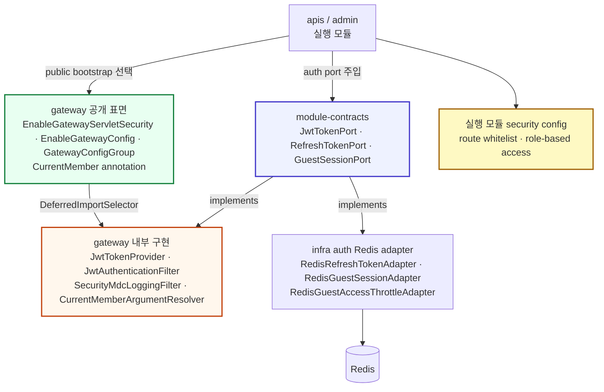
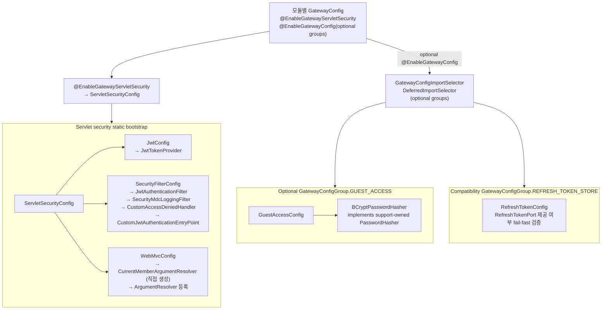
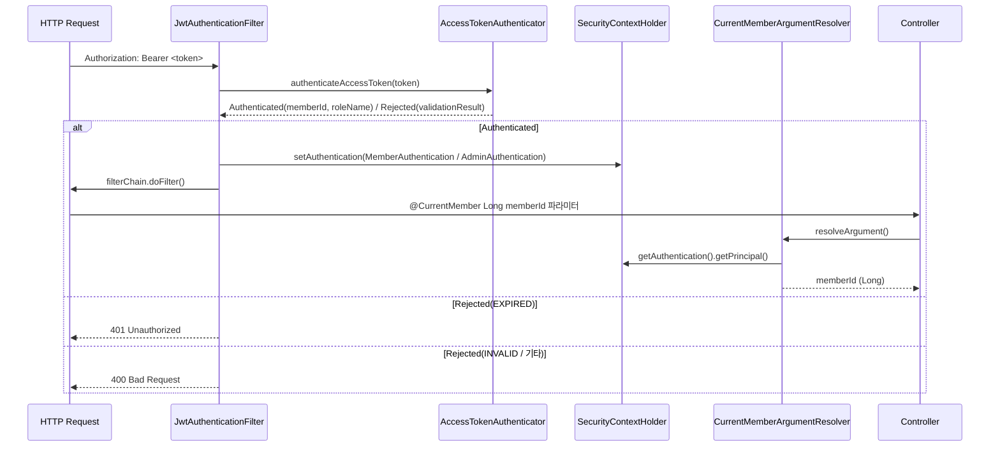
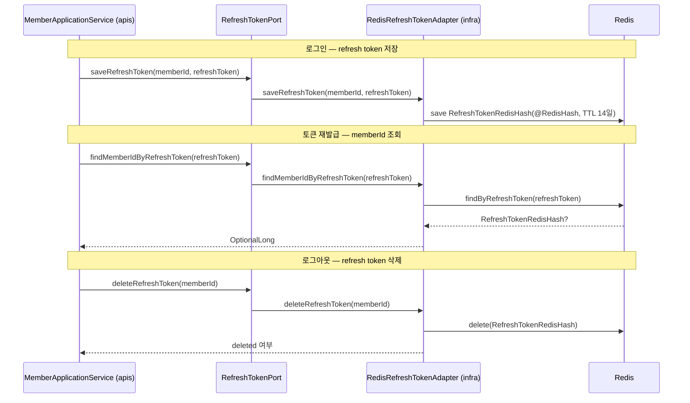

# gateway module

`gateway`는 BEAT의 **인증/인가 진입 어댑터 모듈**입니다.
JWT 발급/검증, 인증 필터, 인가 실패 처리, 현재 사용자 principal 변환처럼
여러 실행 모듈이 공통으로 필요한 보안 primitive를 소유합니다.

`gateway`는 아래 구현 세부사항을 모릅니다.

- 비즈니스 규칙, UseCase, ApplicationService
- JPA Entity / Spring Data Repository
- 외부 API adapter (Kakao, Slack, S3, SMS)
- 배치 잡 / 스케줄러

> 핵심 원칙: 실행 모듈은 `gateway`의 내부 구현 패키지를 직접 import하지 않습니다.
> 공개 표면 (`EnableGatewayServletSecurity`, `EnableGatewayConfig`, `GatewayConfigGroup`, `CurrentMember`, `module-contracts auth port`) 만을 통해 인증 경계를 사용합니다.

### 패키지 구조 규칙 (G1~G5)

`gateway`는 기술 레이어가 아니라 **인증 capability**로 패키지를 나눕니다. Spring Modulith 컨벤션(모듈
base package = API, 하위 package = internal)을 모듈 내부에 적용한 형태입니다.

- **G1 · Public surface 단일화** — 실행 모듈이 import 가능한 것은 `com.beat.gateway` 루트의 bootstrap/annotation
  타입(`@EnableGatewayServletSecurity`, `@EnableGatewayConfig`, `GatewayConfigGroup`, `@CurrentMember`)뿐입니다.
  행위 계약은 `gateway`가 아니라 `module-contracts`의 port로 노출합니다.
- **G2 · Capability-first** — 내부는 인증 capability로 1차 분할합니다: `jwt`, `guest`,
  `authentication`(servlet 필터/인가/principal).
- **G3 · Internal 경계 단일 규칙** — 각 capability 구현은 예외 없이 `<capability>.internal` 아래에 둡니다. 실행
  모듈은 물론 다른 capability도 이를 직접 import하지 않습니다.
- **G4 · Config 동거** — capability를 구성하는 `@Configuration`은 그 capability의
  `internal.config`에 둡니다. Redis 저장 구현은 `infra.redis.auth`가 소유합니다.
- **G5 · Bootstrap 공유만 예외** — optional capability selector인 `GatewayConfigImportSelector`만
  `gateway.shared.internal`에 둡니다. 이것이 유일하게 허용되는 non-capability
  패키지입니다.

```text
com.beat.gateway
├─ (root, public)          EnableGatewayServletSecurity · EnableGatewayConfig · GatewayConfigGroup · CurrentMember
├─ jwt.internal            JwtTokenProvider · JwtTokenParser · JwtTokenIssuer
│                          JwtSigningKeyHolder · JwtProperties (+ config/JwtConfig)
├─ refreshtoken.internal   config/RefreshTokenConfig                   (RefreshTokenPort fail-fast requirement)
├─ guest.internal          config/GuestAccessConfig
├─ com.beat.support.security.password PasswordHasher · internal/BCryptPasswordHasher
├─ authentication.internal JwtAuthenticationFilter · SecurityMdcLoggingFilter · Custom*Handler
│                          CurrentMemberArgumentResolver · MemberAuthentication · AdminAuthentication
│                                                                     (+ config/ServletSecurityConfig·SecurityFilterConfig·WebMvcConfig)
└─ shared.internal         GatewayConfigImportSelector
```

---

## 1. 이 문서를 읽는 방법

새 보안 코드를 추가하거나 기존 코드를 이동할 때 아래 질문에 먼저 답합니다.

```text
1. 이것은 JWT 생성/검증 primitive인가?
2. 이것은 인증 필터 또는 인가 실패 처리인가?
3. 이것은 현재 사용자 identity를 controller에 전달하기 위한 것인가?
4. 이것은 Redis에 상태를 저장하는 인증 out adapter인가?
5. 이것은 guest 비밀번호 해시 같은 gateway security primitive인가?
6. 이것은 route whitelist 또는 역할 기반 라우팅 정책인가?
```

| 질문 | 위치 |
| --- | --- |
| JWT 발급/검증 구현 | `gateway.jwt.internal` |
| 인증 필터, 인가 핸들러, principal resolver | `gateway.authentication.internal` |
| Refresh token/guest session/throttle Redis adapter | `infra.redis.auth` |
| Guest 비밀번호 해시 primitive | `gateway.guest.internal` |
| Optional gateway import selector | `gateway.shared.internal` |
| JWT/refresh token/guest 계약 정의 | `com.beat.contracts.auth` (`module-contracts`) |
| Route whitelist, 역할 기반 접근 정책 | 각 실행 모듈 security config (`apis`, `admin`) |
| SecurityContext 기반 MDC userId 추출 | `gateway.authentication.internal.SecurityMdcLoggingFilter` |
| 비즈니스 로그인/로그아웃 흐름 | 실행 모듈 application service |

---

## 2. 전체 레이어에서 gateway의 위치


```mermaid
flowchart TB
    Apis[apis / admin<br/>실행 모듈]
    GatewayPublic[gateway 공개 표면<br/>EnableGatewayServletSecurity · EnableGatewayConfig · GatewayConfigGroup<br/>CurrentMember annotation]
    Contracts[module-contracts<br/>JwtTokenPort · RefreshTokenPort · GuestSessionPort]
    GatewayInternal[gateway 내부 구현<br/>JwtTokenProvider · JwtAuthenticationFilter<br/>SecurityMdcLoggingFilter · CurrentMemberArgumentResolver]
    InfraAuthRedis[infra auth Redis adapter<br/>RedisRefreshTokenAdapter · RedisGuestSessionAdapter<br/>RedisGuestAccessThrottleAdapter]
    Redis[(Redis)]
    ModuleSecurityConfig[실행 모듈 security config<br/>route whitelist · role-based access]

    Apis -->|public bootstrap 선택| GatewayPublic
    Apis -->|auth port 주입| Contracts
    Apis --> ModuleSecurityConfig
    GatewayPublic -->|DeferredImportSelector| GatewayInternal
    Contracts -->|implements| GatewayInternal
    Contracts -->|implements| InfraAuthRedis
    InfraAuthRedis --> Redis

    style GatewayPublic fill:#e8fff1,stroke:#15803d,stroke-width:2px
    style Contracts fill:#eef2ff,stroke:#4338ca,stroke-width:2px
    style GatewayInternal fill:#fff7ed,stroke:#c2410c,stroke-width:2px
    style ModuleSecurityConfig fill:#fef9c3,stroke:#a16207,stroke-width:2px
```

### 레이어별 책임

| Layer | 책임 | 금지 |
| --- | --- | --- |
| 실행 모듈 | `@EnableGatewayServletSecurity`와 optional gateway primitive 선택, APIs에서 `AuthRedisConfig`로 Redis adapter 조립, route/role 정책 소유 | gateway/infra internal 직접 import |
| gateway 공개 표면 | 선택 가능한 config group, `@CurrentMember` annotation | 내부 구현 노출 |
| module-contracts | JWT/refresh token 계약 정의 | 실행 모듈 DTO, domain model 포함 |
| gateway 내부 구현 | JWT 구현, 인증 필터, guest 비밀번호 해시 | 비즈니스 정책, repository, Redis adapter |

---

## 3. Bootstrap 구조

실행 모듈은 servlet security를 `@EnableGatewayServletSecurity` public annotation으로 정적으로 선택합니다. `REFRESH_TOKEN_STORE`는 기존 공개 bootstrap 호환성을 유지하면서 `RefreshTokenPort` 제공 여부만 fail-fast 검증하고, 실제 Redis adapter는 실행 모듈의 `InfraConfig`에서 선택합니다. `GUEST_ACCESS`는 gateway가 소유하는 guest 비밀번호 해시를 활성화합니다.
`EnableGatewayServletSecurity`는 IDE/Spring analyzer가 따라갈 수 있는 public static import surface이고, 내부적으로 servlet security 대표 config를 직접 import합니다.


```mermaid
flowchart TB
    ModuleGatewayConfig["모듈별 GatewayConfig<br/>@EnableGatewayServletSecurity<br/>@EnableGatewayConfig(optional groups)"]
    Selector["GatewayConfigImportSelector<br/>DeferredImportSelector<br/>(optional groups)"]

    ServletBootstrap["@EnableGatewayServletSecurity<br/>→ ServletSecurityConfig"]

    subgraph SERVLET_BOOTSTRAP["Servlet security static bootstrap"]
        ServletSecurityConfig["ServletSecurityConfig"]
        JwtConfig["JwtConfig<br/>→ JwtTokenProvider"]
        SecurityConfig["SecurityFilterConfig<br/>→ JwtAuthenticationFilter<br/>→ SecurityMdcLoggingFilter<br/>→ CustomAccessDeniedHandler<br/>→ CustomJwtAuthenticationEntryPoint"]
        WebMvcConfig["WebMvcConfig<br/>→ CurrentMemberArgumentResolver (직접 생성)<br/>→ ArgumentResolver 등록"]
    end

    subgraph GUEST_ACCESS["Optional GatewayConfigGroup.GUEST_ACCESS"]
        GuestAccessConfig["GuestAccessConfig"]
        BCryptPasswordHasher["BCryptPasswordHasher<br/>implements support-owned PasswordHasher"]
    end

    subgraph REFRESH_TOKEN_STORE["Compatibility GatewayConfigGroup.REFRESH_TOKEN_STORE"]
        RefreshTokenConfig["RefreshTokenConfig<br/>RefreshTokenPort 제공 여부 fail-fast 검증"]
    end

    ModuleGatewayConfig --> ServletBootstrap
    ModuleGatewayConfig -->|optional @EnableGatewayConfig| Selector
    ServletBootstrap --> SERVLET_BOOTSTRAP
    Selector --> GUEST_ACCESS
    Selector --> REFRESH_TOKEN_STORE
    ServletSecurityConfig --> JwtConfig
    ServletSecurityConfig --> SecurityConfig
    ServletSecurityConfig --> WebMvcConfig
    GuestAccessConfig --> BCryptPasswordHasher
```

### 실행 모듈별 선택

| 모듈 | Servlet security bootstrap | Gateway optional group | `AuthRedisConfig` | 이유 |
| --- | --- | --- | --- | --- |
| `apis` | `@EnableGatewayServletSecurity` | `REFRESH_TOKEN_STORE`, `GUEST_ACCESS` | ✅ | 사용자/guest 인증 + refresh token 저장 |
| `admin` | `@EnableGatewayServletSecurity` | ❌ | ❌ | 관리자 JWT 인증만 |
| `batch` | ❌ | ❌ | ❌ | HTTP 인증 lane 없음 |

```kotlin
// apis/config/GatewayConfig.kt
@EnableGatewayServletSecurity
@EnableGatewayConfig(
    value = [
        GatewayConfigGroup.REFRESH_TOKEN_STORE,
        GatewayConfigGroup.GUEST_ACCESS,
    ],
)
class GatewayConfig

// admin/config/GatewayConfig.kt
@EnableGatewayServletSecurity
class GatewayConfig
```

---

## 4. 공개 표면

실행 모듈이 `gateway`에서 직접 import할 수 있는 것은 아래 공개 표면뿐입니다.

| 공개 타입 | 위치 | 용도 |
| --- | --- | --- |
| `@EnableGatewayServletSecurity` | `com.beat.gateway` | servlet security static bootstrap annotation |
| `@EnableGatewayConfig` | `com.beat.gateway` | optional config group 선택 annotation |
| `GatewayConfigGroup` | `com.beat.gateway` | `REFRESH_TOKEN_STORE` compatibility requirement / optional `GUEST_ACCESS` enum |
| `@CurrentMember` | `com.beat.gateway` | controller 파라미터에서 현재 사용자 memberId 추출 |

JWT/refresh token 계약은 `gateway`가 아니라 `module-contracts`에서 주입받습니다.

| 계약 | 위치 | 구현체 |
| --- | --- | --- |
| `JwtTokenPort` | `com.beat.contracts.auth.jwt` | `gateway.jwt.internal.JwtTokenProvider` |
| `RefreshTokenPort` | `com.beat.contracts.auth.refreshtoken` | `infra.redis.auth.refreshtoken.RedisRefreshTokenAdapter` |
| `GuestSessionPort` | `com.beat.contracts.auth.guest` | `infra.redis.auth.guest.RedisGuestSessionAdapter` |
| `GuestAccessThrottlePort` | `com.beat.contracts.auth.guest` | `infra.redis.auth.guest.RedisGuestAccessThrottleAdapter` |

`AccessTokenAuthenticator`는 구현(`JwtTokenProvider`)과 소비(`JwtAuthenticationFilter`)가 모두 `gateway`
안에서 완결되므로 `module-contracts`가 아니라 `gateway.jwt.internal`이 소유합니다. 필터가 토큰 1회 파싱으로
`memberId`/`roleName`을 얻기 위한 내부 계약이며, 실행 모듈에는 노출하지 않습니다.

---

## 5. JWT 인증 흐름
## 5.1 Security MDC logging 흐름

- `SecurityMdcLoggingFilter`가 JWT보다 먼저 실행되어 모든 요청/인증 실패 응답에도 trace/request MDC와 `X-Request-ID`를 보장합니다.
- `JwtAuthenticationFilter`는 토큰 검증 성공 후 `SecurityContextHolder`에 `Authentication`을 저장하고 MDC `userId`를 인증 사용자 id로 갱신합니다.
- 실행 모듈은 gateway 내부 클래스를 직접 import하지 않고 `@Qualifier("gatewaySecurityMdcLoggingFilter") OncePerRequestFilter`로 주입받습니다.
- `SecurityFilterConfig`는 `gatewaySecurityMdcLoggingFilter` bean과 disabled `FilterRegistrationBean`을 함께 제공해 Spring Boot servlet 자동 등록 중복을 방지합니다.



```mermaid
sequenceDiagram
    participant C as HTTP Request
    participant F as JwtAuthenticationFilter
    participant A as AccessTokenAuthenticator
    participant SC as SecurityContextHolder
    participant R as CurrentMemberArgumentResolver
    participant Ctrl as Controller

    C->>F: Authorization: Bearer <token>
    F->>A: authenticateAccessToken(token)
    A-->>F: Authenticated(memberId, roleName) / Rejected(validationResult)

    alt Authenticated
        F->>SC: setAuthentication(MemberAuthentication / AdminAuthentication)
        F->>C: filterChain.doFilter()
        C->>Ctrl: @CurrentMember Long memberId 파라미터
        Ctrl->>R: resolveArgument()
        R->>SC: getAuthentication().getPrincipal()
        R-->>Ctrl: memberId (Long)
    else Rejected(EXPIRED)
        F-->>C: 401 Unauthorized
    else Rejected(INVALID / 기타)
        F-->>C: 400 Bad Request
    end
```

`EXPIRED -> 401`, `INVALID -> 400`은 현재 클라이언트 호환 계약을 기록한 것이며 보편적 인증 Best Practice를 뜻하지 않습니다. 신규/버전업 API에서는 인증할 수 없는 credential을 일관되게 `401`로 매핑할지 ADR과 소비자 영향 분석 후 결정합니다.

### 인증 객체

| 클래스 | 조건 | 설명 |
| --- | --- | --- |
| `MemberAuthentication` | `ROLE_MEMBER` | 일반 사용자 인증 토큰 |
| `AdminAuthentication` | `ROLE_ADMIN` | 관리자 인증 토큰 |
| `UsernamePasswordAuthenticationToken` | 그 외 role | fallback |

---

## 6. Refresh token 흐름


```mermaid
sequenceDiagram
    participant App as MemberApplicationService (apis)
    participant Port as RefreshTokenPort
    participant Adapter as RedisRefreshTokenAdapter (infra)
    participant Redis as Redis

    Note over App,Redis: 로그인 — refresh token 저장
    App->>Port: saveRefreshToken(memberId, refreshToken)
    Port->>Adapter: saveRefreshToken(memberId, refreshToken)
    Adapter->>Redis: save RefreshTokenRedisHash(@RedisHash, TTL 14일)

    Note over App,Redis: 토큰 재발급 — memberId 조회
    App->>Port: findMemberIdByRefreshToken(refreshToken)
    Port->>Adapter: findMemberIdByRefreshToken(refreshToken)
    Adapter->>Redis: findByRefreshToken(refreshToken)
    Redis-->>Adapter: RefreshTokenRedisHash?
    Adapter-->>App: OptionalLong

    Note over App,Redis: 로그아웃 — refresh token 삭제
    App->>Port: deleteRefreshToken(memberId)
    Port->>Adapter: deleteRefreshToken(memberId)
    Adapter->>Redis: delete(RefreshTokenRedisHash)
    Adapter-->>App: deleted 여부
```

- `RefreshTokenRedisHash`는 `memberId`를 `@Id`로, `refreshToken` 문자열을 `@Indexed`로 저장합니다.
- 기존 운영 hash의 `_class` 호환을 위해 gateway 시절 FQCN을 `@TypeAlias`로 유지합니다.
- 조회 실패와 삭제 실패는 port의 값(`OptionalLong.empty`, `false`)으로 반환하고, application service가 기존 client 오류 계약으로 변환합니다.
- TTL은 14일 (1,209,600초)로 고정됩니다.
- `admin`은 `AuthRedisConfig`를 import하지 않고 Redis runtime dependency도 없으므로 Redis adapter와 auto-configuration이 올라오지 않습니다.

---

## 7. 패키지 구조

```text
gateway/
  src/main/kotlin/com/beat/gateway/
    EnableGatewayConfig.kt                # 공개: optional group 선택 annotation
    EnableGatewayServletSecurity.kt        # 공개: servlet security static bootstrap annotation
    GatewayConfigGroup.kt                  # 공개: REFRESH_TOKEN_STORE / GUEST_ACCESS group enum
    CurrentMember.kt                       # 공개: controller 파라미터 annotation
    jwt/internal/
      JwtTokenProvider.kt                  # implements JwtTokenPort
      JwtTokenParser.kt                    # 서명 및 tokenType 검증
      JwtTokenIssuer.kt                    # access/refresh token 발급
      JwtSigningKeyHolder.kt               # 서명 키 1회 파생 및 보관
      JwtProperties.kt                     # @ConfigurationProperties(prefix = "jwt")
      config/
        JwtConfig.kt                       # JwtTokenProvider bean 등록
    refreshtoken/internal/config/
      RefreshTokenConfig.kt                # RefreshTokenPort 제공 여부 fail-fast 검증
    guest/internal/config/
      GuestAccessConfig.kt                 # GUEST_ACCESS group entrypoint
  support/security/password/
    PasswordHasher.kt                      # public technical API
    internal/
      BCryptPasswordHasher.kt              # BCrypt + legacy verification/upgrade
    authentication/internal/
      JwtAuthenticationFilter.kt           # OncePerRequestFilter
      SecurityMdcLoggingFilter.kt          # observability BaseMdcLoggingFilter 확장
      CurrentMemberArgumentResolver.kt     # @CurrentMember → memberId 변환
      MemberAuthentication.kt              # ROLE_MEMBER 인증 토큰
      AdminAuthentication.kt               # ROLE_ADMIN 인증 토큰
      CustomAccessDeniedHandler.kt         # 403 처리
      CustomJwtAuthenticationEntryPoint.kt # 401 처리
      config/
        ServletSecurityConfig.kt           # servlet security static bootstrap entrypoint
        SecurityFilterConfig.kt            # JWT 필터 / 핸들러 / MDC filter bean + 자동 등록 방지
        WebMvcConfig.kt                    # ArgumentResolver 등록
    shared/internal/
      GatewayConfigImportSelector.kt       # DeferredImportSelector — optional group → internal config

  src/main/resources/
    application-jwt.yml                   # JWT secret / expire time property
```

### 패키지 경계 규칙

- `(root)` — 실행 모듈이 import하는 공개 annotation/enum만 둡니다 (G1).
- `<capability>.internal` — 각 capability 구현체. 실행 모듈은 물론 다른 capability도 직접 import 금지 (G3).
- `<capability>.internal.config` — 그 capability를 구성하는 `@Configuration` (G4).
- `shared.internal` — optional group import selector만 예외적으로 허용 (G5).

---

## 8. 허용 의존성

```text
global-support
module-contracts        # JwtTokenPort, RefreshTokenPort, TokenValidationResult 계약
observability           # BaseMdcLoggingFilter 확장
```

`gateway`는 `observability`의 `BaseMdcLoggingFilter`를 확장해 request correlation MDC를 제공합니다. `FilterRegistrationBean#setEnabled(false)`로 servlet container 자동 등록을 막고, `apis/admin`의 `SecurityFilterChain`에서 JWT보다 먼저 배치합니다. 인증 성공 후에는 `JwtAuthenticationFilter`가 MDC `userId`를 인증 사용자 id로 갱신합니다.

---

## 9. 금지 규칙

- `domain`, `infra`, `apis`, `admin`, `batch` 의존 금지
- 비즈니스 규칙, Repository, 외부 API adapter 보유 금지
- 실행 모듈이 `gateway.internal.*` 패키지를 직접 import하게 만들지 않습니다
- route whitelist, 역할 기반 라우팅 정책은 `gateway`가 소유하지 않습니다 — 각 실행 모듈 security config가 소유합니다
- `gateway`가 실행 모듈 DTO, domain model, application error code를 import하지 않습니다

---

## 10. Guard rails

### `ApisApplicationTest` / `AdminApplicationTest`

- 모듈 import 집합 고정 (`GatewayConfig`, `InfraConfig`, `ObservabilityModuleConfig`)
- `apis`가 `@EnableGatewayServletSecurity + REFRESH_TOKEN_STORE + GUEST_ACCESS`를 선택하고 `AuthRedisConfig`를 함께 제공하는지 확인
- `admin`이 optional gateway group과 Redis runtime/config를 가져가지 않는지 확인

### `ApisArchitectureGuardTest` / `AdminArchitectureGuardTest`

- `gateway.internal.*` import allowlist 위반 감지
- 허용 표면은 `EnableGatewayServletSecurity`, `EnableGatewayConfig`, `GatewayConfigGroup`, `gateway.CurrentMember`로 제한

### `BatchApplicationTest`

- `batch`가 `GatewayModuleConfig` (삭제됨) 또는 gateway bootstrap을 포함하지 않는지 확인

### `SharedBoundaryContractTest`

- gateway main source와 build dependency에 Redis 구현이 남지 않았는지 확인
- infra `AuthRedisConfig`가 narrow Redis repository만 활성화하는지 확인
- Redis hash가 기존 `_class`, keyspace, TTL, index 계약을 유지하는지 확인

---

## 11. 빠른 체크리스트

새 gateway 코드를 추가할 때 아래를 확인합니다.

- [ ] 이 코드가 진짜 인증/인가 primitive인가? 비즈니스 정책이 아닌가?
- [ ] 실행 모듈이 `gateway.internal.*`를 직접 import하게 만들지 않았는가?
- [ ] 새 공개 타입이 필요하다면 `security/servlet/` 또는 `module-contracts`에 두었는가?
- [ ] route whitelist / 역할 기반 접근 제어를 `gateway`에 두지 않았는가?
- [ ] `domain`, `infra`, `apis`, `admin`, `batch` import가 없는가?
- [ ] 새 optional config group이 필요하다면 `GatewayConfigGroup`에 추가하고 `DeferredImportSelector`가 자동으로 처리하는지 확인했는가?
- [ ] servlet security처럼 IDE-visible bootstrap이 필요한 surface는 public annotation/config로 노출했는가?
