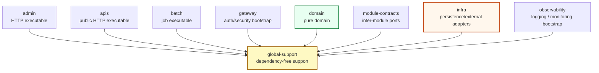
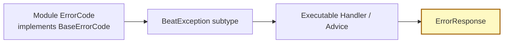

# global-support module guide

`global-support`는 BEAT의 **전역 공통 지원 모듈**입니다.
여러 모듈이 함께 사용하는 response envelope, 공통 exception 계층, 성공/실패 code contract, Kotlin/JDK 기반 순수 utility를 제공합니다.

`global-support`는 아래 구현 세부사항을 모릅니다.

- HTTP controller/advice/filter/interceptor 구현
- Spring MVC / Spring Security / Transaction runtime 정책
- JPA Entity / Spring Data Repository / QueryDSL / Redis 구현
- domain invariant / bounded context business policy
- infra adapter / external client 구현
- executable module별 success/error response language

> 핵심 원칙: `global-support`는 전역에서 재사용하는 dependency-free support surface입니다. 공통 response/exception/utility는 허용하지만, 특정 도메인·실행 모듈·framework runtime에 묶인 코드는 들어올 수 없습니다.

---

## 1. 이 문서를 읽는 방법

이 문서는 공통 응답, 예외, code interface, 순수 utility를 추가하거나 이동할 때 보는 기준서입니다.

먼저 아래 질문에 답합니다.

```text
1. 둘 이상의 모듈이 같은 support type을 필요로 하는가?
2. Kotlin/JDK 외 runtime 없이 설명되고 컴파일될 수 있는가?
3. 특정 bounded context의 비즈니스 규칙을 담지 않는가?
4. 실행 모듈별 응답 문구나 API scenario가 아니라 공통 support surface인가?
5. 장기간 유지해도 되는 monorepo 내부 public namespace인가?
```

답에 따라 위치가 달라집니다.

| 질문 | 위치 |
| --- | --- |
| 공통 응답 envelope | `src/main/kotlin/com/beat/global/support/response` |
| 공통 예외 base / status-specific exception | `src/main/kotlin/com/beat/global/support/exception` |
| 성공/실패 코드 interface | `src/main/kotlin/com/beat/global/support/exception/base` |
| 순수 문자열/날짜/랜덤 helper | `src/main/kotlin/com/beat/global/support/util` |
| context별 domain rule error code | `domain/<context>/exception` |
| 실행 모듈별 success/error response language | `apis` / `admin` / `batch` |
| 인증/인가 runtime contract | `gateway` 또는 `module-contracts/auth` |
| persistence/external adapter contract | `module-contracts` + `infra` 구현 |

---

## 2. 전체 레이어에서 global-support의 위치



`global-support`는 다른 모듈이 의존할 수 있는 하위 지원 계층입니다. 반대로 `global-support`가 실행 모듈, domain, infra, gateway, observability, module-contracts를 의존해서는 안 됩니다.

---

## 3. 현재 모듈 계약

| 영역 | 현재 계약 |
| --- | --- |
| 실행 형태 | 실행 모듈이 아닌 library module |
| Gradle plugin | `beat.library` |
| Public namespace | `com.beat.global.support.*` |
| Language | Kotlin |
| Dependency posture | dependency-free support module |
| Response envelope | `ErrorResponse`, `SuccessResponse<T>` |
| Exception hierarchy | `BeatException` + status-specific exception |
| Code contract | `BaseErrorCode`, `BaseSuccessCode` |
| Utility scope | Kotlin/JDK 기반 순수 utility만 허용 |
| Runtime ownership | 없음. Controller advice, filter, security, transaction을 소유하지 않음 |

---

## 4. 역할과 책임

`global-support`가 소유하는 것:

- dependency-free API response envelope
- 공통 예외 계층의 base type
- 상태별 공통 exception wrapper
- module별 error/success code가 구현할 최소 interface
- 여러 모듈에서 재사용하는 순수 utility
- `com.beat.global.support.*` public namespace

`global-support`가 소유하지 않는 것:

- Controller, handler, advice, interceptor, filter
- `HttpStatus`, `ResponseEntity`, `Page`, `Pageable` 같은 framework/runtime type
- domain invariant, permission, ownership, actor 검증 규칙
- context별 `ErrorCode` / 실행 모듈별 `SuccessCode`
- JPA entity, repository, query adapter, Redis document
- 외부 API DTO, client, retry/backoff 정책
- 로그, 모니터링, tracing bootstrap
- 특정 모듈만 쓰는 helper 또는 adapter 구현 helper

---

## 5. 현재 패키지 구조

```text
global-support/
  build.gradle.kts
  src/main/kotlin/com/beat/global/support/
    response/
      ErrorResponse.kt
      SuccessResponse.kt
    exception/
      BeatException.kt
      BadRequestException.kt
      ConflictException.kt
      ForbiddenException.kt
      NotFoundException.kt
      UnauthorizedException.kt
      base/
        BaseErrorCode.kt
        BaseSuccessCode.kt
    util/          # optional: 순수 utility가 필요할 때 생성
```

### 패키지 규칙

- `com.beat.global.support.*`는 이 모듈의 public namespace입니다.
- package rename은 API 호환성 검토 없이 진행하지 않습니다.
- 특정 모듈 이름이 들어간 package를 만들지 않습니다. 예: `admin`, `domain`, `infra`, `gateway`.
- framework adapter package를 만들지 않습니다. 예: `web`, `mvc`, `jpa`, `redis`, `security`.
- utility는 `util/<purpose>` 아래에 두고, 하나의 모듈만 쓰는 helper는 해당 모듈에 둡니다.

---

## 6. 소유 타입 명세

### 6.1 Response envelope

```text
com.beat.global.support.response.ErrorResponse
com.beat.global.support.response.SuccessResponse<T>
```

역할:

- 모든 실행 모듈이 공유할 수 있는 최소 응답 envelope를 제공합니다.
- `status`, `message`, `data`처럼 transport-agnostic한 값만 담습니다.
- `BaseErrorCode`, `BaseSuccessCode`를 입력받아 envelope를 만드는 factory를 제공합니다.

금지:

- Spring `HttpStatus`, `ResponseEntity`, annotation 의존
- request path, timestamp, validation detail처럼 실행 모듈 정책이 필요한 필드 무분별 추가
- domain model, JPA entity, query projection 직접 포함
- admin/apis/batch 전용 메시지나 code enum 직접 소유

### 6.2 Exception hierarchy

```text
com.beat.global.support.exception.BeatException
com.beat.global.support.exception.BadRequestException
com.beat.global.support.exception.UnauthorizedException
com.beat.global.support.exception.ForbiddenException
com.beat.global.support.exception.NotFoundException
com.beat.global.support.exception.ConflictException
```

역할:

- `BaseErrorCode`를 담는 공통 exception wrapper를 제공합니다.
- status별 exception class는 의미 분류만 담당합니다.
- 실제 예외를 HTTP response로 변환하는 정책은 실행 모듈의 handler/advice가 소유합니다.

금지:

- controller advice 또는 exception handler 구현
- logging/tracing side effect
- repository lookup, actor validation, permission policy 직접 판단
- 외부 시스템 장애를 API 언어로 번역하는 adapter 정책

### 6.3 Base code contract

```text
com.beat.global.support.exception.base.BaseErrorCode
com.beat.global.support.exception.base.BaseSuccessCode
```

역할:

- module별 error/success enum이 구현해야 하는 최소 interface입니다.
- `getStatus()`, `getMessage()`만 요구합니다.
- enum 자체의 소유권은 각 모듈에 둡니다.

### 6.4 Pure utility

허용 예시:

- 문자열 format/normalization helper
- 날짜/시간 계산 helper
- random/token primitive helper
- Kotlin/JDK collection/value helper

금지 예시:

- domain policy가 들어간 calculator/validator
- Spring bean, annotation, property binding 기반 utility
- JPA/Redis/S3/Slack 같은 adapter helper
- 실행 모듈 request/response shape에 종속된 mapper

---

## 7. 의존성 규칙

### 허용 의존성

원칙적으로 아래만 허용합니다.

```text
Kotlin standard library
JDK standard library
```

새 dependency가 필요하면 `global-support`가 아니라 소유 모듈 내부 구현 또는 별도 모듈이 맞는지 먼저 검토합니다.

### 금지 규칙

- project dependency 추가 금지
  - `project(":apis")`
  - `project(":admin")`
  - `project(":batch")`
  - `project(":gateway")`
  - `project(":domain")`
  - `project(":infra")`
  - `project(":module-contracts")`
  - `project(":observability")`
- Spring/Jakarta runtime 의존 금지
  - `org.springframework.*`
  - `jakarta.servlet.*`
  - `ResponseEntity`, `HttpStatus`, `ControllerAdvice`
- persistence/external 구현 의존 금지
  - `jakarta.persistence.*`
  - `org.springframework.data.*`
  - `com.querydsl.*`
  - Redis client/document type
- reflection runtime 의존 금지
  - `kotlin-reflect`
- executable/domain/infra package import 금지
  - `com.beat.admin.*`
  - `com.beat.apis.*`
  - `com.beat.batch.*`
  - `com.beat.domain.*`
  - `com.beat.infra.*`
  - `com.beat.gateway.*`

---

## 8. 타입 입장 규칙

새 코드가 `global-support`에 들어오려면 아래 조건을 모두 만족해야 합니다.

| 조건 | 설명 |
| --- | --- |
| 공유성 | 둘 이상의 모듈이 같은 support type을 필요로 함 |
| 중립성 | framework, runtime, bounded context에 종속되지 않음 |
| 안정성 | monorepo 내부 public type으로 장기간 유지 가능함 |
| 최소성 | 현재 필요한 필드와 method만 포함함 |
| 소유권 명확성 | 더 구체적인 소유 모듈이 없음 |

판단 기준:

```text
허용:
BaseErrorCode처럼 여러 모듈의 enum이 구현하는 최소 interface
ErrorResponse처럼 transport-neutral한 응답 envelope
BeatException처럼 BaseErrorCode를 담는 공통 exception base
String/Date/Random처럼 Kotlin/JDK 기반 순수 utility

금지:
AdminSuccessCode처럼 실행 모듈 전용 응답 언어
PerformanceErrorCode처럼 context invariant를 담는 domain code
JpaBaseEntity처럼 persistence model base type
CurrentMember처럼 security runtime adapter type
S3UploadHelper처럼 infra adapter에 묶인 helper
```

---

## 9. 사용 규칙

### 9.1 실행 모듈에서의 사용



규칙:

- 실행 모듈은 자신이 소유한 `ErrorCode` / `SuccessCode` enum을 정의합니다.
- enum은 `BaseErrorCode` 또는 `BaseSuccessCode`를 구현할 수 있습니다.
- response 변환은 실행 모듈 handler/advice/controller boundary에서 수행합니다.
- `global-support`에 실행 모듈 전용 status/message enum을 추가하지 않습니다.

### 9.2 domain에서의 사용

규칙:

- domain은 순수 규칙 위반을 표현하는 error code만 소유합니다.
- domain error code가 필요하면 `BaseErrorCode`를 구현할 수 있습니다.
- domain model은 `ErrorResponse`, `SuccessResponse`를 만들지 않습니다.
- 현 계약상 domain error code도 `BaseErrorCode.getStatus()` 값을 제공할 수 있지만, domain model이 response를 만들거나 HTTP 변환 정책을 직접 소유하지 않습니다.
- status/message를 API 응답으로 해석하고 변환하는 책임은 application/executable boundary에서 다룹니다.

### 9.3 infra에서의 사용

규칙:

- infra는 adapter 실패를 그대로 global exception으로 일반화하지 않습니다.
- 외부 시스템/DB/Redis 세부 실패는 adapter 또는 호출 use-case의 언어로 번역합니다.
- persistence entity나 external DTO가 `global-support` response envelope를 필드로 갖지 않습니다.

---

## 10. 변경 체크리스트

```text
[ ] 더 구체적인 소유 모듈이 없는가?
[ ] Kotlin/JDK 외 dependency가 필요하지 않은가?
[ ] Spring/JPA/Redis/HTTP runtime type을 import하지 않는가?
[ ] context별 비즈니스 규칙이나 실행 모듈별 문구를 담지 않는가?
[ ] public namespace 변경 또는 response shape 변경의 호환성 영향을 검토했는가?
[ ] 기존 response/exception/utility 구조로 충분하지 않은가?
[ ] boundary guard test를 통과하는가?
```

호환성 주의:

- `ErrorResponse` / `SuccessResponse` 필드 변경은 API 응답 JSON shape에 영향을 줄 수 있습니다.
- `BaseErrorCode` / `BaseSuccessCode` method 변경은 여러 모듈 enum 구현체를 깨뜨릴 수 있습니다.
- `BeatException.baseErrorCode` 변경은 handler/advice 변환 로직을 깨뜨릴 수 있습니다.

---

## 11. Guardrail test와 검증

현재 경계는 root의 `SharedBoundaryContractTest`와 `transitionBoundaryTest`로 보호합니다.

일반 변경 후 최소 검증:

```bash
./gradlew :global-support:compileKotlin --no-daemon
./gradlew transitionBoundaryTest --no-daemon
```

구조 변경 또는 public contract 변경 후 권장 검증:

```bash
./gradlew :apis:test --tests com.beat.apis.ApisArchitectureGuardTest --no-daemon
./gradlew :admin:test --tests com.beat.admin.AdminArchitectureGuardTest --no-daemon
./gradlew :batch:test --tests com.beat.batch.BatchArchitectureGuardTest --no-daemon
./gradlew check --no-daemon
```

---

## 12. Migration note

현재 문서는 public namespace를 `com.beat.global.support.*`로 정리한 이후의 기준서입니다.

- `global-support`는 response/exception/base contract와 순수 utility를 함께 소유합니다.
- `com.beat.global.support.*`는 현재 모듈의 public namespace입니다.
- `global-support`는 runtime lane import 없이 dependency-free support module로 남아야 합니다.

---

## 13. 빠른 판단표

| 추가하려는 것 | `global-support` 여부 | 이유 |
| --- | --- | --- |
| `BaseErrorCode` 공통 method 보강 | 신중히 가능 | 모든 구현체와 response 변환 영향 검토 필요 |
| `ErrorResponse` factory 추가 | 가능 | dependency-free envelope 편의이며 shape 불변이면 안전 |
| `StringUtils` / `DateUtils` / `RandomUtil` | 가능 | 둘 이상의 모듈에서 쓰는 Kotlin/JDK 기반 순수 utility라면 허용 |
| `AdminSuccessCode` | 불가 | admin response boundary 소유 |
| `PerformanceErrorCode` | 불가 | performance domain rule 소유 |
| `CurrentMember` | 불가 | gateway/security runtime contract |
| `JpaBaseEntity` | 불가 | persistence 구현 세부사항 |
| 외부 API 실패 DTO | 불가 | infra/module-contracts 경계에서 검토 |

`global-support`는 전역 지원 코드만 담습니다. 공통으로 보인다는 이유만으로 올리지 말고, 더 구체적인 소유권이 없는 dependency-free support type인지 먼저 확인합니다.
