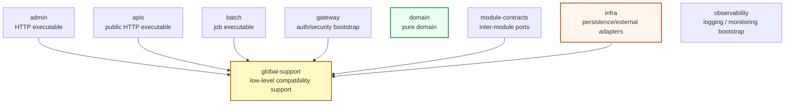
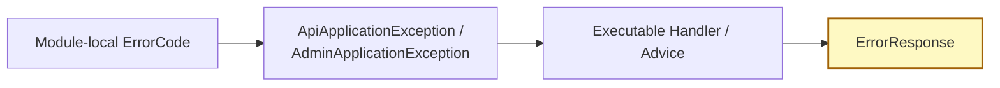

# global-support module guide

`global-support`는 BEAT의 **전역 공통 지원 모듈**입니다.
여러 모듈이 함께 사용하는 response envelope, `SuccessCode`, 이미지 URL 직렬화 확장과 소규모 utility를 제공합니다.

`global-support`는 아래 구현 세부사항을 모릅니다.

- HTTP controller/advice/filter/interceptor 구현
- Spring MVC / Spring Security / Transaction runtime 정책
- JPA Entity / Spring Data Repository / QueryDSL / Redis 구현
- domain invariant / bounded context business policy
- infra adapter / external client 구현
- executable module별 success/error response language

> 핵심 원칙: `global-support`는 프로젝트 모듈에 의존하지 않는 저수준 호환성 surface입니다. 현재 Jackson 3 직렬화 확장을 위해 `compileOnly` 의존성은 사용합니다. 특정 도메인·실행 모듈·Spring runtime 정책은 들어올 수 없습니다.

---

## 1. 이 문서를 읽는 방법

이 문서는 공통 응답, success code interface, 순수 utility를 추가하거나 이동할 때 보는 기준서입니다.

먼저 아래 질문에 답합니다.

```text
1. 둘 이상의 모듈이 같은 support type을 필요로 하는가?
2. Kotlin/JDK만으로 설명되는가? 아니라면 현재 허용된 Jackson 직렬화 확장인가?
3. 특정 bounded context의 비즈니스 규칙을 담지 않는가?
4. 실행 모듈별 응답 문구나 API scenario가 아니라 공통 support surface인가?
5. 장기간 유지해도 되는 monorepo 내부 public namespace인가?
```

답에 따라 위치가 달라집니다.

| 질문 | 위치 |
| --- | --- |
| 공통 응답 envelope | `src/main/kotlin/com/beat/global/support/response` |
| 공통 success code interface | `src/main/kotlin/com/beat/global/support/response/SuccessCode.kt` |
| application exception/error contract | `apis/exception` 또는 `admin/exception` |
| 이미지 key helper | `src/main/kotlin/com/beat/global/support/utils` |
| 공통 CDN URL 직렬화 annotation/serializer | `src/main/kotlin/com/beat/global/support/jackson` |
| context별 domain rule error code | `domain/<context>/exception` |
| 실행 모듈별 success/error response language | `apis` / `admin` / `batch` |
| 인증/인가 runtime contract | `gateway` 또는 `module-contracts/auth` |
| persistence/external adapter contract | `module-contracts` + `infra` 구현 |

---

## 2. 전체 레이어에서 global-support의 위치


```mermaid
flowchart TB
    Admin[admin<br/>HTTP executable]
    Apis[apis<br/>public HTTP executable]
    Batch[batch<br/>job executable]
    Gateway[gateway<br/>auth/security bootstrap]
    Domain[domain<br/>pure domain]
    Contracts[module-contracts<br/>inter-module ports]
    Infra[infra<br/>persistence/external adapters]
    Observability[observability<br/>logging / monitoring bootstrap]
    Global[global-support<br/>low-level compatibility support]

    Admin --> Global
    Apis --> Global
    Batch --> Global
    Gateway --> Global
    Contracts --> Global
    Infra --> Global

    style Global fill:#fef9c3,stroke:#a16207,stroke-width:2px
    style Domain fill:#e8fff1,stroke:#15803d,stroke-width:2px
    style Infra fill:#fff7ed,stroke:#c2410c,stroke-width:2px
```

`global-support`는 다른 모듈이 의존할 수 있는 하위 지원 계층입니다. 반대로 `global-support`가 실행 모듈, domain, infra, gateway, observability, module-contracts를 의존해서는 안 됩니다.

---

## 3. 현재 모듈 계약

| 영역 | 현재 계약 |
| --- | --- |
| 실행 형태 | 실행 모듈이 아닌 library module |
| Gradle plugin | `beat.library` |
| Public namespace | `com.beat.global.support.*` |
| Language | Kotlin |
| Dependency posture | project dependency 없음, Jackson 3 `compileOnly` 허용 |
| Response envelope | `ErrorResponse`, `SuccessResponse<T>` |
| Success contract | `SuccessCode` |
| Utility scope | 이미지 key helper와 CDN URL Jackson 직렬화 확장 |
| Runtime ownership | 없음. Controller advice, filter, security, transaction을 소유하지 않음 |

---

## 4. 역할과 책임

`global-support`가 소유하는 것:

- API 호환 response envelope
- 실행 모듈별 success enum이 구현하는 최소 `SuccessCode` interface
- 여러 모듈에서 재사용하는 이미지 key helper와 Jackson 직렬화 확장
- `com.beat.global.support.*` public namespace

`global-support`가 소유하지 않는 것:

- Controller, handler, advice, interceptor, filter
- `HttpStatus`, `ResponseEntity`, `Page`, `Pageable` 같은 framework/runtime type
- domain invariant, permission, ownership, actor 검증 규칙
- `ApplicationException`, `ApplicationErrorCode`, `ApplicationErrorType`
- context별 application `ErrorCode` / 실행 모듈별 success enum
- JPA entity, repository, query adapter, Redis document
- 외부 API DTO, client, retry/backoff 정책
- 로그, 모니터링, tracing bootstrap
- 특정 모듈만 쓰는 helper 또는 adapter 구현 helper

---

## 5. 현재 패키지 구조

```text
global-support/
  build.gradle.kts
  src/main/kotlin/com/beat/global/support/
    response/
      ErrorResponse.kt
      SuccessResponse.kt
      SuccessCode.kt
    jackson/
      CdnImageUrl.kt
      CdnImageUrlSerializer.kt
    utils/
      ImageKeyExtractor.kt
```

### 패키지 규칙

- `com.beat.global.support.*`는 이 모듈의 public namespace입니다.
- package rename은 API 호환성 검토 없이 진행하지 않습니다.
- 특정 모듈 이름이 들어간 package를 만들지 않습니다. 예: `admin`, `domain`, `infra`, `gateway`.
- framework adapter package를 만들지 않습니다. 예: `web`, `mvc`, `jpa`, `redis`, `security`.
- 현재 helper는 `utils`에 두며, 하나의 모듈만 쓰는 helper는 해당 모듈에 둡니다. 새 범용 utility package를 관성적으로 확장하지 않습니다.

---

## 6. 소유 타입 명세

### 6.1 Response envelope

```text
com.beat.global.support.response.ErrorResponse
com.beat.global.support.response.SuccessResponse<T>
```

역할:

- 모든 실행 모듈이 공유할 수 있는 최소 응답 envelope를 제공합니다.
- 기존 HTTP API가 사용하는 `status`, `message`, `data` JSON shape를 보존합니다.
- 실행 모듈이 결정한 status/message로 envelope를 만드는 factory를 제공합니다.
- RFC 9457 `ProblemDetail`은 현재 API의 대체 응답이 아닙니다. 도입하려면 별도 API version, 소비자 전환, OpenAPI/contract test와 deprecation 계획이 먼저 필요합니다.

금지:

- Spring `HttpStatus`, `ResponseEntity`, annotation 의존
- request path, timestamp, validation detail처럼 실행 모듈 정책이 필요한 필드 무분별 추가
- domain model, JPA entity, query projection 직접 포함
- admin/apis/batch 전용 메시지나 code enum 직접 소유

### 6.2 Success contract

```text
com.beat.global.support.response.SuccessCode
```

역할:

- 실행 모듈의 success enum이 제공할 `status`와 `message`의 최소 shape를 정의합니다.
- `SuccessResponse` factory가 기존 성공 응답 JSON 계약을 유지하는 데 사용합니다.
- 실제 성공 문구와 status enum은 `apis`/`admin`의 각 API response boundary가 소유합니다.

금지:

- application error/exception 계약 추가
- 실행 모듈 또는 feature 전용 success enum 추가
- Spring `HttpStatus`나 `ResponseEntity` 추가

### 6.3 Jackson extension

`CdnImageUrl`과 `CdnImageUrlSerializer`는 Jackson 3을 사용하는 실행 모듈의 JSON 직렬화 확장입니다. 이는 순수 utility가 아니라 presentation adapter 성격의 현재 호환 계약입니다. serializer 설정을 전역 mutable 상태로 추가 확장하지 않으며, 후속 분리 시에는 실행 모듈/shared-web의 instance-configured serializer를 우선합니다.

### 6.4 Utility

허용 예시:

- 문자열 format/normalization helper
- 날짜/시간 계산 helper
- random/token primitive helper
- Kotlin/JDK collection/value helper

금지 예시:

- domain policy가 들어간 calculator/validator
- Spring bean, annotation, property binding 기반 utility
- JPA/Redis/S3/Slack 같은 adapter helper
- 실행 모듈 request/response shape에 종속된 mapper

---

## 7. 의존성 규칙

### 허용 의존성

원칙적으로 아래만 허용합니다.

```text
Kotlin standard library
JDK standard library
Jackson 3 databind (`compileOnly`, 기존 CDN 직렬화 확장에 한함)
```

새 dependency가 필요하면 `global-support`가 아니라 소유 모듈 내부 구현 또는 별도 모듈이 맞는지 먼저 검토합니다.

### 금지 규칙

- project dependency 추가 금지
  - `project(":apis")`
  - `project(":admin")`
  - `project(":batch")`
  - `project(":gateway")`
  - `project(":domain")`
  - `project(":infra")`
  - `project(":module-contracts")`
  - `project(":observability")`
- Spring/Jakarta runtime 의존 금지
  - `org.springframework.*`
  - `jakarta.servlet.*`
  - `ResponseEntity`, `HttpStatus`, `ControllerAdvice`
- persistence/external 구현 의존 금지
  - `jakarta.persistence.*`
  - `org.springframework.data.*`
  - `com.querydsl.*`
  - Redis client/document type
- reflection runtime 의존 금지
  - `kotlin-reflect`
- executable/domain/infra package import 금지
  - `com.beat.admin.*`
  - `com.beat.apis.*`
  - `com.beat.batch.*`
  - `com.beat.domain.*`
  - `com.beat.infra.*`
  - `com.beat.gateway.*`

---

## 8. 타입 입장 규칙

새 코드가 `global-support`에 들어오려면 아래 조건을 모두 만족해야 합니다.

| 조건 | 설명 |
| --- | --- |
| 공유성 | 둘 이상의 모듈이 같은 support type을 필요로 함 |
| 중립성 | 기본은 framework/runtime/bounded context 중립. 현재 Jackson 직렬화 확장만 명시적 예외 |
| 안정성 | monorepo 내부 public type으로 장기간 유지 가능함 |
| 최소성 | 현재 필요한 필드와 method만 포함함 |
| 소유권 명확성 | 더 구체적인 소유 모듈이 없음 |

판단 기준:

```text
허용:
ErrorResponse처럼 기존 HTTP API가 공유하는 호환 응답 envelope
SuccessCode처럼 기존 성공 응답 factory가 공유하는 최소 interface
ImageKeyExtractor처럼 side effect 없는 helper
CdnImageUrl처럼 현재 승인된 Jackson 직렬화 확장

금지:
ApplicationException처럼 실행 모듈의 use-case 실패를 나타내는 exception
ApplicationErrorCode/ApplicationErrorType처럼 실행 모듈 handler와 결합되는 오류 계약
AdminSuccessCode처럼 실행 모듈 전용 응답 언어
PerformanceErrorCode처럼 context invariant를 담는 domain code
JpaBaseEntity처럼 persistence model base type
CurrentMember처럼 security runtime adapter type
S3UploadHelper처럼 infra adapter에 묶인 helper
```

---

## 9. 사용 규칙

### 9.1 실행 모듈에서의 사용


```mermaid
flowchart LR
    ErrorCode[Module-local ErrorCode]
    Exception[ApiApplicationException /<br/>AdminApplicationException]
    Handler[Executable Handler / Advice]
    Response[ErrorResponse]

    ErrorCode --> Exception
    Exception --> Handler
    Handler --> Response

    style Response fill:#fef9c3,stroke:#a16207,stroke-width:2px
```

규칙:

- 실행 모듈은 자신이 소유한 `ErrorCode` / `SuccessCode` enum을 정의합니다.
- `apis`는 `ApiApplicationException`과 자체 `ApplicationErrorCode`/`ApplicationErrorType`을, `admin`은 `AdminApplicationException`과 자체 계약을 소유합니다.
- 각 success enum은 global-support의 `SuccessCode`를 구현합니다.
- response 변환은 실행 모듈 handler/advice/controller boundary에서 수행합니다.
- `global-support`에 실행 모듈 전용 status/message enum을 추가하지 않습니다.

### 9.2 domain에서의 사용

규칙:

- domain은 순수 규칙 위반을 표현하는 error code만 소유합니다.
- domain error code는 domain의 `DomainErrorCode`를 구현하며 실행 모듈의 `ApplicationErrorCode`를 구현하지 않습니다.
- domain은 `DomainException`을 던지고 `global-support`에 의존하지 않습니다.
- domain model은 `ErrorResponse`, `SuccessResponse`를 만들지 않습니다.
- HTTP status와 response envelope 변환은 `apis`/`admin` handler가 담당합니다.
- `ApplicationErrorCode`/`ApiApplicationException`/`AdminApplicationException`은 각 실행 모듈의 use-case 실패 계약이며 domain 계약이 아닙니다.

### 9.3 infra에서의 사용

규칙:

- infra는 adapter 실패를 그대로 global exception으로 일반화하지 않습니다.
- 외부 시스템/DB/Redis 세부 실패는 adapter 또는 호출 use-case의 언어로 번역합니다.
- persistence entity나 external DTO가 `global-support` response envelope를 필드로 갖지 않습니다.

---

## 10. 변경 체크리스트

```text
[ ] 더 구체적인 소유 모듈이 없는가?
[ ] Kotlin/JDK 외 dependency라면 현재 승인된 Jackson 직렬화 확장 범위인가?
[ ] Spring/JPA/Redis/HTTP runtime type을 import하지 않는가?
[ ] context별 비즈니스 규칙이나 실행 모듈별 문구를 담지 않는가?
[ ] public namespace 변경 또는 response shape 변경의 호환성 영향을 검토했는가?
[ ] 기존 response/success/utility 구조로 충분하지 않은가?
[ ] boundary guard test를 통과하는가?
```

호환성 주의:

- `ErrorResponse` / `SuccessResponse` 필드 변경은 API 응답 JSON shape에 영향을 줄 수 있습니다.
- `ProblemDetail` 반환은 field shape뿐 아니라 `application/problem+json` media type까지 바꿀 수 있으므로 현재 handler에 혼용하지 않습니다.
- `SuccessCode` method 변경은 여러 모듈 success enum 구현체를 깨뜨릴 수 있습니다.
- application exception/error 계약 변경은 `apis` 또는 `admin` 내부에서 해당 handler와 HTTP 계약을 함께 검증합니다.

---

## 11. Guardrail test와 검증

현재 경계는 root의 `SharedBoundaryContractTest`와 `transitionBoundaryTest`로 보호합니다.

일반 변경 후 최소 검증:

```bash
./gradlew :global-support:compileKotlin --no-daemon
./gradlew transitionBoundaryTest --no-daemon
```

구조 변경 또는 public contract 변경 후 권장 검증:

```bash
./gradlew :apis:test --tests com.beat.apis.ApisArchitectureGuardTest --no-daemon
./gradlew :admin:test --tests com.beat.admin.AdminArchitectureGuardTest --no-daemon
./gradlew :batch:test --tests com.beat.batch.BatchArchitectureGuardTest --no-daemon
./gradlew check --no-daemon
```

---

## 12. Migration note

현재 문서는 public namespace를 `com.beat.global.support.*`로 정리한 이후의 기준서입니다.

- `global-support`는 response envelope, `SuccessCode`, 순수 utility와 승인된 Jackson 직렬화 확장을 소유합니다.
- `com.beat.global.support.*`는 현재 모듈의 public namespace입니다.
- `global-support`는 다른 project module이나 Spring runtime lane을 import하지 않습니다. Jackson 3 `compileOnly`는 현재 CDN 직렬화 확장에만 허용합니다.

---

## 13. 빠른 판단표

| 추가하려는 것 | `global-support` 여부 | 이유 |
| --- | --- | --- |
| `SuccessCode` 공통 method 보강 | 신중히 가능 | 모든 success enum과 response 변환 영향 검토 필요 |
| `ApplicationErrorCode` 공통화 | 불가 | `apis`/`admin`이 서로 다른 HTTP 실행 경계의 오류 계약을 소유 |
| `ErrorResponse` factory 추가 | 신중히 가능 | 기존 API JSON shape와 모든 소비자 호환성 검증 필요 |
| `StringUtils` / `DateUtils` / `RandomUtil` | 가능 | 둘 이상의 모듈에서 쓰는 Kotlin/JDK 기반 순수 utility라면 허용 |
| `AdminSuccessCode` | 불가 | admin response boundary 소유 |
| `PerformanceErrorCode` | 불가 | performance domain rule 소유 |
| `CurrentMember` | 불가 | gateway/security runtime contract |
| `JpaBaseEntity` | 불가 | persistence 구현 세부사항 |
| 외부 API 실패 DTO | 불가 | infra/module-contracts 경계에서 검토 |

`global-support`는 전역 호환 지원 코드만 담습니다. 공통으로 보인다는 이유만으로 올리지 말고, 더 구체적인 소유권이 없는 저수준 contract인지 먼저 확인합니다.
