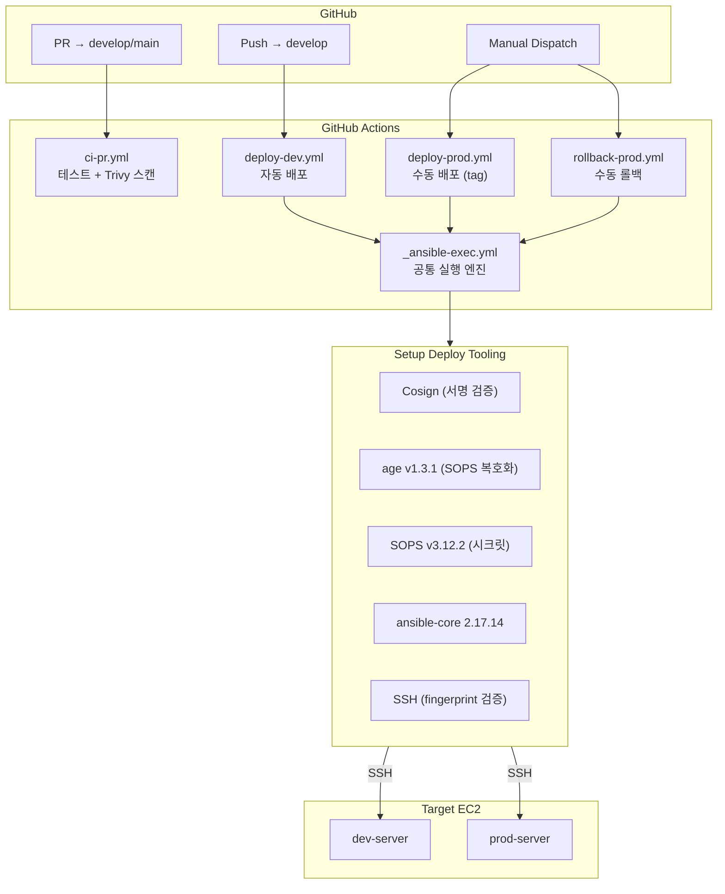
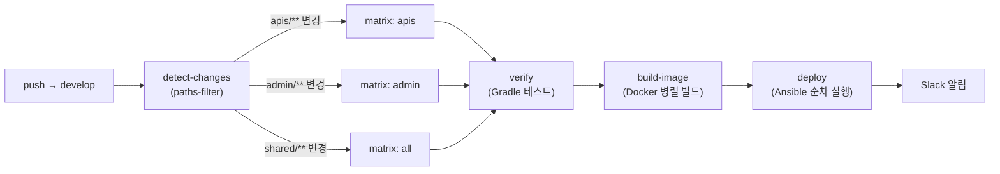
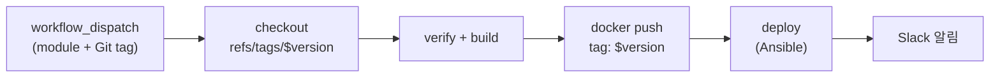
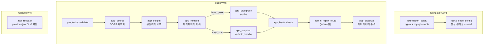
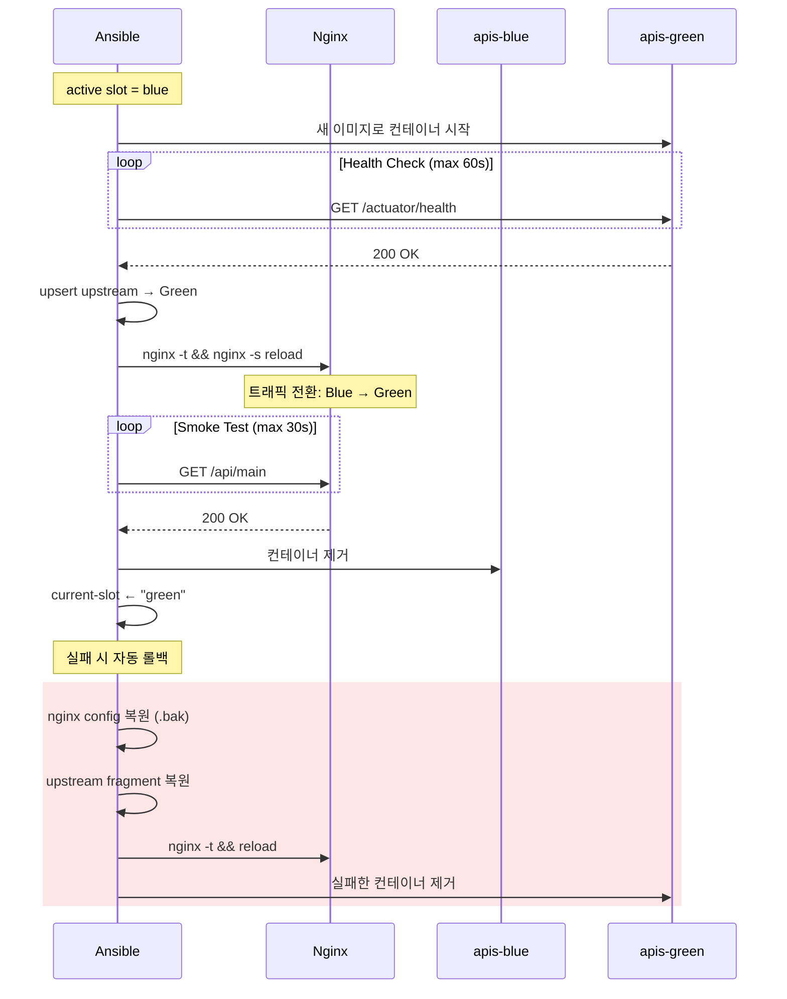
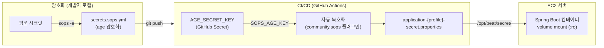
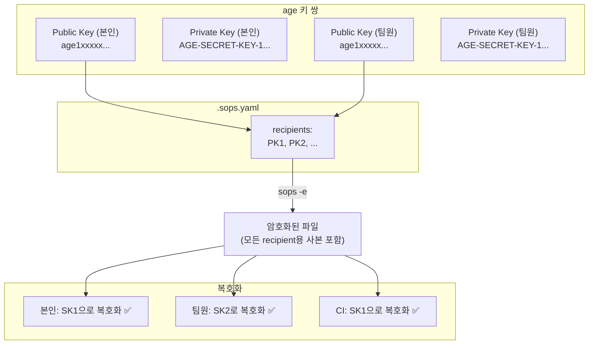
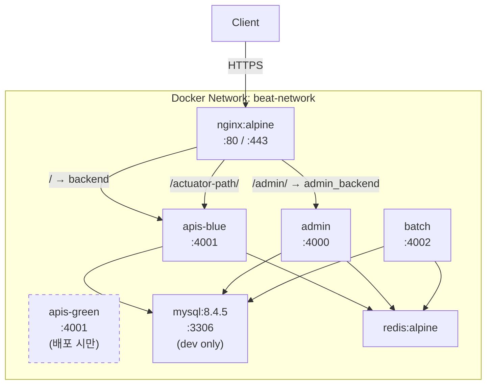
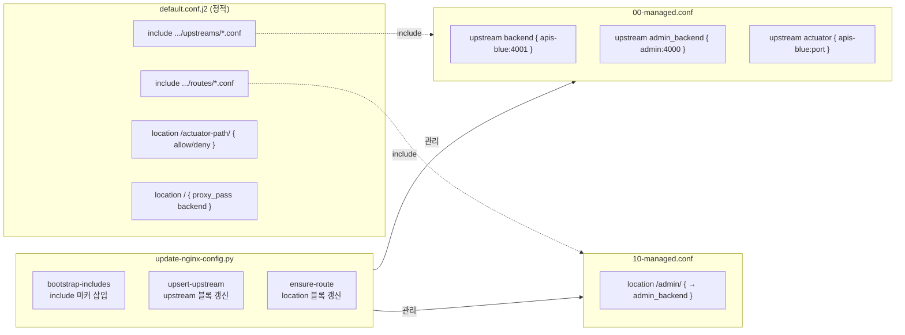
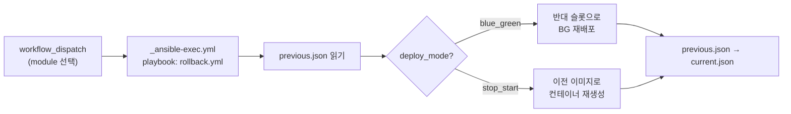

# infra module

> 이 문서는 `infra` 모듈의 최종 To-Be 계약을 정의한다. `infra`는 구현 기술과 외부 adapter의 집합소이며, 상위 유스케이스를 알면 안 된다.

## 역할

- JPA/QueryDSL/async 등 기술 설정을 소유한다.
- `domain` Repository Interface의 구현체를 제공한다.
- 외부 API client, 파일 저장소, 메시징, 서드파티 adapter를 구현한다.
- 실행 모듈이 필요한 기술 설정만 명시적으로 import할 수 있는 부트스트랩 진입점을 제공한다.

## 허용 의존성

- `domain`
- `global-utils`

## 금지 규칙

- `apis`, `admin`, `batch`, `gateway` 의존 금지
- UseCase, Controller, 앱 전용 DTO 보유 금지
- `domain` 모델 대신 infra entity/adapter 타입을 외부에 직접 노출 금지

## As-Is 패키지 구조

```text
infra/
  src/main/java/com/beat/infra/
    EnableInfraBaseConfig.java
    InfraBaseConfig.java
    InfraBaseConfigGroup.java
    InfraBaseConfigImportSelector.java      # DeferredImportSelector — enum → class 매핑
    config/
      AsyncConfig.java                      # AsyncConfigurer, @Import(TaskExecutorConfig)
      TaskExecutorConfig.java               # beatApplicationTaskExecutor 빈 생성
      TaskSchedulerConfig.java              # taskScheduler 빈 생성
      JpaConfig.java
      MysqlCustomDialect.java
      QueryDslConfig.java
      RedisCacheConfig.java
      ThreadPoolProperties.java
  src/main/kotlin/com/beat/infra/
    InfraModuleConfig.kt

legacy root:
  src/main/java/com/beat/domain/**/dao/
  src/main/java/com/beat/global/common/config/**
```

설명:
- `InfraBaseConfigImportSelector`가 `@EnableInfraBaseConfig`의 enum 값을 읽어 해당 `@Configuration` 클래스를 선택적으로 import한다.
- `AsyncConfig`는 `@Import(TaskExecutorConfig.class)`로 executor 빈만 전이 로드하고, infra는 security-aware wrapper를 직접 소유하지 않는다.
- scheduler bean은 `TaskSchedulerConfig` + `InfraBaseConfigGroup.SCHEDULER`로 분리되어 batch에서만 명시적으로 가져간다.
- Redis runtime wiring은 Spring Boot auto-configuration과 gateway-owned config가 담당하고, infra는 더 이상 gateway-specific Redis bean을 소유하지 않는다.
- future shared caching은 dormant `RedisCacheConfig` + `InfraBaseConfigGroup.REDIS_CACHE`에서 시작하고, 현재 실행 모듈은 아직 이를 import하지 않는다.
- 일부 공통 config는 `infra`로 이동했지만, repository/JPA/query 구현 상당수는 아직 legacy root `dao` 패키지에 남아 있다.
- 즉 `infra`도 아직 최종형이 아니라 **이관 진행 중인 landing zone**이다.

## To-Be 패키지 구조

```text
com.beat.infra.config.*
com.beat.infra.external.<provider>
com.beat.infra.<context>.repository.jpa
com.beat.infra.<context>.repository.impl
com.beat.infra.<context>.repository.query   # 필요 시만
```

설명:
- `domain.<context>.repository.XxxRepository` 구현은 `infra.<context>.repository.impl`이 맡는다.
- Spring Data JPA 인터페이스는 `infra.<context>.repository.jpa`에 둔다.
- query 전용 구현은 지금 기본값이 아니고, 조회 복잡도 증가나 jOOQ 도입이 필요할 때만 `repository.query`를 추가한다.

## 최종 목표

- `infra.external.*` 타입을 상위 실행 모듈이 직접 import하지 않는다.
- `InfraModuleConfig`가 실제 기술 import를 모으는 진입점으로 성장한다.
- JPA/QueryDSL/async 부트스트랩이 명시적으로 조립되고, shared cache가 필요해질 때 `REDIS_CACHE` 그룹으로 확장한다.

---

# Deployment Infrastructure

> `infra/ansible/` 디렉토리는 BEAT 서버의 배포 자동화를 담당한다.
> GitHub Actions + Ansible + SOPS(age) 조합으로 dev/prod 환경을 관리한다.

## 전체 배포 아키텍처



## CI/CD 파이프라인

### Dev 배포 (자동)



- `shared` 경로(domain, gateway, build-logic, gradle 등) 변경 시 **전체 모듈** 배포
- 이미지 태그: `dev-${GITHUB_SHA}`
- deploy job은 `max-parallel: 1` — nginx 설정 충돌 방지

### Prod 배포 (수동)



- **수동 트리거만** 허용 (workflow_dispatch)
- Git tag 기반 체크아웃
- `concurrency: prod-runtime` — prod 배포는 동시에 1개만

## Ansible 구조

### 디렉토리 레이아웃

```text
infra/ansible/
├── ansible.cfg                          # SOPS 플러그인, SSH 파이프라이닝
├── collections/requirements.yml         # community.docker, community.sops
├── files/
│   └── update-nginx-config.py           # nginx fragment 관리 유틸리티
├── inventories/
│   ├── dev/
│   │   ├── hosts.yml                    # 호스트 그룹 + SSH 포트/사용자 (IP는 SOPS)
│   │   └── group_vars/all/
│   │       ├── main.yml                 # 평문 변수 (배포 설정, 컨테이너 구성)
│   │       └── secrets.sops.yml         # SOPS 암호화 (DB, 서버 IP, 도메인 등)
│   └── prod/
│       ├── hosts.yml                    # 호스트 그룹 + SSH 포트/사용자 (IP는 SOPS)
│       └── group_vars/all/
│           ├── main.yml                 # 평문 변수
│           └── secrets.sops.yml         # SOPS 암호화
├── playbooks/
│   ├── foundation.yml                   # 인프라 기반 스택
│   ├── deploy.yml                       # 앱 배포
│   ├── rollback.yml                     # 롤백
│   └── secret.yml                       # 시크릿만 동기화
├── roles/
│   ├── foundation_stack/                # docker-compose 기반 기초 서비스
│   ├── nginx_base_config/               # nginx 설정 렌더링 + 프로모션
│   ├── app_secret/                      # SOPS → properties 파일
│   ├── app_scripts/                     # 배포 스크립트 설치
│   ├── app_release/                     # 릴리즈 메타데이터
│   ├── app_dev_switch/                  # dev blue-green 진입점
│   ├── app_prod_switch/                 # prod blue-green 진입점
│   ├── app_bluegreen/                   # blue-green 핵심 로직
│   ├── app_stopstart/                   # stop-start 배포
│   ├── app_healthcheck/                 # 헬스체크
│   ├── app_cleanup/                     # 메타데이터 승격 + 이미지 정리
│   └── app_rollback/                    # 롤백 로직
└── templates/
    ├── foundation.compose.yml.j2        # docker-compose 템플릿
    └── default.conf.j2                  # nginx 설정 템플릿
```

### Playbook 흐름



### 모듈별 배포 전략

| 모듈 | 배포 모드 | 포트 | 다운타임 | Nginx 라우팅 |
|------|----------|------|---------|-------------|
| **apis** | blue_green | 4001 | Zero-downtime | `/ → backend` upstream 전환 |
| **admin** | stop_start | 4000 | 있음 | `/admin/ → admin_backend` |
| **batch** | stop_start | 4002 | 있음 | 없음 (내부 스케줄러) |

### Blue-Green 배포 상세 (apis)



## SOPS 시크릿 관리

### 암호화 체인



### age 키 관리



**키 1개로 복호화 가능**: SOPS는 각 recipient의 public key로 별도 암호화 사본을 만든다. 복호화 시 자신의 private key 하나만 있으면 된다.

### secrets.sops.yml에 저장되는 항목

| 카테고리 | 변수 | 설명 |
|---------|------|------|
| **인프라** | `ansible_host` | 서버 IP (평문 노출 방지) |
| **인프라** | `nginx_server_name` | 도메인 |
| **인프라** | `letsencrypt_cert_name` | SSL 인증서 도메인 |
| **인프라** | `actuator_allow_cidrs` | actuator 접근 허용 CIDR 목록 |
| **인프라** | `actuator_port` | actuator 포트 (시크릿 경로 일부) |
| **인프라** | `actuator_path` | actuator 경로 (시크릿 경로 일부) |
| **DB** | `mysql_root_password`, `mysql_database`, `mysql_user`, `mysql_password` | MySQL 접속 정보 |
| **앱** | `app_secret_content` | Spring Boot 시크릿 properties 전체 |

`main.yml`에는 배포 모드, 컨테이너 이름, 포트, 경로 등 **노출되어도 무방한 설정값**만 남긴다.

### 팀원 추가 절차

```bash
# 1. 팀원이 age 키 생성
age-keygen -o ~/Library/Application\ Support/sops/age/keys.txt
# 출력: public key: age1xxxxxxxxx...

# 2. .sops.yaml에 팀원 public key 추가 (쉼표 구분)
# creation_rules:
#   - path_regex: ...
#     age: >-
#       age1본인publickey...,
#       age1새팀원publickey...

# 3. 기존 시크릿 파일 재암호화 (기존 키 소유자가 실행)
sops updatekeys infra/ansible/inventories/dev/group_vars/all/secrets.sops.yml
sops updatekeys infra/ansible/inventories/prod/group_vars/all/secrets.sops.yml

# 4. 커밋 & 푸시
```

### 시크릿 편집

```bash
# 복호화 후 편집기 열기 (저장 시 자동 재암호화)
sops infra/ansible/inventories/dev/group_vars/all/secrets.sops.yml

# 특정 값만 추출
sops -d --extract '["actuator_port"]' infra/ansible/inventories/dev/group_vars/all/secrets.sops.yml
```

## 서버 구성

### Docker 컨테이너 구조



### Nginx Generated Fragment 시스템



### 서버 파일시스템 레이아웃

```text
/home/ubuntu/deployment/                    # Ansible 작업 디렉토리
├── docker-compose.yml                      # foundation 렌더링
├── update-nginx-config.py                  # nginx fragment 관리
└── nginx/
    ├── default.conf                        # 후보 설정 (source)
    └── generated/
        ├── upstreams/00-managed.conf       # upstream fragment (source)
        └── routes/10-managed.conf          # route fragment (source)

/var/lib/docker/volumes/nginx-config-volume/_data/
├── conf.d/default.conf                     # 실제 적용 설정 (target)
└── generated/
    ├── upstreams/00-managed.conf           # upstream fragment (target)
    └── routes/10-managed.conf              # route fragment (target)

/opt/beat/
├── secret/
│   └── application-{profile}-secret.properties
└── releases/{module}/
    ├── current-slot                        # blue/green (apis만)
    ├── current.json                        # 현재 배포 메타데이터
    └── previous.json                       # 이전 배포 (롤백용)
```

## GitHub Secrets

### 필수 (Repository-level)

| Secret | 용도 |
|--------|------|
| `AGE_SECRET_KEY` | SOPS 복호화용 age private key |

### 필수 (Environment: dev)

| Secret | 용도 |
|--------|------|
| `DEV_DOCKER_LOGIN_USERNAME` | Docker Hub 사용자명 |
| `DEV_DOCKER_LOGIN_ACCESSTOKEN` | Docker Hub 액세스 토큰 |
| `DEV_SSH_HOST` | dev 서버 IP |
| `DEV_SSH_PORT` | dev 서버 SSH 포트 |
| `DEV_SSH_PRIVATE_KEY` | dev 서버 SSH 비밀키 |
| `DEV_SSH_HOST_FINGERPRINT` | dev 서버 SSH 호스트 지문 (`SHA256:...`) |

### 필수 (Environment: prod)

| Secret | 용도 |
|--------|------|
| `PROD_DOCKER_LOGIN_USERNAME` | Docker Hub 사용자명 |
| `PROD_DOCKER_LOGIN_ACCESSTOKEN` | Docker Hub 액세스 토큰 |
| `PROD_SSH_HOST` | prod 서버 IP |
| `PROD_SSH_PORT` | prod 서버 SSH 포트 |
| `PROD_SSH_PRIVATE_KEY` | prod 서버 SSH 비밀키 |
| `PROD_SSH_HOST_FINGERPRINT` | prod 서버 SSH 호스트 지문 (`SHA256:...`) |

### 선택 (Repository-level)

| Secret | 용도 |
|--------|------|
| `SLACK_WEBHOOK_URL` | 배포 성공/실패 Slack 알림 (없으면 skip) |
| `ACTION_TOKEN` | Release Drafter용 GitHub 토큰 |

### SSH Host Fingerprint 확인 방법

```bash
# 로컬 터미널에서 실행 (서버 접속 불필요, 공개키 조회)
ssh-keyscan -p 22 <서버IP> 2>/dev/null | ssh-keygen -lf - -E sha256
# 출력에서 ED25519의 SHA256:... 값을 사용
```

> **참고**: `DEV_SSH_HOST`와 `ansible_host`(secrets.sops.yml)는 동일한 IP이다.
> 전자는 GHA runner의 SSH known_hosts 설정에, 후자는 Ansible inventory 접속에 사용된다.

## 로컬 개발

### 사전 준비

1. **SOPS + age 설치**
   ```bash
   # macOS
   brew install sops age
   ```

2. **age 키 생성** (최초 1회)
   ```bash
   age-keygen -o ~/Library/Application\ Support/sops/age/keys.txt
   # 출력된 public key를 기존 키 소유자에게 전달
   # → .sops.yaml에 추가 + sops updatekeys 실행 필요
   ```

3. **시크릿 파일 생성**
   ```bash
   ./scripts/generate-local-dev-secret.sh
   # → secret/application-dev-secret.properties 생성
   ```
   이 스크립트는 SOPS로 `secrets.sops.yml`을 복호화하여 로컬용 properties 파일을 만든다.
   `DEV_REDIS_HOST`는 자동으로 `localhost`로 오버라이드된다.

### 로컬 실행

```bash
# 로컬 MySQL, Redis가 필요
# MySQL: localhost:3306
# Redis: localhost:6379

# 모듈별 실행
./gradlew :apis:bootRun
./gradlew :admin:bootRun
./gradlew :batch:bootRun
```

### 로컬 검증

```bash
# 전체 테스트
./gradlew test

# 배포 계약 테스트
./gradlew :test --tests com.beat.RootRetirementContractTest

# Ansible syntax check
cd infra/ansible
ansible-playbook playbooks/foundation.yml -i inventories/dev/hosts.yml --syntax-check
ansible-playbook playbooks/deploy.yml -i inventories/dev/hosts.yml --syntax-check \
  -e module=apis -e image=test -e image_tag=test
```

## 환경별 차이

| 항목 | Dev | Prod |
|------|-----|------|
| 배포 트리거 | develop push (자동) | workflow_dispatch (수동, tag 필수) |
| 이미지 태그 | `dev-{SHA}` | `{version}` (예: `v1.2.3`) |
| MySQL | Docker 컨테이너 (foundation) | 비활성 (`foundation_mysql_enabled: false`, 외부 RDS) |
| Redis 컨테이너명 | `redis` | `beat-prod-redis` |
| 도메인 | `secrets.sops.yml`의 `nginx_server_name` 참조 | 동일 |
| 롤백 | 재배포로 대체 | rollback-prod.yml (수동) |
| concurrency | `deploy-dev-runtime-{ref}` (브랜치별) | `prod-runtime` (전역 락) |

## Rollback

prod 전용 `rollback-prod.yml` 워크플로우가 제공된다.



- `previous.json`이 없으면 롤백 불가 (assert 실패)
- 롤백 후 `current.json`에 이전 배포 메타데이터가 복원된다
- blue-green 모듈은 `run_switch.yml`을 재활용하여 역방향 전환을 수행한다
