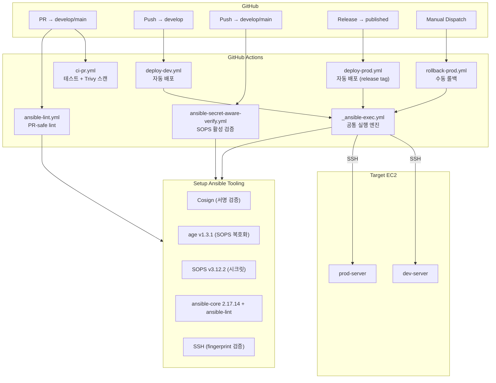
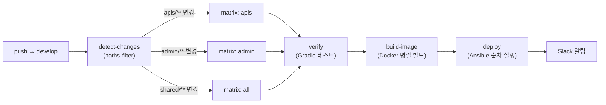
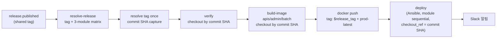
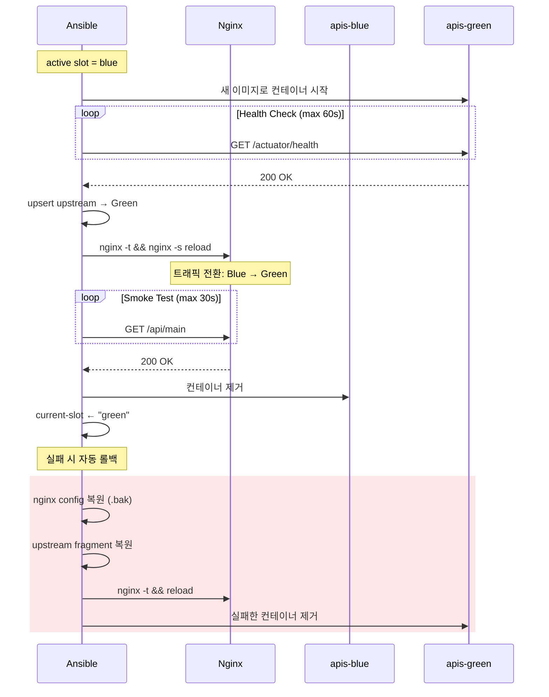
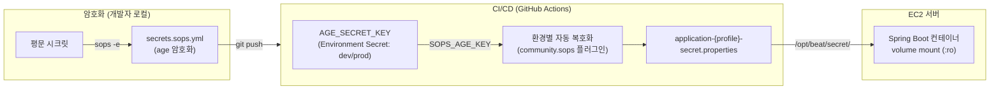
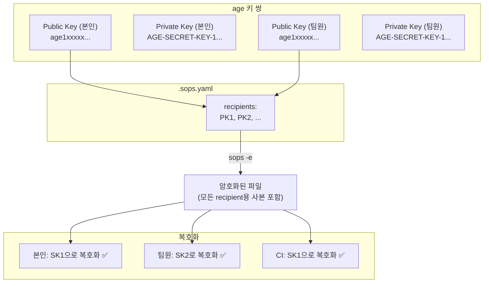
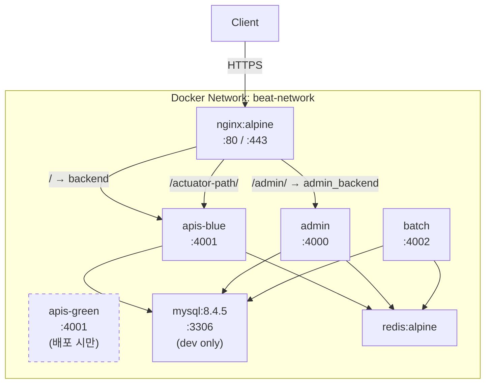
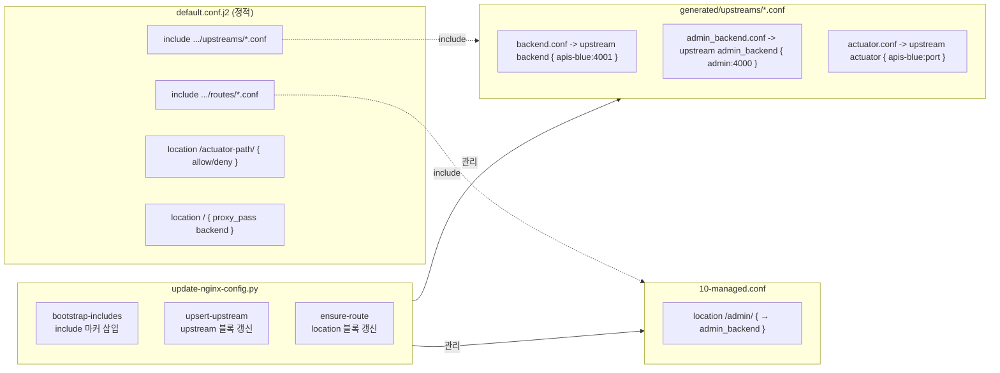
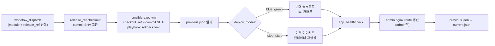

# infra module

> 이 문서는 `infra` 모듈의 현재 application-infra/deployment-docs 상태, 목표 계약, 그리고 #384에서 수행하지 않는 후속 작업을 구분한다. `infra`는 구현 기술과 외부 adapter의 집합소이며, 상위 유스케이스를 알면 안 된다.
> Kotlin JPA entity 작성 규약의 canonical source of truth는 루트 [`MIGRATION.md`](../MIGRATION.md)의 `Canonical Kotlin JPA entity rules` 절이다. 이 README는 모듈 역할만 요약하고, 규약 본문은 중복하지 않는다.

## Migration status

| Current | Target | Deferred-to-issue |
| --- | --- | --- |
| Application infra bootstrap (`EnableInfraBaseConfig`, JPA, QueryDSL, async, scheduler groups, external clients) and deployment/Ansible docs coexist in this module. QueryDSL/JPA configuration remain current migration surfaces. Dormant `RedisCacheConfig` / `REDIS_CACHE` is retained as an infra-owned future shared cache extension point. | `infra` owns JPA entity / persistence model, Spring Data adapter, QueryDSL/Kotlin JDSL query implementation, and implementation of domain repository interfaces. Deployment docs stay separated from application infra contracts. | QueryDSL/JDSL and `JpaConfig` scan decisions -> #381; shared cache concrete activation policy -> future cache issue; domain persistence split -> #380. |

## 역할

- JPA/QueryDSL/async 등 기술 설정을 소유한다.
- JPA entity / persistence model, Spring Data adapter, QueryDSL/Kotlin JDSL query 구현체를 소유한다.
- `domain` repository interface의 구현체를 제공한다.
- 외부 API client, 파일 저장소, 메시징, 서드파티 adapter를 구현한다.
- 실행 모듈이 필요한 기술 설정만 명시적으로 import할 수 있는 부트스트랩 진입점을 제공한다.

## 허용 의존성

- `domain`
- `global-utils`

## 금지 규칙

- `apis`, `admin`, `batch`, `gateway` 의존 금지
- UseCase, Controller, 앱 전용 DTO 보유 금지
- infra persistence model / adapter 타입을 실행 모듈 API나 domain 계약으로 직접 노출 금지

## As-Is 패키지 구조

```text
infra/
  src/main/java/com/beat/infra/
    EnableInfraBaseConfig.java
    InfraBaseConfig.java
    InfraBaseConfigGroup.java
    InfraBaseConfigImportSelector.java      # DeferredImportSelector — enum → class 매핑
    config/
      AsyncConfig.java                      # AsyncConfigurer, @Import(TaskExecutorConfig)
      TaskExecutorConfig.java               # beatApplicationTaskExecutor 빈 생성
      TaskSchedulerConfig.java              # taskScheduler 빈 생성
      JpaConfig.java
      MysqlCustomDialect.java
      QueryDslConfig.java
      RedisCacheConfig.java
      ThreadPoolProperties.java
    persistence/
      InfraPersistenceConfig.java              # infra.persistence narrow component scan
      InfraPersistenceMarker.java              # entity/repository/component scan root
      promotion/mapper/PromotionPersistenceMapper.java
      promotion/repository/PromotionJpaRepository.java
      promotion/repository/PromotionRepositoryImpl.java
  src/main/kotlin/com/beat/infra/
    InfraModuleConfig.kt
    persistence/
      promotion/entity/PromotionJpaEntity.kt   # Kotlin JPA reference slice; canonical authoring rules live in ../MIGRATION.md

current transitional sources:
  domain/src/main/java/com/beat/domain/**/dao/       # Spring Data repository concern that should move behind infra boundary
  domain/src/main/java/com/beat/domain/**/domain/    # JPA entity / persistence concern that should be split from domain model
  src/main/java/com/beat/global/common/config/**
```

설명:
- `InfraBaseConfigImportSelector`가 `@EnableInfraBaseConfig`의 enum 값을 읽어 해당 `@Configuration` 클래스를 선택적으로 import한다.
- `InfraPersistenceConfig`는 `JpaConfig`가 runtime safety net으로 import하고, JPA를 쓰는 실행 모듈 `InfraConfig.kt`가 IDE static-analysis breadcrumb로 한 번 더 import한다. 두 경로 모두 의도된 중복이며, `@EnableInfraBaseConfig` meta-annotation에 persistence를 직접 넣지는 않는다.
- `AsyncConfig`는 `@Import(TaskExecutorConfig.class)`로 executor 빈만 전이 로드하고, infra는 security-aware wrapper를 직접 소유하지 않는다.
- scheduler bean은 `TaskSchedulerConfig` + `InfraBaseConfigGroup.SCHEDULER`로 분리되어 batch에서만 명시적으로 가져간다.
- Redis runtime wiring은 Spring Boot auto-configuration과 gateway-owned config가 담당하고, infra는 더 이상 gateway-specific Redis bean을 소유하지 않는다.
- future shared caching은 dormant `RedisCacheConfig` + `InfraBaseConfigGroup.REDIS_CACHE`에서 시작하고, 현재 실행 모듈은 아직 이를 import하지 않는다. 활성화 전에는 cache name, TTL, serializer, namespace, invalidation policy, owner module, runtime opt-in이 먼저 정해져야 한다.
- #378 기준 `RedisCacheConfig`는 삭제하지도 활성화하지도 않는 infra-owned dormant extension point다. gateway refresh-token Redis storage와 shared cache bootstrap은 별도 경계다.
- Kotlin JPA entity 작성 규칙은 root [`MIGRATION.md`](../MIGRATION.md)의 canonical guide를 따른다. `PromotionJpaEntity.kt`는 현재 검증된 reference slice이고, rule 본문을 이 README에 중복 복제하지 않는다.
- 일부 공통 config와 Promotion JPA entity / mapper / repository adapter / implementation은 `infra`로 이동했지만, JPA entity / Spring Data repository adapter / query 구현 상당수는 아직 `domain` 쪽 transitional package에 남아 있다.
- 즉 `infra`도 아직 최종형이 아니라 **persistence 구현 책임을 받아오는 이관 진행 중인 landing zone**이다.

## #378 known deferred package exceptions

아래 두 파일은 physical module은 `infra`지만 Spring Data custom repository fragment discovery와 현재 `JpaConfig`/domain repository 구조에 묶여 있어 #378에서 package move하지 않는다. 누락이 아니라 #380/#381로 넘기는 명시적 예외다.

| File | Current package | Deferred reason | Follow-up |
| --- | --- | --- | --- |
| `infra/src/main/java/com/beat/domain/booking/dao/TicketRepositoryCustomImpl.java` | `com.beat.domain.booking.dao` | Spring Data custom fragment discovery가 domain repository interface package와 결합되어 있음 | #380/#381 |
| `infra/src/main/java/com/beat/domain/schedule/dao/ScheduleRepositoryCustomImpl.java` | `com.beat.domain.schedule.dao` | QueryDSL implementation boundary와 `JpaConfig` scan 결정이 함께 필요함 | #381 |

`SharedBoundaryContractTest`는 infra source에서 `com.beat.domain.*` package residue가 위 두 파일을 넘지 않도록 고정한다.

## To-Be 패키지 구조

```text
com.beat.infra.config.*
com.beat.infra.external.<provider>
com.beat.infra.persistence.<context>.entity
com.beat.infra.persistence.<context>.repository
com.beat.infra.persistence.<context>.mapper             # domain repository persistence-domain mapping이 필요할 때만
com.beat.infra.persistence.<context>.repository.query   # read 최적화/query projection이 필요할 때만
```

설명:
- `domain.<context>.repository.XxxRepository` 같은 repository interface는 `domain`이 소유한다.
- 그 interface의 구현체는 `infra.persistence.<context>.repository`가 맡는다.
- JPA entity / persistence model은 `infra.persistence.<context>.entity`가 소유한다.
- Spring Data JPA adapter는 `infra.persistence.<context>.repository`에 두되, domain repository interface가 아니라 infra 내부 구현 세부사항으로 취급한다.
- mapper를 도입한다면 `XxxPersistenceMapper`는 pure domain model과 infra persistence entity가 실제로 분리된 slice에서만 추가한다. 쉽게 말해 DB 저장용 객체와 도메인 객체 사이의 번역기다. repository 조회, lazy reference 획득, query projection 조립은 mapper 책임이 아니다.
- query 전용 구현은 지금 기본값이 아니고, 조회 복잡도 증가나 jOOQ/Kotlin JDSL 도입이 필요할 때만 `repository.query`를 추가한다. 이때 화면/목록/통계용 read model은 persistence mapper를 재사용하지 않고 query 전용 row/DTO로 바로 만든다.

## 최종 목표

- `infra.external.*` 타입을 상위 실행 모듈이 직접 import하지 않는다.
- `InfraModuleConfig`가 실제 기술 import를 모으는 진입점으로 성장한다.
- JPA/QueryDSL/async 부트스트랩이 명시적으로 조립된다.
- JPA entity / Spring Data adapter / query 구현체 / domain repository 구현체는 infra 책임으로 모인다.
- shared cache가 필요해질 때 `REDIS_CACHE` 그룹으로 확장한다.

---

# Deployment Infrastructure

> `infra/ansible/` 디렉토리는 BEAT 서버의 배포 자동화를 담당한다.
> GitHub Actions + Ansible + SOPS(age) 조합으로 dev/prod 환경을 관리한다.

## 전체 배포 아키텍처



## CI/CD 파이프라인

### Dev 배포 (자동)



- `shared` 경로(domain, gateway, build-logic, gradle 등) 변경 시 **전체 모듈** 배포
- 이미지 태그: `dev-${GITHUB_SHA}`
- deploy job은 `max-parallel: 1` — nginx 설정 충돌 방지

### Ansible lint / secret-aware 검증

- `ansible-lint.yml`
  - PR-safe lint 경로
  - `working-directory: infra/ansible`
  - `ANSIBLE_VARS_ENABLED=host_group_vars`로 SOPS vars plugin을 비활성화하고 playbook/role 구조만 검증
- `ansible-secret-aware-verify.yml`
  - push to `develop`/`main`, `workflow_dispatch`에서 실행
  - `environment: dev` / `environment: prod` 각각에서 `AGE_SECRET_KEY`를 읽음
  - dev/prod 각각에서 `apis`, `admin`, `batch` 3개 module group을 모두 resolver로 검증
  - 현재 dev/prod inventory가 같은 host를 가리키더라도, `${module}_servers` contract drift를 조기에 잡기 위해 세 모듈 그룹을 모두 검사
  - `ansible-inventory --list`로 SOPS 복호화가 실제로 되는지 확인
  - 같은 환경에서 `ansible-lint playbooks/*.yml roles`도 실행해 SOPS 활성 상태의 lint까지 검증

### Prod 배포 (자동, release published)



- `github.event.release.tag_name` 을 **prod 공통 버전 source**로 사용
- `apis/admin/batch` 3개 모듈을 **같은 release tag**로 build/push/deploy
- release tag는 `resolve-release` 단계에서 한 번만 해석하고, 이후 verify/build/deploy는 모두 **immutable commit SHA** 를 사용해 TOCTOU를 방지한다
- 이미지 태그는 모듈별로 `:{release_tag}` 와 `:prod-latest` 를 함께 push
- deploy 단계는 `max-parallel: 1` 로 모듈을 순차 배포
- `release-drafter.yml` 은 draft release 갱신용이며, **실제 prod deploy trigger는 published release** 뿐이다
- `rollback-prod.yml` 은 계속 **수동 workflow_dispatch** 로 유지
- `concurrency: prod-runtime` — prod 배포/롤백은 동시에 1개만
- resolver는 `ansible-inventory`로 대상 host/group를 선택하고, `community.sops` 환경에서 `ansible-inventory --host` 결과에 `ENC[...]` 가 남을 수 있기 때문에 평문이 필요한 `ssh_host / ssh_port / ssh_host_fingerprint`만 임시 `ansible-playbook`으로 materialize 한다
- `_ansible-exec.yml` 은 inventory resolver 성공을 전제로 하며, prod caller 쪽 legacy SSH fallback은 두지 않는다

## Ansible 구조

### 디렉토리 레이아웃

```text
infra/ansible/
├── ansible.cfg                          # SOPS 플러그인, SSH 파이프라이닝
├── collections/requirements.yml         # community.docker, community.sops
├── inventories/
│   ├── dev/
│   │   ├── hosts.yml                    # 호스트 그룹 + ansible_port / ansible_user (ansible_host는 SOPS)
│   │   └── group_vars/all/
│   │       ├── main.yml                 # 평문 변수 (배포 설정, 컨테이너 구성)
│   │       └── secrets.sops.yml         # SOPS 암호화 (ansible_host, ssh_host_fingerprint, DB, 도메인 등)
│   └── prod/
│       ├── hosts.yml                    # 호스트 그룹 + ansible_port / ansible_user (ansible_host는 SOPS)
│       └── group_vars/all/
│           ├── main.yml                 # 평문 변수
│           └── secrets.sops.yml         # SOPS 암호화 (ansible_host, ssh_host_fingerprint, DB, 도메인 등)
├── playbooks/
│   ├── foundation.yml                   # 인프라 기반 스택
│   ├── deploy.yml                       # 앱 배포
│   ├── rollback.yml                     # 롤백
│   └── secret.yml                       # 시크릿만 동기화
├── roles/
│   ├── foundation_stack/                # docker-compose 기반 기초 서비스
│   │   └── templates/foundation.compose.yml.j2
│   ├── nginx_base_config/               # nginx 설정 렌더링 + 프로모션
│   │   └── templates/default.conf.j2
│   ├── nginx_config_helper/             # update-nginx-config.py 배포 helper
│   ├── app_secret/                      # SOPS → properties 파일
│   ├── app_scripts/                     # 배포 디렉토리 + nginx helper 준비
│   ├── app_release/                     # 릴리즈 메타데이터
│   ├── app_dev_switch/                  # dev blue-green 진입점
│   ├── app_prod_switch/                 # prod blue-green 진입점
│   ├── app_bluegreen/                   # blue-green 핵심 로직
│   ├── app_stopstart/                   # stop-start 배포
│   ├── app_healthcheck/                 # 헬스체크
│   ├── app_cleanup/                     # 메타데이터 승격 + 이미지 정리
│   └── app_rollback/                    # 롤백 로직
```

설명:
- 공용 nginx helper `update-nginx-config.py`는 더 이상 `infra/ansible/files/`에 두지 않고 `roles/nginx_config_helper/files/`로 이동했다.
- foundation / nginx 템플릿도 전역 `templates/`가 아니라 각 role의 `templates/` 안에서 관리한다.
- `app_dev_switch`, `app_prod_switch`, `app_rollback`은 상대 `import_tasks` 대신 `import_role` + 명시적 vars 전달 구조를 사용한다.

### Playbook 흐름

```mermaid
flowchart TD
    subgraph Foundation["foundation.yml"]
        FS["foundation_stack<br/>nginx + mysql + redis"]
        NBC["nginx_base_config<br/>설정 렌더링 + seed"]
        FS --> NBC
    end

    subgraph Deploy["deploy.yml"]
        VAL["pre_tasks: validate"]
        SEC["app_secret<br/>SOPS 복호화"]
        SCR["app_scripts<br/>유틸리티 배포"]
        REL["app_release<br/>메타데이터 기록"]
        BG["app_bluegreen<br/>(apis)"]
        SS["app_stopstart<br/>(admin, batch)"]
        HC["app_healthcheck"]
        NR["admin_nginx_route<br/>(admin만)"]
        CL["app_cleanup<br/>메타데이터 승격"]

        VAL --> SEC --> SCR --> REL
        REL -->|"blue_green"| BG
        REL -->|"stop_start"| SS
        BG --> HC
        SS --> HC
        HC --> NR --> CL
    end

    subgraph Rollback["rollback.yml"]
        RB["app_rollback<br/>이전 릴리스로 런타임 복원"]
        RHC["app_healthcheck<br/>복원된 런타임 검증"]
        RNR["admin_nginx_route<br/>(admin만)"]
        RR["previous.json → current.json<br/>메타데이터 정합성 복원"]
    end

    RB --> RHC --> RNR --> RR
```



### 모듈별 배포 전략

| 모듈 | 배포 모드 | 포트 | 다운타임 | Nginx 라우팅 |
|------|----------|------|---------|-------------|
| **apis** | blue_green | 4001 | Zero-downtime | `/ → backend` upstream 전환 |
| **admin** | stop_start | 4000 | 있음 | `/admin/ → admin_backend` |
| **batch** | stop_start | 4002 | 있음 | 없음 (내부 스케줄러) |

### Blue-Green 배포 상세 (apis)



## SOPS 시크릿 관리

### 암호화 체인



### age 키 관리



**키 1개로 복호화 가능**: SOPS는 각 recipient의 public key로 별도 암호화 사본을 만든다. 복호화 시 자신의 private key 하나만 있으면 된다.

### secrets.sops.yml에 저장되는 항목

| 카테고리 | 변수 | 설명 |
|---------|------|------|
| **인프라** | `ansible_host` | 서버 IP (평문 노출 방지) |
| **인프라** | `nginx_server_name` | 도메인 |
| **인프라** | `letsencrypt_cert_name` | SSL 인증서 도메인 |
| **인프라** | `actuator_allow_cidrs` | actuator 접근 허용 CIDR 목록 |
| **인프라** | `actuator_port` | actuator 포트 (시크릿 경로 일부) |
| **인프라** | `actuator_path` | actuator 경로 (시크릿 경로 일부) |
| **DB** | `mysql_root_password`, `mysql_database`, `mysql_user`, `mysql_password` | MySQL 접속 정보 |
| **앱** | `app_secret_content` | Spring Boot 시크릿 properties 전체 |

`main.yml`에는 배포 모드, 컨테이너 이름, 포트, 경로 등 **노출되어도 무방한 설정값**만 남긴다.

### 팀원 추가 절차

```bash
# 1. 팀원이 age 키 생성
age-keygen -o ~/Library/Application\ Support/sops/age/keys.txt
# 출력: public key: age1xxxxxxxxx...

# 2. .sops.yaml에 팀원 public key 추가 (쉼표 구분)
# creation_rules:
#   - path_regex: ...
#     age: >-
#       age1본인publickey...,
#       age1새팀원publickey...

# 3. 기존 시크릿 파일 재암호화 (기존 키 소유자가 실행)
sops updatekeys infra/ansible/inventories/dev/group_vars/all/secrets.sops.yml
sops updatekeys infra/ansible/inventories/prod/group_vars/all/secrets.sops.yml

# 4. 커밋 & 푸시
```

### 시크릿 편집

```bash
# 복호화 후 편집기 열기 (저장 시 자동 재암호화)
sops infra/ansible/inventories/dev/group_vars/all/secrets.sops.yml

# 특정 값만 추출
sops -d --extract '["actuator_port"]' infra/ansible/inventories/dev/group_vars/all/secrets.sops.yml
```

## 서버 구성

### Docker 컨테이너 구조



### Nginx Generated Fragment 시스템



### 서버 파일시스템 레이아웃

```text
/home/ubuntu/deployment/                    # Ansible 작업 디렉토리
├── docker-compose.yml                      # foundation 렌더링
├── update-nginx-config.py                  # nginx fragment 관리
└── nginx/
    ├── default.conf                        # 후보 설정 (source, 다음 promotion 입력)
    └── generated/
        ├── upstreams/backend.conf          # backend upstream fragment (source)
        ├── upstreams/admin_backend.conf    # admin upstream fragment (source)
        ├── upstreams/actuator.conf         # actuator upstream fragment (source)
        └── routes/10-managed.conf          # route fragment (source, helper가 갱신)

/var/lib/docker/volumes/nginx-config-volume/_data/
├── conf.d/default.conf                     # 실제 적용 설정 (target, 현재 live)
└── generated/
    ├── upstreams/backend.conf              # backend upstream fragment (target, 현재 live)
    ├── upstreams/admin_backend.conf        # admin upstream fragment (target, 현재 live)
    ├── upstreams/actuator.conf             # actuator upstream fragment (target, 현재 live)
    └── routes/10-managed.conf              # route fragment (target, 현재 live)

/opt/beat/
├── secret/
│   └── application-{profile}-secret.properties
└── releases/{module}/
    ├── current-slot                        # blue/green (apis만)
    ├── current.json                        # 현재 배포 메타데이터
    └── previous.json                       # 이전 배포 (롤백용)
```

## GitHub Secrets

### 필수 (Environment: dev)

| Secret | 용도 |
|--------|------|
| `AGE_SECRET_KEY` | dev 환경 SOPS 복호화용 age private key |
| `DEV_DOCKER_LOGIN_USERNAME` | Docker Hub 사용자명 |
| `DEV_DOCKER_LOGIN_ACCESSTOKEN` | Docker Hub 액세스 토큰 |
| `DEV_SSH_HOST` | dev 서버 IP |
| `DEV_SSH_PORT` | dev 서버 SSH 포트 |
| `DEV_SSH_PRIVATE_KEY` | dev 서버 SSH 비밀키 |
| `DEV_SSH_HOST_FINGERPRINT` | dev 서버 SSH 호스트 지문 (`SHA256:...`) |

### 필수 (Environment: prod)

| Secret | 용도 |
|--------|------|
| `AGE_SECRET_KEY` | prod 환경 SOPS 복호화용 age private key |
| `PROD_DOCKER_LOGIN_USERNAME` | Docker Hub 사용자명 |
| `PROD_DOCKER_LOGIN_ACCESSTOKEN` | Docker Hub 액세스 토큰 |
| `PROD_SSH_HOST` | prod 서버 IP |
| `PROD_SSH_PORT` | prod 서버 SSH 포트 |
| `PROD_SSH_PRIVATE_KEY` | prod 서버 SSH 비밀키 |
| `PROD_SSH_HOST_FINGERPRINT` | prod 서버 SSH 호스트 지문 (`SHA256:...`) |

### 선택 (Repository-level 또는 Environment-level)

| Secret | 용도 |
|--------|------|
| `SLACK_WEBHOOK_URL` | 배포 성공/실패 Slack 알림 (없으면 skip) |
| `ACTION_TOKEN` | Release Drafter용 GitHub 토큰 |

### SSH Host Fingerprint 확인 방법

```bash
# 로컬 터미널에서 실행 (서버 접속 불필요, 공개키 조회)
ssh-keyscan -p 22 <서버IP> 2>/dev/null | ssh-keygen -lf - -E sha256
# 출력에서 ED25519의 SHA256:... 값을 사용
```

> **참고**: `DEV_SSH_HOST`와 `ansible_host`(secrets.sops.yml)는 동일한 IP이다.
> 전자는 GHA runner의 SSH known_hosts 설정에, 후자는 Ansible inventory 접속에 사용된다.

## 로컬 개발

### 사전 준비

1. **SOPS + age 설치**
   ```bash
   # macOS
   brew install sops age
   ```

2. **age 키 생성** (최초 1회)
   ```bash
   age-keygen -o ~/Library/Application\ Support/sops/age/keys.txt
   # 출력된 public key를 기존 키 소유자에게 전달
   # → .sops.yaml에 추가 + sops updatekeys 실행 필요
   ```

3. **시크릿 파일 생성**
   ```bash
   ./scripts/generate-local-dev-secret.sh
   # → secret/application-dev-secret.properties 생성
   ```
   이 스크립트는 SOPS로 `secrets.sops.yml`을 복호화하여 로컬용 properties 파일을 만든다.
   `DEV_REDIS_HOST`는 자동으로 `localhost`로 오버라이드된다.

### 로컬 실행

```bash
# 로컬 MySQL, Redis가 필요
# MySQL: localhost:3306
# Redis: localhost:6379

# 모듈별 실행
./gradlew :apis:bootRun
./gradlew :admin:bootRun
./gradlew :batch:bootRun
```

### 로컬 검증

```bash
# 전체 테스트
./gradlew test

# 배포 계약 테스트
./gradlew :test --tests com.beat.RootRetirementContractTest

# Ansible syntax check
cd infra/ansible
ansible-playbook playbooks/foundation.yml -i inventories/dev/hosts.yml --syntax-check
ansible-playbook playbooks/deploy.yml -i inventories/dev/hosts.yml --syntax-check \
  -e module=apis -e image=test -e image_tag=test
```

## 환경별 차이

| 항목 | Dev | Prod |
|------|-----|------|
| 배포 트리거 | develop push / workflow_dispatch | release.published (자동, shared tag) |
| 이미지 태그 | `dev-{SHA}` + `dev-latest` | `{release_tag}` (예: `v1.2.3`) + `prod-latest` |
| MySQL | Docker 컨테이너 (foundation) | 비활성 (`foundation_mysql_enabled: false`, 외부 RDS) |
| Redis 컨테이너명 | `redis` | `beat-prod-redis` |
| 도메인 | `secrets.sops.yml`의 `nginx_server_name` 참조 | 동일 |
| 롤백 | 재배포로 대체 | rollback-prod.yml (수동) |
| concurrency | `deploy-dev-runtime-{ref}` (브랜치별) | `prod-runtime` (전역 락) |

## Rollback

prod 전용 `rollback-prod.yml` 워크플로우가 제공된다.



- `previous.json`이 없으면 롤백 불가 (assert 실패)
- 롤백은 `release_ref` 입력(릴리스 태그 또는 커밋 SHA)을 먼저 immutable commit SHA로 해석하고, `_ansible-exec.yml`의 `checkout_ref`로 전달해 prod 배포 때와 같은 코드 기준에서 실행한다.
- 롤백 후 `app_healthcheck`와 nginx route 갱신이 모두 성공해야 `current.json`을 실제로 다시 live 가 된 이전 배포 메타데이터로 복원한다.
- 이 승격은 선택사항이 아니다. 다음 deploy의 `app_cleanup`이 항상 `current.json -> previous.json`을 수행하므로, rollback 직후 `current.json`이 실제 live 릴리스를 가리키지 않으면 다음 rollback 대상이 틀어진다.
- 반대로 post-rollback healthcheck 또는 route 갱신이 실패하면 metadata promotion을 차단하여 검증되지 않은 runtime 상태를 `current.json`에 기록하지 않는다.
- blue-green 모듈은 `run_switch.yml`을 재활용하여 역방향 전환을 수행한다

### Nginx source/target contract

- `deployment/nginx/**` 는 후보(source) 설정이다. helper와 seed 로직이 이 경로를 갱신하고, 다음 promotion의 입력으로 재사용된다.
- `nginx-config-volume/_data/**` 는 실제 적용(target) 설정이다. `nginx -t` 와 reload가 통과한 live 구성이 여기에 존재한다.
- Nginx 관련 role은 실패 시 target만이 아니라 source도 함께 복원해야 한다. 그렇지 않으면 다음 실행에서 오염된 source가 다시 target으로 승격될 수 있다.
