# infra module

`infra`는 BEAT의 **기술 구현 어댑터 모듈**입니다.
JPA/QueryDSL persistence 어댑터, 외부 API 클라이언트, 파일 저장소, 메시징 어댑터처럼
상위 레이어가 필요로 하는 모든 기술 구현을 소유합니다.

`infra`는 아래 구현 세부사항을 모릅니다.

- HTTP Controller / ResponseDTO
- Batch Job / Runner / Scheduled entrypoint
- 비즈니스 UseCase / ApplicationService
- 실행 모듈 전용 ErrorCode / SuccessCode

> 핵심 원칙: 실행 모듈은 `@EnableInfraBaseConfig`로 필요한 기술 슬라이스만 선택합니다.
> 실행 모듈이 `infra.external.*` 또는 `infra.persistence.*` 구현 패키지를 직접 import하지 않습니다.

---

## 1. 이 문서를 읽는 방법

새 infra 코드를 추가하거나 기존 코드를 이동할 때 아래 질문에 먼저 답합니다.

```text
1. 이것은 DB/캐시/검색엔진과 통신하는 저장소 구현인가?
2. 이것은 외부 API/서드파티 서비스(OAuth, Slack, SMS, S3)를 호출하는 클라이언트인가?
3. 이것은 domain repository interface의 구현체인가?
4. 이것은 module-contracts read port의 구현체인가?
5. 이것은 Spring Boot 기술 설정(async, JPA, 외부 클라이언트)인가?
```

| 질문                                               | 위치                                             |
|--------------------------------------------------|------------------------------------------------|
| domain RepositoryPort 구현체 + Spring Data 어댑터      | `infra.persistence.<context>.repository`       |
| JPA entity / persistence model                   | `infra.persistence.<context>.entity`           |
| domain ↔ JPA entity 변환 mapper                    | `infra.persistence.<context>.mapper`           |
| module-contracts ReadPort 구현체 / query projection | `infra.persistence.<context>.repository.query` |
| 외부 API 클라이언트 / 서드파티 어댑터                          | `infra.external.<concern>.<provider>`          |
| JPA/async/external-client 기술 설정                  | `infra.config`                                 |
| domain model, UseCase, ApplicationService        | `domain` / 실행 모듈                               |
| 실행 모듈 간 계약, ReadModel contract                   | `module-contracts`                             |

---

## 2. 전체 레이어에서 infra의 위치

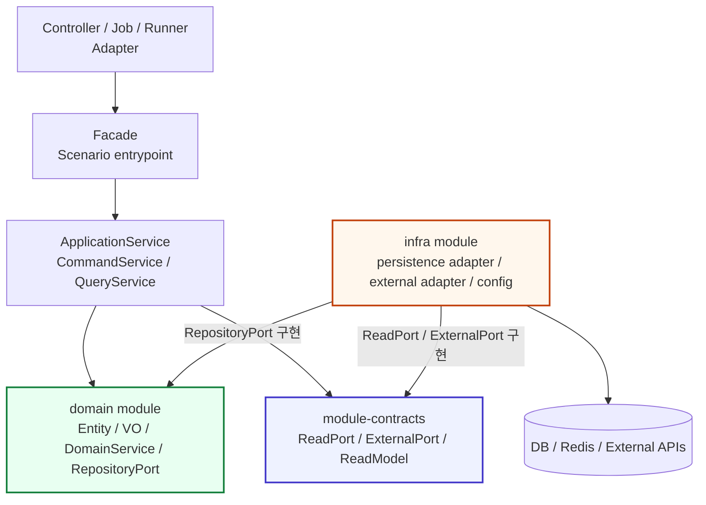

### 레이어별 책임

| Layer              | 책임                                        | 금지                              |
|--------------------|-------------------------------------------|---------------------------------|
| Controller / Job   | 요청/트리거를 받는 adapter                        | infra 구현 직접 import              |
| Facade             | 실행 시나리오 조합 진입점                            | infra 직접 호출                     |
| ApplicationService | use-case 실행, transaction, domain 호출       | infra 구현 직접 의존                  |
| domain             | 도메인 상태, 불변식, 저장소 계약(interface)            | Spring/JPA/infra 구현             |
| module-contracts   | port/contract/read model 정의               | infra 구현, domain model 직접 노출    |
| **infra**          | persistence/external adapter 구현, 기술 설정 소유 | service 계층 소유, 실행 모듈 DTO import |

---

## 3. Bootstrap 구조

실행 모듈은 `@EnableInfraBaseConfig`로 필요한 기술 슬라이스만 선택합니다.
`InfraBaseConfigImportSelector`(`DeferredImportSelector`)가 선택된 group에 해당하는 config만 로드합니다.

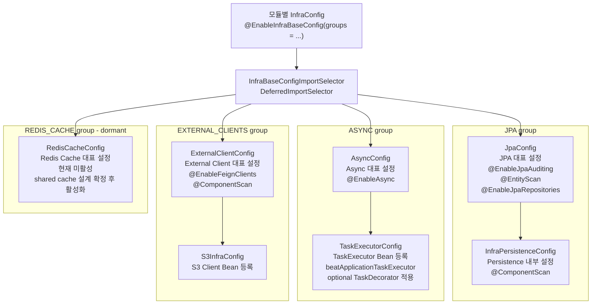


### Async TaskDecorator 규칙

`TaskExecutorConfig`는 `beatApplicationTaskExecutor`를 소유하고, application context에 존재하는 `TaskDecorator` bean을 executor에 적용합니다.
이를 통해 `observability`가 제공하는 MDC propagation decorator처럼 executor 실행 전후 context를 다루는 횡단 관심사를 `infra`가 구체 타입에 의존하지 않고 수용할 수 있습니다.

- `infra`는 observability 구현체를 직접 import하지 않고 Spring `TaskDecorator` abstraction만 봅니다.
- decorator가 여러 개면 `CompositeTaskDecorator`로 순서대로 합성합니다.
- `@Async("taskExecutor")`는 `AsyncConfig`가 노출하는 executor alias를 통해 동일한 decorator 적용을 받습니다.

### 실행 모듈별 group 선택

| 모듈      | JPA | ASYNC | EXTERNAL_CLIENTS | REDIS_CACHE | 이유                                   |
|---------|-----|-------|------------------|-------------|--------------------------------------|
| `apis`  | ✅   | ✅     | ✅                | ❌           | 사용자 API + 비동기 알림 + 외부 OAuth/Slack/S3 |
| `admin` | ✅   | ❌     | ✅                | ❌           | 관리자 API + 외부 클라이언트, 비동기 불필요          |
| `batch` | ✅   | ✅     | ❌                | ❌           | 스케줄/배치 + 비동기, 외부 API 없음              |

```kotlin
// apis/config/InfraConfig.kt
@EnableInfraBaseConfig(value = [JPA, ASYNC, EXTERNAL_CLIENTS])
@Import(InfraPersistenceConfig::class)
class InfraConfig

// admin/config/InfraConfig.kt
@EnableInfraBaseConfig(value = [JPA, EXTERNAL_CLIENTS])
@Import(InfraPersistenceConfig::class)
class InfraConfig

// batch/config/InfraConfig.kt
@EnableInfraBaseConfig(value = [JPA, ASYNC])
@Import(InfraPersistenceConfig::class)
class InfraConfig
```

### Support config 규칙

top-level group config(`AsyncConfig`, `ExternalClientConfig`, `JpaConfig`, `RedisCacheConfig`)만 `InfraBaseConfig`를
구현합니다.
그 아래에서 `@Import`로 전이 로드되는 support config(`TaskExecutorConfig`, `ThreadPoolProperties`, `InfraPersistenceConfig`,
`S3InfraConfig`)는
`InfraBaseConfig`를 구현하지 않습니다. 실행 모듈은 support config를 직접 import하지 않는 것이 원칙이나, `InfraPersistenceConfig`는 IDE
static-analysis 경로 확보를 위해 예외적으로 `@Import`합니다 (Section 4 공개 표면 참조).

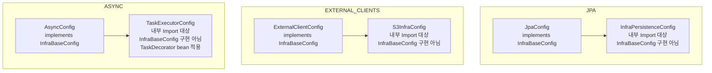

---

## 4. 공개 표면

실행 모듈이 `infra`에서 직접 import할 수 있는 것은 아래뿐입니다.

| 공개 타입                    | 위치                           | 용도                                                                |
|--------------------------|------------------------------|-------------------------------------------------------------------|
| `@EnableInfraBaseConfig` | `com.beat.infra`             | group 선택 annotation                                               |
| `InfraBaseConfigGroup`   | `com.beat.infra`             | JPA / ASYNC / EXTERNAL_CLIENTS / REDIS_CACHE enum                 |
| `InfraPersistenceConfig` | `com.beat.infra.persistence` | IDE static-analysis breadcrumb (IDE only, runtime은 JpaConfig가 보장) |

`infra.external.*`, `infra.persistence.*` 구현 패키지를 실행 모듈이 직접 import하면 안 됩니다.
외부 어댑터 주입은 `module-contracts` port interface를 통해서만 받습니다.

---

## 5. infra.external — 외부 어댑터

`infra.external`은 외부 API / 서드파티 서비스를 호출하는 어댑터 전용 영역입니다.
`infra.persistence`와 같은 레벨에서 타입을 구분합니다.

패키지 계층: `external.<concern>.<provider>`

- **1단계 concern**: 어댑터의 비즈니스 역할(`auth`, `notification`, `sms`, `storage`)
- **2단계 provider**: 실제 외부 서비스(`kakao`, `slack`, `s3`)
- provider가 단일이고 concern이 이미 구체적이면 provider 레벨 생략 가능(`external.sms`)

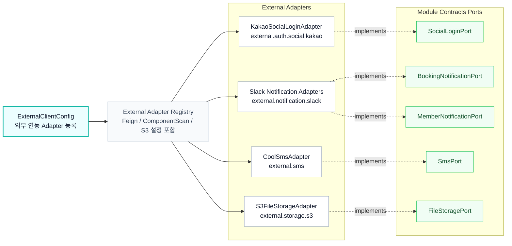

### 외부 어댑터 규칙

- `module-contracts`의 port interface(`SocialLoginPort`, `BookingNotificationPort`, ...)를 구현합니다.
- 실행 모듈 DTO, ApplicationService, domain model을 import하지 않습니다.
- Feign client는 `@FeignClient` interface로 정의하고 `ExternalClientConfig`의 `@EnableFeignClients(basePackageClasses=...)`로
  등록합니다.
- 외부 API 응답 DTO (response 패키지)는 해당 provider 패키지 아래에 둡니다.
- 새 외부 서비스가 추가될 때는 `external.<concern>.<provider>` 경로로 추가합니다.

### RedisCacheConfig (dormant)

`InfraBaseConfigGroup.REDIS_CACHE`는 shared cache가 필요해질 때를 위한 확장 점입니다.
`RedisCacheConfig`는 `@Bean`, `@EnableCaching`, `CacheManager`를 포함하지 않은 상태로 유지합니다.
활성화 전에 cache name, TTL, serializer, namespace, invalidation policy, owner module, runtime opt-in을 먼저 정해야 합니다.
gateway-owned Redis refresh token store와 shared cache bootstrap은 별도 경계입니다.

---

## 6. infra.persistence — 영속성 어댑터

`infra.persistence`는 JPA entity, Spring Data 어댑터, domain repository 구현체, query 어댑터를 소유합니다.

패키지 계층: `persistence.<context>.*`

| 하위 패키지              | 소유 대상                                           | 생성 기준                                  |
|---------------------|-------------------------------------------------|----------------------------------------|
| `.entity`           | Kotlin JPA entity (`@Entity`, `@Table`)         | 항상                                     |
| `.repository`       | JpaRepository, RepositoryPort 구현체               | 항상                                     |
| `.mapper`           | JPA entity ↔ domain model 변환                    | entity와 domain model이 실제로 분리된 slice에서만 |
| `.repository.query` | module-contracts ReadPort 구현체, query projection | 화면/검색/통계 조회가 복잡해질 때만                   |

### 현재 persistence context

| Context            | entity | repository | mapper | query                           |
|--------------------|--------|------------|--------|---------------------------------|
| `booking`          | ✅      | ✅          | ✅      | ✅ (MakerTicketReadPortImpl)     |
| `cast`             | ✅      | ✅          | ✅      | -                               |
| `member`           | ✅      | ✅          | ✅      | -                               |
| `performance`      | ✅      | ✅          | ✅      | -                               |
| `performanceimage` | ✅      | ✅          | ✅      | -                               |
| `promotion`        | ✅      | ✅          | ✅      | -                               |
| `schedule`         | ✅      | ✅          | ✅      | ✅ (ScheduleQueryRepositoryImpl) |
| `staff`            | ✅      | ✅          | ✅      | -                               |
| `user`             | ✅      | ✅          | ✅      | -                               |

### 영속성 어댑터 규칙

- command repository 어댑터는 JPA entity를 domain model로 변환해 `domain` RepositoryPort를 구현합니다.
- query 어댑터는 조회 전용 read model을 만듭니다. domain model을 억지로 복원하지 않습니다.
- read model은 JPA Entity도 domain model도 API ResponseDTO도 아닙니다. infra query 구현과 실행 모듈 query service 사이의 조회 결과 shape입니다.
- infra는 실행 모듈 내부 DTO/ResponseDTO를 반환하지 않습니다.
- mapper는 persistence entity와 domain model 사이의 변환만 담당합니다. query projection 조립, lazy reference 획득, API 응답 조립은 mapper 책임이
  아닙니다.

### Kotlin JPA entity 규칙

JPA entity 작성 규약의 canonical source of truth는 루트 [`MIGRATION.md`](../MIGRATION.md)의 `Canonical Kotlin JPA entity rules`
절입니다.

---

## 7. 패키지 구조

```text
infra/
  src/main/java/com/beat/infra/
    EnableInfraBaseConfig.java                    # 공개: group 선택 annotation
    InfraBaseConfig.java                          # 공개: top-level group marker interface
    InfraBaseConfigGroup.java                     # 공개: JPA / ASYNC / EXTERNAL_CLIENTS / REDIS_CACHE
    InfraBaseConfigImportSelector.java            # DeferredImportSelector — enum → config class 매핑
    config/
      AsyncConfig.java                            # ASYNC group owner, @Import(TaskExecutorConfig)
      ExternalClientConfig.java                   # EXTERNAL_CLIENTS group owner, @Import(S3InfraConfig)
      JpaConfig.java                              # JPA group owner, @Import(InfraPersistenceConfig)
      RedisCacheConfig.java                       # REDIS_CACHE group owner (dormant)
      TaskExecutorConfig.java                     # support config; beatApplicationTaskExecutor 빈
      MysqlCustomDialect.java                     # support config
      ThreadPoolProperties.java                   # support config
    external/
      auth/social/kakao/
        KakaoSocialLoginAdapter.java              # implements SocialLoginPort
        client/
          KakaoApiClient.java                     # @FeignClient
          KakaoAuthApiClient.java                 # @FeignClient
        response/
          KakaoAccessTokenResponse.java
          KakaoAccount.java
          KakaoUserProfile.java
          KakaoUserResponse.java
      notification/slack/
        SlackBookingNotificationAdapter.java      # implements BookingNotificationPort
        SlackMemberNotificationAdapter.java       # implements MemberNotificationPort
        client/
          BookingSlackClient.java                 # @FeignClient
          MemberSlackClient.java                  # @FeignClient
        vo/
          SlackConstant.java
          block/  Block.java DividerBlock.java HeaderBlock.java SectionBlock.java
          message/ SlackMessage.java
          text/   MarkdownText.java PlainText.java Text.java
      sms/
        CoolSmsAdapter.java                       # implements SmsPort
      storage/s3/
        S3FileStorageAdapter.java                 # implements FileStoragePort
        S3InfraConfig.java                        # support config; AmazonS3 빈
    persistence/
      InfraPersistenceConfig.java                 # @ComponentScan(basePackageClasses=InfraPersistenceMarker)
      InfraPersistenceMarker.java                 # entity/repository scan root
      common/
        (BaseTimeEntity.kt — Kotlin)
      <context>/                                  # booking · cast · member · performance · performanceimage
        entity/   <Context>JpaEntity.kt           #   · promotion · schedule · staff · user
        mapper/   <Context>PersistenceMapper.java
        repository/
          <Context>JpaRepository.java
          <Context>RepositoryImpl.java
          query/  <Query>ReadPortImpl.java        # booking: MakerTicketReadPortImpl
                                                  # schedule: ScheduleQueryRepositoryImpl

  src/main/kotlin/com/beat/infra/
    persistence/
      common/
        BaseTimeEntity.kt                         # @MappedSuperclass; auditing
      <context>/entity/
        <Context>JpaEntity.kt                     # 9개 context 전부 Kotlin
```

---

## 8. 허용 의존성

```text
domain
module-contracts
global-support
```

---

## 9. 금지 규칙

- `apis`, `admin`, `batch`, `gateway` 직접 의존 금지
- UseCase, ApplicationService, Controller, 실행 모듈 전용 DTO 보유 금지
- infra persistence model / external adapter 구현 타입을 실행 모듈 API나 domain 계약으로 직접 노출 금지
- `InfraModuleConfig.kt`처럼 전역 스캔 진입점을 `@EnableInfraBaseConfig`와 병행 선언 금지
- support config(`TaskExecutorConfig`, `ThreadPoolProperties`, `InfraPersistenceConfig`, `S3InfraConfig`)에
  `InfraBaseConfig` 구현 금지
- 실행 모듈이 `infra.external.*` 또는 `infra.persistence.*` 구현 패키지를 직접 import하게 만들지 않습니다 (`InfraPersistenceConfig` IDE
  breadcrumb 제외)
- infra query adapter가 실행 모듈 내부 DTO/ResponseDTO를 반환하지 않습니다
- domain model, ApplicationService, Facade를 infra에서 소유하지 않습니다

---

## 10. Guard rails

### `SharedBoundaryContractTest`

- `InfraBaseConfig` marker javadoc이 `Marker for top-level infra bootstrap configurations`를 포함하는지 확인
- top-level group config 4개가 `InfraBaseConfig`를 구현하는지 확인
- support config 4개가 `InfraBaseConfig`를 구현하지 않는지 확인
- `InfraModuleConfig.kt`가 존재하지 않는지 확인
- `RedisCacheConfig`가 `@EnableCaching`, `CacheManager`, `@Bean`을 포함하지 않는지 확인
- `S3InfraConfig`가 `InfraBaseConfig`를 구현하지 않는지 확인

### infra-local tests

| 테스트                                           | 검증 대상                                      |
|-----------------------------------------------|--------------------------------------------|
| `AsyncConfigTest`                             | async exception handler 포맷 회귀 방지           |
| `BookingPersistenceMapperTest`                | Booking entity ↔ domain model 매핑 계약        |
| `MakerTicketReadPortImplOrderingContractTest` | maker ticket query 정렬 계약                   |
| `CastPersistenceMapperTest`                   | Cast entity ↔ domain model 매핑 계약           |
| `PromotionJpaEntityContractTest`              | Kotlin JPA entity Kotlin canonical rule 검증 |
| `PromotionPersistenceMapperTest`              | Promotion entity ↔ domain model 매핑 계약      |
| `StaffPersistenceMapperTest`                  | Staff entity ↔ domain model 매핑 계약          |

---

## 11. 빠른 체크리스트

새 infra 코드를 추가할 때 아래를 확인합니다.

- [ ] 외부 어댑터라면 `infra.external.<concern>.<provider>` 아래에 두었는가?
- [ ] 영속성 어댑터라면 `infra.persistence.<context>.*` 아래에 두었는가?
- [ ] `module-contracts` port interface를 구현했는가? (어댑터 타입 노출 금지)
- [ ] 실행 모듈 DTO / ResponseDTO / ApplicationService를 import하지 않았는가?
- [ ] domain model을 infra query 결과로 직접 반환하지 않았는가? (read model 사용)
- [ ] 새 group이 필요하다면 `InfraBaseConfigGroup`에 추가하고 `InfraBaseConfig`를 구현했는가?
- [ ] support config라면 `InfraBaseConfig`를 구현하지 않고 group owner가 `@Import`로 전이 로드하는지 확인했는가?
- [ ] 실행 모듈 `InfraConfig`에서 `@EnableInfraBaseConfig` group 선택이 올바른가?
- [ ] Kotlin JPA entity 작성 규약을 `MIGRATION.md` canonical guide를 따랐는가?
- [ ] mapper는 entity ↔ domain 변환만 담당하고 query projection 조립을 담당하지 않는가?
- [ ] query adapter라면 `module-contracts` ReadPort를 구현하고 API ResponseDTO를 반환하지 않는가?

---

# Deployment Infrastructure

> `infra/ansible/` 디렉토리는 BEAT 서버의 배포 자동화를 담당합니다.
> GitHub Actions + Ansible + SOPS(age) 조합으로 dev/prod 환경을 관리합니다.

## 전체 배포 아키텍처

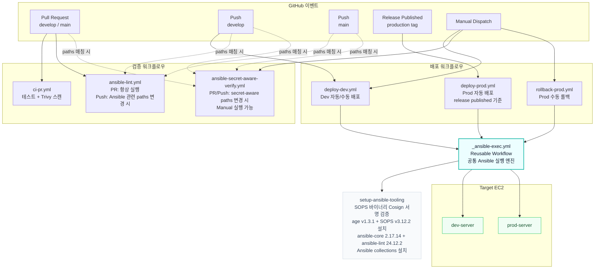

## CI/CD 파이프라인

### Dev 배포 (자동)

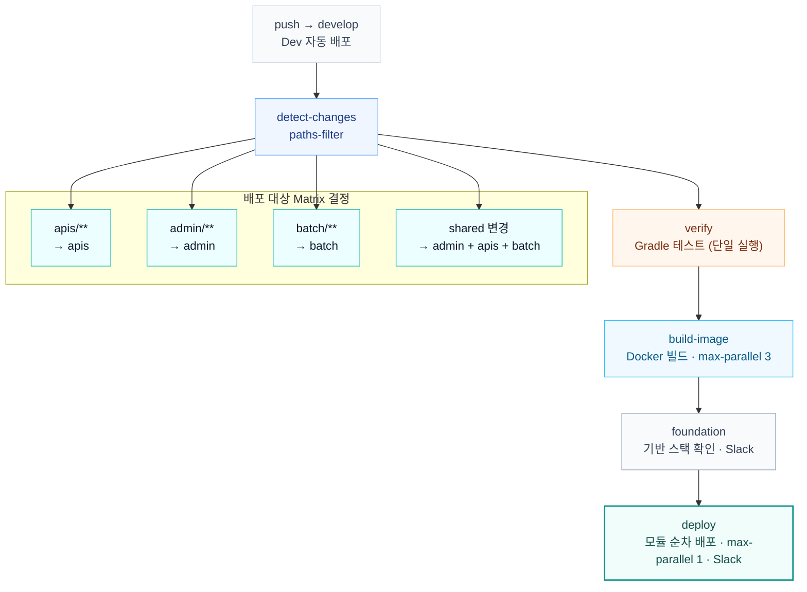

- `shared` 경로(domain, gateway, build-logic, gradle 등) 변경 시 **전체 모듈** 배포
- 이미지 태그: `dev-${GITHUB_SHA}`
- foundation job은 build-image 이후 deploy 전에 실행되며, deploy와 같은 `deploy-dev-runtime-${{ github.ref }}` concurrency group을
  사용하고 `needs: foundation`으로 marker 생성을 강제한다
- deploy job은 `max-parallel: 1` — nginx 설정 충돌 방지

### Ansible lint / secret-aware 검증

- `ansible-lint.yml`
    - PR-safe lint 경로
    - `working-directory: infra/ansible`
    - `ANSIBLE_VARS_ENABLED=host_group_vars`로 SOPS vars plugin을 비활성화하고 playbook/role 구조만 검증
- `ansible-secret-aware-verify.yml`
    - push to `develop`/`main`, `workflow_dispatch`에서 실행
    - `environment: dev` / `environment: prod` 각각에서 `AGE_SECRET_KEY`를 읽음
    - dev/prod 각각에서 `apis`, `admin`, `batch` 3개 module group을 모두 resolver로 검증
    - 현재 dev/prod inventory가 같은 host를 가리키더라도, `${module}_servers` contract drift를 조기에 잡기 위해 세 모듈 그룹을 모두 검사
    - `ansible-inventory --list`로 SOPS 복호화가 실제로 되는지 확인
    - 같은 환경에서 `ansible-lint playbooks/*.yml roles`도 실행해 SOPS 활성 상태의 lint까지 검증

### Prod 배포 (자동, release published)

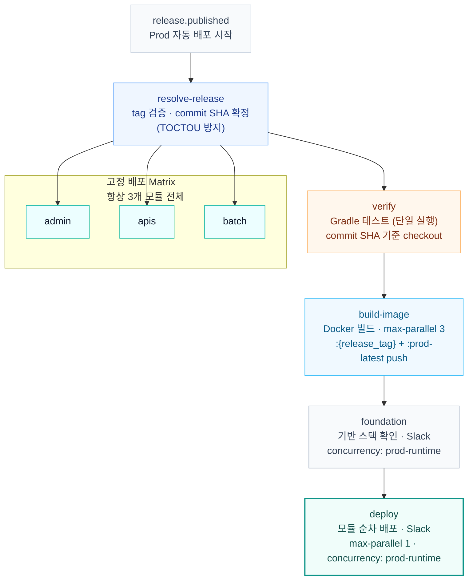

- `github.event.release.tag_name` 을 **prod 공통 버전 source**로 사용
- `apis/admin/batch` 3개 모듈을 **같은 release tag**로 build/push/deploy
- release tag는 `resolve-release` 단계에서 한 번만 해석하고, 이후 verify/build/deploy는 모두 **immutable commit SHA** 를 사용해 TOCTOU를 방지한다
- 이미지 태그는 모듈별로 `:{release_tag}` 와 `:prod-latest` 를 함께 push
- deploy 단계는 `max-parallel: 1` 로 모듈을 순차 배포
- `release-drafter.yml` 은 draft release 갱신용이며, **실제 prod deploy trigger는 published release** 뿐이다
- `rollback-prod.yml` 은 계속 **수동 workflow_dispatch** 로 유지
- foundation/deploy/rollback은 모두 `concurrency: prod-runtime` — prod 런타임 변경은 동시에 1개만
- resolver는 `ansible-inventory`로 대상 host/group를 선택하고, `community.sops` 환경에서 `ansible-inventory --host` 결과에 `ENC[...]` 가
  남을 수 있기 때문에 평문이 필요한 `ssh_host / ssh_port / ssh_host_fingerprint`만 임시 `ansible-playbook`으로 materialize 한다
- `_ansible-exec.yml` 은 inventory resolver 성공을 전제로 하며, prod caller 쪽 legacy SSH fallback은 두지 않는다

## Ansible 구조

### 디렉토리 레이아웃

```text
infra/ansible/
├── .ansible-lint.yml                    # Ansible Lint 검사 규칙
├── ansible.cfg                          # SOPS 플러그인, SSH 파이프라이닝
├── collections/requirements.yml         # community.docker, community.sops
├── inventories/
│   ├── dev/
│   │   ├── hosts.yml                    # 호스트 그룹 + ansible_port / ansible_user (ansible_host는 SOPS)
│   │   └── group_vars/all/
│   │       ├── main.yml                 # 평문 변수 (배포 설정, 컨테이너 구성)
│   │       └── secrets.sops.yml         # SOPS 암호화 (ansible_host, ssh_host_fingerprint, DB, 도메인 등)
│   └── prod/
│       ├── hosts.yml                    # 호스트 그룹 + ansible_port / ansible_user (ansible_host는 SOPS)
│       └── group_vars/all/
│           ├── main.yml                 # 평문 변수
│           └── secrets.sops.yml         # SOPS 암호화 (ansible_host, ssh_host_fingerprint, DB, 도메인 등)
├── playbooks/
│   ├── foundation.yml                   # 인프라 기반 스택
│   ├── deploy.yml                       # 앱 배포
│   ├── rollback.yml                     # 롤백
│   ├── secret.yml                       # 시크릿만 동기화
│   └── tasks/
│       └── validate_nginx_fragments.yml # Nginx fragment 매핑 공통 검증 로직
├── roles/
│   ├── foundation_stack/                # docker-compose 기반 기초 서비스
│   │   └── templates/foundation.compose.yml.j2
│   ├── nginx_base_config/               # nginx 설정 렌더링 + 프로모션
│   │   └── templates/default.conf.j2
│   ├── nginx_config_helper/             # update-nginx-config.py 배포 helper
│   ├── nginx_fragment_transaction/      # Nginx 설정 파일 변경 시 백업/복원(트랜잭션) 롤백 보장
│   ├── app_container_runtime/           # 컨테이너 런타임 환경변수(Profile, Actuator, 스케줄러 등) 조립
│   ├── app_secret/                      # SOPS → properties 파일
│   ├── app_scripts/                     # 배포 디렉토리 + nginx helper 준비
│   ├── app_release/                     # 릴리즈 메타데이터
│   ├── app_bluegreen/                   # blue-green 핵심 로직
│   ├── app_stopstart/                   # stop-start 배포
│   ├── app_healthcheck/                 # 헬스체크
│   ├── app_cleanup/                     # 메타데이터 승격 + 이미지 정리
│   └── app_rollback/                    # 롤백 로직
```

설명:

- 공용 nginx helper `update-nginx-config.py`는 `roles/nginx_config_helper/files/`로 이동했다.
- foundation / nginx 템플릿도 전역 `templates/`가 아니라 각 role의 `templates/` 안에서 관리한다.
- `deploy.yml`은 blue-green 모듈에서 `app_bluegreen`을 직접 import하고, `app_rollback`은 상대 `import_tasks` 대신 `import_role` + 명시적
  vars 전달 구조를 사용한다.

### Legacy nginx named volume → bind mount 마이그레이션

`foundation_stack`은 첫 실행 시 `nginx_legacy_config_volume_name`(Docker named volume)에 nginx 설정이 남아있으면 bind mount 디렉토리로
복사한다.

- `community.docker.docker_volume_info`로 legacy volume 존재 여부를 확인한다.
- volume이 있으면 `-anv` dry-run 후 실제 복사한다.
- 마이그레이션 완료 후 `.bind-mount-migrated-from-{{ foundation_stack_legacy_nginx_volume_name }}` marker를 생성해 중복 마이그레이션을 방지한다.
- Docker volume 내부 경로(`/var/lib/...`)를 직접 참조하지 않는다. `community.docker.docker_volume_info`가 volume metadata를 안전하게 추상화한다.

### Foundation marker contract

- `foundation.yml`은 `foundation_stack`과 선택적 `nginx_base_config`가 모두 성공한 뒤 `{{ deployment_dir }}/.foundation-applied`
  marker를 생성한다.
- marker는 foundation의 마지막 `post_tasks`에서 쓰이므로, foundation 도중 실패하면 새 marker가 생성되지 않는다. inventory나 foundation 변수 변경 후에는
  `foundation.yml`을 다시 실행해 marker를 갱신한다.
- marker 내용은 YAML 형식이며 `applied_at`, `commit_sha`, `deploy_environment`, `foundation_mysql_enabled`,
  `foundation_redis_enabled`, `foundation_manage_nginx`를 기록한다.
- `deploy.yml`과 `rollback.yml`은 앱 role을 실행하기 전에 같은 marker를 `stat`/`slurp`로 확인한다. marker가 없으면 foundation이 적용되지 않은 host로
  보고 즉시 실패하고, marker가 있으면 내용을 diagnostic log로 출력한다.
- `deploy-dev.yml`과 `deploy-prod.yml`은 deploy job 전에 `foundation` job을 실행한다. reusable workflow `_ansible-exec.yml`에
  `module: foundation`을 전달하되, SSH metadata resolver는 현재 단일 host inventory contract를 재사용하기 위해 `connection_module`을 조회한다.
  기본값은 `apis`이며, inventory 대표 호스트가 바뀌면 GitHub environment/repository variable `DEV_FOUNDATION_CONNECTION_MODULE` /
  `PROD_FOUNDATION_CONNECTION_MODULE`로 `${connection_module}_servers` 조회 대상을 바꾼다.
- foundation job과 deploy/rollback job은 각각 기존 `deploy-dev-runtime-${{ github.ref }}` / `prod-runtime` concurrency group을
  공유하므로 foundation, deploy, rollback이 같은 런타임에서 겹치지 않는다.

### Seed placeholder upstreams

`nginx_base_config`는 첫 foundation 실행 시 backend/admin/actuator upstream fragment가 없으면
`nginx_seed_placeholder_host:nginx_seed_placeholder_port`(기본 `127.0.0.1:65535`)를 가리키는
placeholder upstream을 생성한다. 이는 다음 두 가지를 보장한다.

1. **`nginx -t` 통과**: nginx가 시작하려면 모든 referenced upstream이 정의되어 있어야 한다.
   placeholder가 없으면 첫 deploy 전 nginx 부팅/검증이 실패한다.
2. **Blackhole 동작**: `127.0.0.1:65535`는 의도적으로 도달 불가능한 endpoint다.
   placeholder가 실수로 트래픽을 받더라도 실제 애플리케이션으로 라우팅되지 않는다.

placeholder는 `app_bluegreen`(apis)이나 `app_stopstart/admin_nginx_route`(admin)이 첫 배포될 때
`upsert-upstream`으로 실제 컨테이너 이름과 포트로 덮어쓴다. inventory에서 host/port를 변경할 수는
있지만, nginx pre-deploy validation + blackhole 계약을 깨지 않는 값으로만 유지해야 한다.

### Nginx access log와 app port 노출 계약

- HTTP request completion logging은 nginx `access.log`가 소유한다.
- `nginx_base_config`의 `log_format`은 key=value로 `traceId=$request_id`, `clientIp=$remote_addr`,
  `request="$request"`, `status=$status`, `bytes=$body_bytes_sent`, `referer="$http_referer"`,
  `userAgent="$http_user_agent"`, `xForwardedFor="$http_x_forwarded_for"`, `requestTime=$request_time`을 기록한다.
- application log는 business/domain event 중심이며, nginx access log와 같은 `traceId`로 join한다.
- foundation compose에서 host publish는 nginx `80:80`, `443:443`만 공개 소유한다. MySQL은
  `127.0.0.1:3306:3306`으로 loopback에 한정하고 Redis는 host publish를 갖지 않는다.
- app container(`apis`, `admin`, `batch`) run task에는 `ports:`를 추가하지 않는다. 앱은 Docker network 내부에서
  container name + app port로만 nginx upstream에 연결된다.
- 운영 확인은 `sudo ss -tulpen | grep -E ':80|:443|:4001|:4002|:4000'`와
  `docker ps --format 'table {{.Names}}\t{{.Ports}}'`로 수행한다.

### Scanner/bot nginx 차단 정책

BEAT는 PHP/WordPress/Laravel 기반 서비스가 아니므로 `/.env`, `/.git/config`, `/wp-admin/`,
`/wp-content/`, `/wordpress/`, `/laravel/`, 명백한 PHP probing path는 nginx에서 먼저 종료한다.

- scanner/bot 차단은 `nginx_base_config`가 소유하고, generated route fragment보다 앞에서 평가한다.
- HTTP server에서는 `/.well-known/acme-challenge/`를 먼저 살린 뒤 scanner block을 적용하고, 그 다음 HTTPS redirect를 수행한다.
- HTTPS server에서는 scanner block을 generated route include보다 먼저 둔다.
- 기본 응답은 `404`다. `444`는 운영 access log와 smoke 검증 후에만 선택한다.
- broad `*.php`/`.*\.php` regex는 사용하지 않는다. `/index.php`, `/phpinfo.php`, `/info.php` 같은 PHP probing은 exact match로만 차단한다.
- root `.env` 계열만 narrow anchored regex로 보강한다. path 전체의 `.env`를 넓게 잡지 않는다.
- scanner 결과 확인은 nginx `access.log`에서 수행한다. app request completion log를 추가하지 않는다.
- rate limit은 1차 rollout에서 강제 적용하지 않는다. access log top-N과 정상 사용자 영향도를 확인한 뒤, 필요하면 scanner location에만 별도 threshold로 적용한다.

운영 전/후 smoke:

```bash
docker exec nginx nginx -t

curl -Ik https://<host>/.env
curl -Ik https://<host>/.git/config
curl -Ik https://<host>/wp-admin/index.php
curl -Ik https://<host>/wordpress/.git/config
curl -Ik https://<host>/laravel/.env

curl -Ik https://<host>/api/main
curl -Ik https://<host>/admin/
curl -Ik https://<host>/robots.txt
curl -Ik https://<host>/favicon.ico
```

기본 기대값은 scanner path `404`, 정상 route 비차단이다.

응급 rollback은 scanner block만 disable하고 foundation/nginx role을 다시 적용한다.
`nginx_base_config` transaction이 검증과 reload를 수행하므로, 아래 `nginx -t`는 적용 후 확인용이다.

```bash
ansible-playbook infra/ansible/playbooks/foundation.yml \
  -i infra/ansible/inventories/prod/hosts.yml \
  --tags nginx \
  -e deploy_environment=prod \
  -e foundation_manage_nginx=true \
  -e nginx_scanner_block_enabled=false

docker exec nginx nginx -t
```

재활성화:

```bash
ansible-playbook infra/ansible/playbooks/foundation.yml \
  -i infra/ansible/inventories/prod/hosts.yml \
  --tags nginx \
  -e deploy_environment=prod \
  -e foundation_manage_nginx=true \
  -e nginx_scanner_block_enabled=true
```

### Nginx fragment mapping contract

`nginx_fragments` inventory 값은 upstream 이름과 generated fragment 파일명을 묶는 canonical mapping이다.
`nginx_base_config`, `app_bluegreen`, `app_stopstart/admin_nginx_route`는 `backend.conf` 같은 파일명을
직접 하드코딩하지 않고 이 mapping의 `fragment_file`을 참조한다. `foundation.yml`, `deploy.yml`,
`rollback.yml`은 preflight에서 mapping 누락/빈 값/중복 파일명을 즉시 실패시킨다.

운영 중인 host에서 `fragment_file`을 바꾸면 기존 `nginx/generated` source/target fragment와 `.bak`
복구 경계가 서로 다른 경로를 보게 될 수 있다. 따라서 `nginx_fragments`는 일반 운영 변수라기보다
read-only contract로 취급하고, 변경이 필요하면 기존 fragment 이동/정리 계획과 함께 별도 마이그레이션으로
진행한다.

### Playbook 흐름

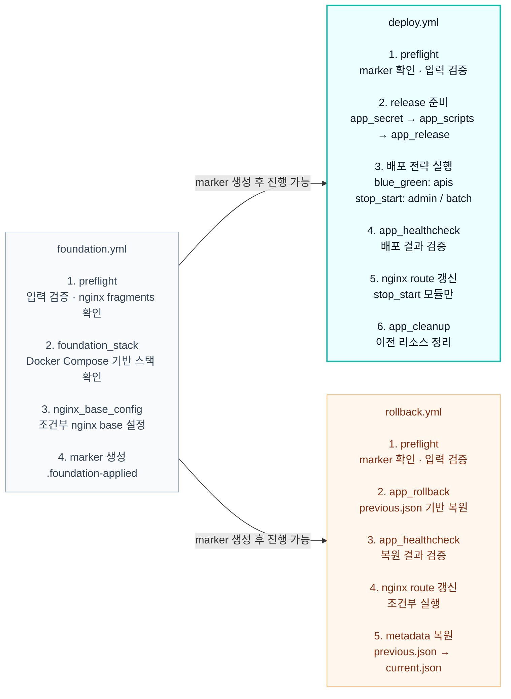

### 모듈별 배포 전략

| 모듈        | 배포 모드      | 포트   | 다운타임          | Nginx 라우팅                 |
|-----------|------------|------|---------------|---------------------------|
| **apis**  | blue_green | 4001 | Zero-downtime | `/ → backend` upstream 전환 |
| **admin** | stop_start | 4000 | 있음            | `/admin/ → admin_backend` |
| **batch** | stop_start | 4002 | 있음            | 없음 (내부 스케줄러)              |

### Blue-Green 배포 상세 (apis)

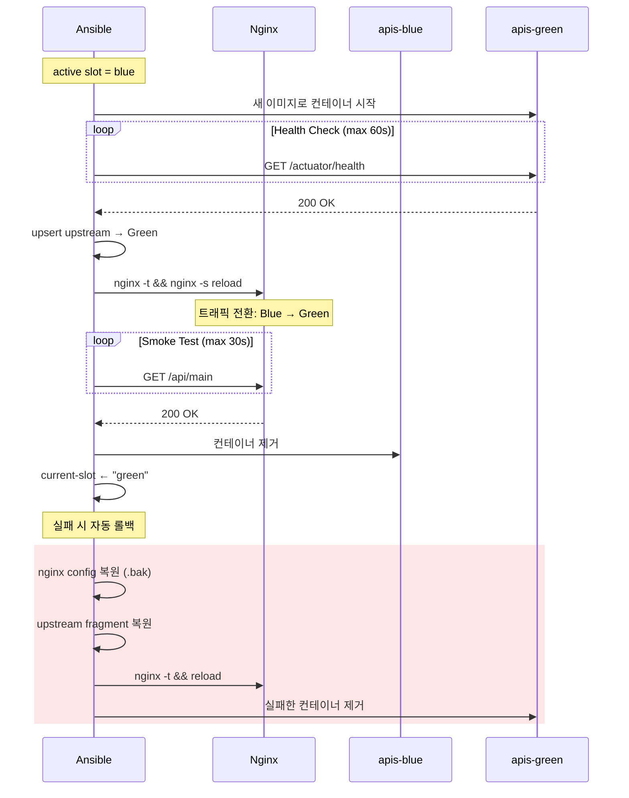

> **💡 아키텍처 상세: Ephemeral Curl Container 패턴**
> 위 다이어그램의 `Health Check` 단계는 타겟 호스트(EC2)에 `curl`이 설치되어 있는지 묻지도 따지지도 않습니다. 대신 도커 내부의 `beat-network`에 `curlimages/curl` 컨테이너를 일회성(ephemeral)으로 띄워 타겟 컨테이너의 Actuator 내부 엔드포인트를 호출하여 헬스체크를 수행한 뒤 즉시 삭제합니다. 이를 통해 호스트 운영체제 환경에 대한 의존성을 완벽하게 제거하고 네트워크 격리를 보장합니다.

## SOPS 시크릿 관리

### 암호화 체인

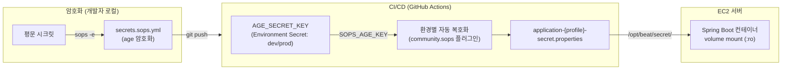

### age 키 관리

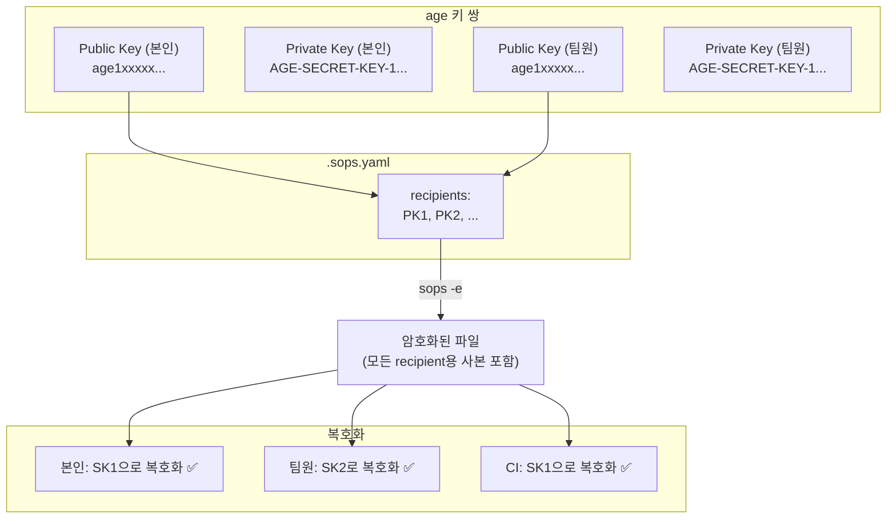

**키 1개로 복호화 가능**: SOPS는 각 recipient의 public key로 별도 암호화 사본을 만든다. 복호화 시 자신의 private key 하나만 있으면 된다.

### secrets.sops.yml에 저장되는 항목

| 카테고리    | 변수                                                                      | 설명                            |
|---------|-------------------------------------------------------------------------|-------------------------------|
| **인프라** | `ansible_host`                                                          | 서버 IP (평문 노출 방지)              |
| **인프라** | `ssh_host_fingerprint`                                                  | 서버 SSH 호스트 지문 (`SHA256:...`)   |
| **인프라** | `nginx_server_name`                                                     | 도메인                           |
| **인프라** | `letsencrypt_cert_name`                                                 | SSL 인증서 도메인                   |
| **인프라** | `actuator_allow_cidrs`                                                  | actuator 접근 허용 CIDR 목록        |
| **인프라** | `actuator_port`                                                         | actuator 포트 (시크릿 경로 일부)       |
| **인프라** | `actuator_path`                                                         | actuator 경로 (시크릿 경로 일부)       |
| **DB**  | `mysql_root_password`, `mysql_database`, `mysql_user`, `mysql_password` | MySQL 접속 정보                   |
| **앱**   | `app_secret_content`                                                    | Spring Boot 시크릿 properties 전체 |

`main.yml`에는 배포 모드, 컨테이너 이름, 포트, 경로 등 **노출되어도 무방한 설정값**만 남긴다.

### 🛡️ 시크릿 런타임 주입 및 권한 제어 (12-Factor)

`app_secret` 역할(Role)이 `app_secret_content`를 복호화하여 타겟 서버의 물리적 파일로 쓸 때, 매우 정교한 방어적 보안이 적용됩니다.

1. **파일 권한 통제 (0640 & UID 10001)**: 호스트의 `/opt/beat/secret` 경로에 생성되는 시크릿 파일은 `root:10001` 소유권과 `0640` 파일 권한을 강제합니다. 컨테이너가 루트 권한 없이 `UID 10001` 계정으로 실행되므로 파일을 합법적으로 읽을 수 있지만, 호스트에 침투한 다른 권한 없는 사용자나 스크립트는 시크릿을 절대 탈취할 수 없습니다.
2. **읽기 전용(RO) 마운트**: 애플리케이션 컨테이너를 구동할 때 `-v /opt/beat/secret:/app/secret:ro` 형태로 볼륨을 마운트합니다. Spring Boot는 `/app/secret` 경로에서 프로퍼티를 안전하게 로드하며, 컨테이너 내부에서 시크릿 파일을 임의로 수정/삭제하는 것을 원천 차단합니다.

### 팀원 추가 절차

```bash
# 1. 팀원이 age 키 생성
age-keygen -o ~/Library/Application\ Support/sops/age/keys.txt
# 출력: public key: age1xxxxxxxxx...

# 2. .sops.yaml에 팀원 public key 추가 (쉼표 구분)
# creation_rules:
#   - path_regex: ...
#     age: >-
#       age1본인publickey...,
#       age1새팀원publickey...

# 3. 기존 시크릿 파일 재암호화 (기존 키 소유자가 실행)
sops updatekeys infra/ansible/inventories/dev/group_vars/all/secrets.sops.yml
sops updatekeys infra/ansible/inventories/prod/group_vars/all/secrets.sops.yml

# 4. 커밋 & 푸시
```

### 시크릿 편집

```bash
# 복호화 후 편집기 열기 (저장 시 자동 재암호화)
sops infra/ansible/inventories/dev/group_vars/all/secrets.sops.yml

# 특정 값만 추출
sops -d --extract '["actuator_port"]' infra/ansible/inventories/dev/group_vars/all/secrets.sops.yml
```

## 타겟 서버 사전 요구사항 (Prerequisites)

Ansible의 `community.docker` 모듈이 타겟 EC2 서버에서 정상 동작하기 위해, 서버 셋업 시(AMI 또는 User Data) 다음 패키지들이 미리 설치되어 있어야 합니다.

1. **Docker Engine & Compose V2**
   - `docker-ce`, `docker-ce-cli`
   - `docker-compose-plugin` (`docker_compose_v2` 모듈 실행용)
2. **Python & Docker SDK (필수!)**
   - `python3`
   - `python3-docker` (또는 `pip3 install docker`) 
   - 이 패키지가 없으면 `docker_volume_info`, `docker_network` 등의 Ansible 모듈이 Python 라이브러리 참조 에러로 실패합니다.
3. **Nginx Helper 스크립트 종속성**
   - `update-nginx-config.py`는 외부 의존성 없이 표준 파이썬 라이브러리만 사용하므로 추가 pip 패키지 설치는 필요 없습니다.

또한, Ansible Playbook이 정상 동작하려면 아래 **파일 시스템 구조**가 타겟 서버에 미리 존재해야 합니다 (Ansible이 자동으로 생성해주지 않는 Out-of-band 관리 대상입니다).

4. **SSL 인증서 (Certbot)**
   - Nginx가 HTTPS 설정으로 구동되기 위해 Let's Encrypt 인증서가 필수입니다.
   - `/home/ubuntu/data/certbot/conf/live/<letsencrypt_cert_name>/fullchain.pem` 및 `privkey.pem`
   - 위 파일들이 사전에 발급되어 있지 않으면 `foundation_stack` 실행 시 Nginx 컨테이너가 볼륨 마운트 및 설정 파일 파싱 오류로 즉시 종료(Exit 1)됩니다.
5. **Redis 설정 파일**
   - `/home/ubuntu/redis.conf`
   - 이 파일이 호스트에 없으면 Docker 엔진이 이를 디렉토리로 간주하여 빈 폴더를 생성해버리고, 결과적으로 Redis 컨테이너가 `Fatal error, can't open config file` 에러와 함께 구동에 실패합니다.

---

## 서버 구성

### Docker 컨테이너 구조

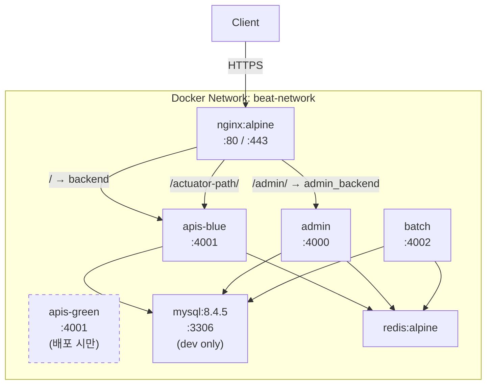

### Nginx Generated Fragment 시스템

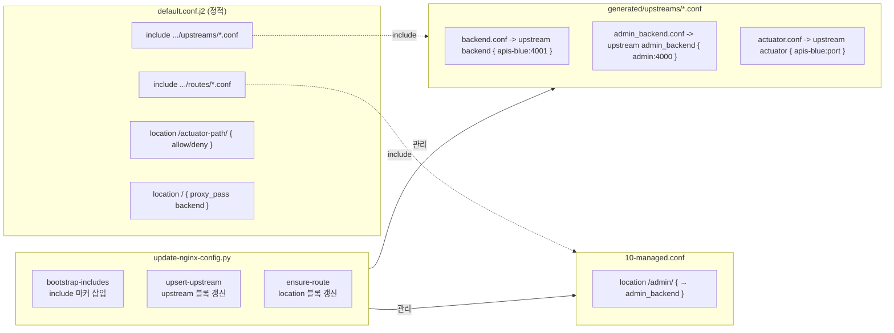

### 서버 파일시스템 레이아웃

```text
/home/ubuntu/deployment/                    # Ansible 작업 디렉토리
├── docker-compose.yml                      # foundation 렌더링
├── update-nginx-config.py                  # nginx fragment 관리
└── nginx/
    ├── default.conf                        # 후보 설정 (source, 다음 promotion 입력)
    ├── generated-source/                   # 후보 fragment (source, 다음 promotion 입력)
    │   ├── upstreams/backend.conf
    │   ├── upstreams/admin_backend.conf
    │   ├── upstreams/actuator.conf
    │   └── routes/10-managed.conf
    ├── conf.d/default.conf                 # bind mount target → /etc/nginx/conf.d/default.conf
    └── generated/                          # bind mount target → /etc/nginx/generated
        ├── upstreams/backend.conf
        ├── upstreams/admin_backend.conf
        ├── upstreams/actuator.conf
        └── routes/10-managed.conf

/opt/beat/
├── secret/
│   └── application-{profile}-secret.properties
└── releases/{module}/
    ├── current-slot                        # blue/green (apis만)
    ├── current.json                        # 현재 배포 메타데이터
    └── previous.json                       # 이전 배포 (롤백용)
```

### Release metadata schema

`app_release`는 배포 시작 시 `pending.json`을 쓰고, 배포/검증이 끝난 뒤 `app_cleanup`이 이를 `current.json`으로 승격한다. 기존 `current.json`은
`previous.json`으로 보존되어 rollback 입력이 된다. `app_rollback`은 rollback 전에 기존 `current.json`을 `reverted-<UTC>.json`으로
archive한다.

> **💡 리소스 정리(Cleanup) 정책**: `app_cleanup`은 메타데이터 승격과 동시에 `docker image prune -f --filter "until=72h"` 명령을 실행하여 **72시간이 지난(오래된) 댕글링 이미지를 자동 삭제**합니다. 이를 통해 빈번한 CI/CD 배포로 인해 EC2 호스트의 디스크 용량이 고갈되는 것을 효과적으로 방지합니다.

| 필드                   | 의미                                  | 출처 / provenance                                     |
|----------------------|-------------------------------------|-----------------------------------------------------|
| `module`             | 배포 대상 모듈 (`apis`, `admin`, `batch`) | GitHub workflow matrix/input이 Ansible extra var로 전달 |
| `image`              | 실제 실행할 Docker image 전체 이름           | deploy/rollback workflow에서 전달한 image extra var      |
| `image_tag`          | image tag 또는 release tag            | dev는 `dev-{GITHUB_SHA}`, prod는 release tag 기준       |
| `commit_sha`         | 배포 기준 Git commit SHA                | GitHub run에서 해석한 commit SHA                         |
| `deploy_actor`       | 배포를 트리거한 GitHub actor               | GitHub workflow의 actor 값                            |
| `deploy_environment` | Ansible inventory 환경 (`dev`/`prod`) | inventory `deploy_environment`                      |
| `created_at`         | metadata 생성 시각                      | Ansible controller(GitHub runner)에서 계산한 UTC         |

`created_at`은 원격 EC2의 시스템 시간이 아니라 controller UTC(GitHub runner)에서 계산한다. EC2 clock drift의 영향을 받지 않는다.

## GitHub Secrets

### 필수 (Environment: dev)

| Secret                         | 용도                               |
|--------------------------------|----------------------------------|
| `AGE_SECRET_KEY`               | dev 환경 SOPS 복호화용 age private key |
| `DEV_DOCKER_LOGIN_USERNAME`    | Docker Hub 사용자명                  |
| `DEV_DOCKER_LOGIN_ACCESSTOKEN` | Docker Hub 액세스 토큰                |
| `DEV_SSH_PRIVATE_KEY`          | dev 서버 SSH 비밀키                   |

> **참고**: 이전 방식에서는 서버 IP와 SSH 지문을 GitHub Secret으로 관리했으나, 현재는 `resolve-ansible-connection` 액션을 통해 `secrets.sops.yml`에서 동적으로 복호화하여 사용하므로 GitHub Secret에서 제거되었습니다.

### 필수 (Environment: prod)

| Secret                          | 용도                                |
|---------------------------------|-----------------------------------|
| `AGE_SECRET_KEY`                | prod 환경 SOPS 복호화용 age private key |
| `PROD_DOCKER_LOGIN_USERNAME`    | Docker Hub 사용자명                   |
| `PROD_DOCKER_LOGIN_ACCESSTOKEN` | Docker Hub 액세스 토큰                 |
| `PROD_SSH_PRIVATE_KEY`          | prod 서버 SSH 비밀키                   |

### 선택 (Repository-level 또는 Environment-level)

| Secret              | 용도                           |
|---------------------|------------------------------|
| `SLACK_WEBHOOK_URL` | 배포 성공/실패 Slack 알림 (없으면 skip) |
| `ACTION_TOKEN`      | Release Drafter용 GitHub 토큰   |

### SSH Host Fingerprint 확인 방법

```bash
# 로컬 터미널에서 실행 (서버 접속 불필요, 공개키 조회)
ssh-keyscan -p 22 <서버IP> 2>/dev/null | ssh-keygen -lf - -E sha256
# 출력에서 ED25519의 SHA256:... 값을 사용
```

### SSH pipelining + sudo `requiretty` caveat

`infra/ansible/ansible.cfg`는 SSH pipelining을 켠다. Ubuntu 22.04 계열 기본 EC2 AMI에서는 `become: true`와 함께 정상 동작하지만, 일부 커스텀 AMI나
레거시 sudoers 정책에서 `Defaults requiretty`가 켜져 있으면 Ansible pipelining + sudo 조합이 실패할 수 있다.

- Ubuntu 기본 AMI처럼 `requiretty`가 없는 환경: 현재 설정 유지 (`pipelining = True`)
- 커스텀 AMI에서 sudo가 TTY를 요구하는 환경: sudoers에서 `requiretty`를 끄거나, 해당 inventory/ansible.cfg에서 pipelining을 비활성화한 뒤 재검증
- 증상: SSH 접속은 성공하지만 `become` 태스크가 sudo/TTY 관련 오류로 실패

운영 AMI를 교체할 때는 foundation/deploy/rollback syntax check만으로 충분하지 않다. 실제 `become` 태스크가 포함된 dry-run 또는 제한된 smoke deploy로
pipelining 호환성을 확인한다.

## 로컬 개발

### 사전 준비

1. **SOPS + age 설치**
   ```bash
   # macOS
   brew install sops age
   ```

2. **age 키 생성** (최초 1회)
   ```bash
   age-keygen -o ~/Library/Application\ Support/sops/age/keys.txt
   # 출력된 public key를 기존 키 소유자에게 전달
   # → .sops.yaml에 추가 + sops updatekeys 실행 필요
   ```

3. **시크릿 파일 생성**
   ```bash
   ./scripts/generate-local-dev-secret.sh
   # → secret/application-dev-secret.properties 생성
   
   ./scripts/generate-local-prod-secret.sh
   # → secret/application-prod-secret.properties 생성
   ```

### 로컬 실행

```bash
./gradlew :apis:bootRun
./gradlew :admin:bootRun
./gradlew :batch:bootRun
```

### 로컬 검증

```bash
# 전체 테스트
./gradlew test

# infra 컴파일
./gradlew :infra:compileJava :infra:compileKotlin

# boundary contract 테스트
./gradlew :test --tests "com.beat.SharedBoundaryContractTest"

# Ansible syntax check
cd infra/ansible
ansible-playbook playbooks/foundation.yml -i inventories/dev/hosts.yml --syntax-check
ansible-playbook playbooks/deploy.yml -i inventories/dev/hosts.yml --syntax-check \
  -e module=apis -e image=test -e image_tag=test
ansible-playbook playbooks/deploy.yml -i inventories/prod/hosts.yml --syntax-check \
  -e module=admin -e image=test -e image_tag=test
ansible-playbook playbooks/rollback.yml -i inventories/dev/hosts.yml --syntax-check -e module=batch
ansible-playbook playbooks/rollback.yml -i inventories/prod/hosts.yml --syntax-check -e module=apis
```

## 환경별 차이

| 항목          | Dev                                        | Prod                                            |
|-------------|--------------------------------------------|-------------------------------------------------|
| 배포 트리거      | develop push / workflow_dispatch           | release.published (자동, shared tag)              |
| 이미지 태그      | `dev-{SHA}` + `dev-latest`                 | `{release_tag}` (예: `v1.2.3`) + `prod-latest`   |
| MySQL       | Docker 컨테이너 (foundation)                   | 비활성 (`foundation_mysql_enabled: false`, 외부 RDS) |
| Redis 컨테이너명 | `redis`                                    | `beat-prod-redis`                               |
| 도메인         | `secrets.sops.yml`의 `nginx_server_name` 참조 | 동일                                              |
| 롤백          | 재배포로 대체                                    | rollback-prod.yml (수동)                          |
| concurrency | `deploy-dev-runtime-{ref}` (브랜치별)          | `prod-runtime` (전역 락)                           |

## Rollback

prod 전용 `rollback-prod.yml` 워크플로우가 제공된다.

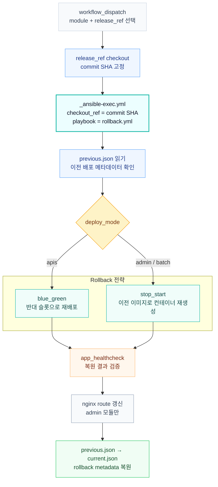

- `previous.json`이 없으면 롤백 불가 (assert 실패)
- 롤백은 `release_ref` 입력을 먼저 immutable commit SHA로 해석하고, `_ansible-exec.yml`의 `checkout_ref`로 전달해 prod 배포와 같은 코드 기준에서 실행한다
- 롤백 후 `app_healthcheck`와 nginx route 갱신이 모두 성공해야 `current.json`을 live 상태로 복원한다

### Nginx source/target contract

- `deployment/nginx/default.conf` 와 `deployment/nginx/generated-source/**` 는 후보(source) 설정이다.
- `deployment/nginx/conf.d/**` 와 `deployment/nginx/generated/**` 는 nginx 컨테이너에 bind mount되는 실제 적용(target) 설정이다.
- Nginx 관련 role은 실패 시 target만이 아니라 source도 함께 복원해야 한다.
