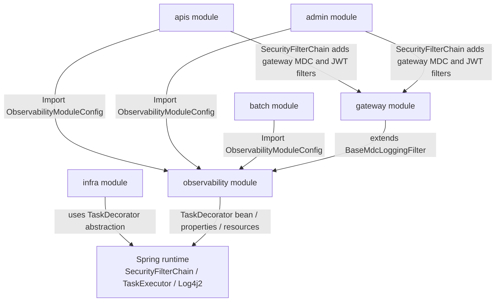
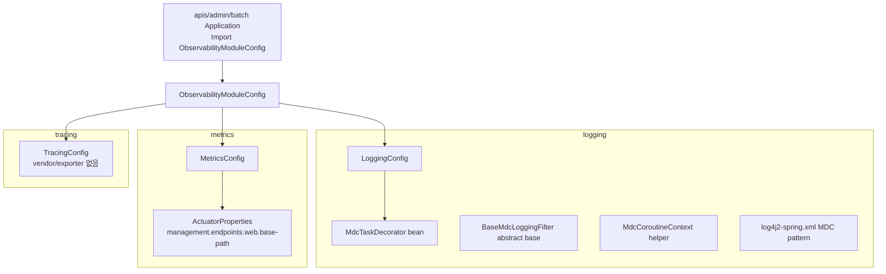
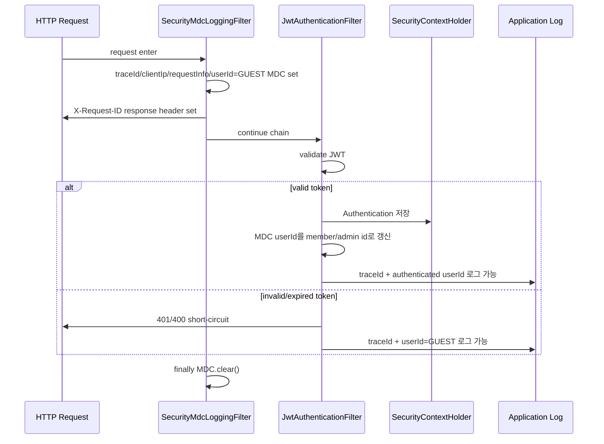
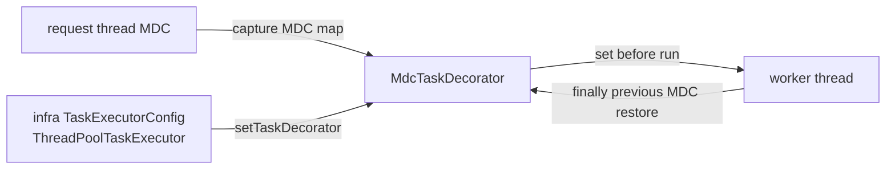

# observability module

`observability`는 BEAT 실행 모듈이 공유하는 **logging / metrics / tracing / actuator bootstrap 경계**입니다.
HTTP 요청 correlation은 MDC 기반으로 처리하고, actuator 설정 소유권은 이 모듈에 둡니다.

> 핵심 원칙: 실행 모듈은 `ObservabilityModuleConfig`만 import합니다.
> observability는 gateway/security, 실행 모듈, domain/infra 비즈니스 구현을 직접 알지 않습니다.

---

## 1. 이 문서를 읽는 방법

새 observability 코드를 추가하거나 기존 코드를 이동할 때 아래 질문에 먼저 답합니다.

| 질문 | 위치 |
| --- | --- |
| 실행 모듈이 observability를 켜는 진입점인가? | `ObservabilityModuleConfig` |
| log4j2 pattern, MDC helper, async/coroutine MDC 전파인가? | `logging` |
| HTTP request MDC key를 채우는 servlet filter base인가? | `logging.filter` |
| 인증 사용자 식별이 필요한 MDC filter인가? | `gateway.security.internal.servlet` |
| actuator base path 같은 management endpoint property인가? | `metrics.config` |
| vendor/exporter 없는 tracing placeholder인가? | `tracing` |
| controller/service/tx 실행 시간 AOP logging인가? | 추가 금지 — #460에서 제거됨 |

---

## 2. 전체 레이어에서 observability의 위치



### 레이어별 책임

| Layer | 책임 | 금지 |
| --- | --- | --- |
| 실행 모듈 (`apis`, `admin`, `batch`) | `ObservabilityModuleConfig` import, 실행 환경 profile/property 제공 | observability 내부 config 직접 import |
| `observability` 공개 진입점 | logging / metrics / tracing slice 조립 | gateway/security 구현 import |
| `observability.logging` | log pattern 계약, MDC async/coroutine helper, 공통 filter base | servlet filter bean 자동 등록 |
| `gateway` | SecurityContext 기반 MDC userId 식별 filter 제공 | observability로 역의존 만들기 |
| `infra` | executor 소유, context의 `TaskDecorator` 적용 | observability 구현체 직접 import |

---

## 3. Bootstrap 구조

실행 모듈은 `ObservabilityModuleConfig`만 import합니다.
이 config가 observability 내부 slice를 조립합니다.



### 실행 모듈별 적용

| 모듈 | `ObservabilityModuleConfig` | servlet MDC filter 자동 등록 | 비고 |
| --- | --- | --- | --- |
| `apis` | ✅ | ❌ | `SecurityFilterChain`에서 gateway MDC filter를 JWT보다 먼저 배치 |
| `admin` | ✅ | ❌ | `SecurityFilterChain`에서 gateway MDC filter를 JWT보다 먼저 배치 |
| `batch` | ✅ | ❌ | 이번 PR에서는 servlet MDC filter 미등록 |

---

## 4. 공개 표면

| 공개 타입 | 위치 | 용도 |
| --- | --- | --- |
| `ObservabilityModuleConfig` | `com.beat.observability` | 실행 모듈이 import하는 유일한 bootstrap entrypoint |
| `BaseMdcLoggingFilter` | `com.beat.observability.logging.filter` | gateway/security-aware filter가 확장하는 공통 MDC filter base |
| `SimpleMdcLoggingFilter` | `com.beat.observability.logging.filter` | 비인증 runtime용 기본 구현. 현재는 자동 등록하지 않음 |
| `MdcCoroutineContext` | `com.beat.observability.logging.coroutines` | coroutine dispatcher 전환 시 MDC 전파 helper |

내부 slice config인 `LoggingConfig`, `MetricsConfig`, `TracingConfig`는 `ObservabilityModuleConfig`가 import합니다.
실행 모듈이 직접 import하지 않습니다.

---

## 5. Request correlation logging

### MDC key 계약

HTTP 요청 로깅 MDC pipeline은 아래 값을 기록합니다.

| key | source | fallback |
| --- | --- | --- |
| `traceId` | `BaseMdcLoggingFilter`: `X-Request-ID` request header | UUID 기반 32자리 trace id 생성 |
| `userId` | `BaseMdcLoggingFilter`: `resolveUserId()` 결과 | `GUEST` |
| `clientIp` | `BaseMdcLoggingFilter`: `X-Forwarded-For` 첫 번째 값 → `X-Real-IP` → `remoteAddr` | `remoteAddr` |
| `requestInfo` | `BaseMdcLoggingFilter`: `METHOD URI` | 없음 |
| `routePattern` | `RoutePatternMdcInterceptor`: `HandlerMapping.BEST_MATCHING_PATTERN_ATTRIBUTE` | `NO_ROUTE` |

필터는 response에도 `X-Request-ID`를 기록하고, request 종료 시 `MDC.clear()`를 실행합니다.
`routePattern`은 handler mapping 이후 `RoutePatternMdcInterceptor`가 채웁니다. 따라서 매칭된 Spring MVC 요청은
`GET /api/performances/detail/{performanceId}`처럼 안정적인 route key로 집계할 수 있고, handler가 없는
scanner/404 요청은 `NO_ROUTE` 또는 route 미기록이 정상입니다.

### 운영 로그 책임 분리

- Request completion logging은 nginx `access.log`가 소유합니다.
- nginx access log는 `traceId`, `clientIp`, `request`, `status`, `bytes`, `referer`, `userAgent`, `xForwardedFor`,
  `requestTime` 같은 HTTP 완료 사실을 기록합니다.
- Application log는 request completion log를 중복으로 남기지 않고 business event/domain flow 메시지에 집중합니다.
- Application log context는 MDC key-value(`traceId`, `userId`, `clientIp`, `request`, `route`)로 붙입니다.
- nginx access log와 application log는 같은 `traceId`로 join합니다.
- raw URI(`requestInfo`)는 디버깅용이고, route-level aggregation은 가능한 경우 `routePattern`을 사용합니다.

### Security-aware userId 흐름



중요한 순서:

```text
SecurityMdcLoggingFilter
  -> JwtAuthenticationFilter
  -> UsernamePasswordAuthenticationFilter anchor
  -> Spring Security 기본 필터들
```

MDC filter를 JWT보다 먼저 배치하는 이유는 invalid/expired token에서 JWT filter가 chain을 끊어도 `traceId`, `requestInfo`, `X-Request-ID`가 보장되어야 하기 때문입니다.
JWT 인증 성공 시에는 `JwtAuthenticationFilter`가 MDC `userId`를 인증 사용자 id로 갱신합니다.

### Log4j2 pattern

`observability/src/main/resources/log4j2-spring.xml`은 MDC fallback을 포함합니다.

```text
[traceId=%equals{%X{traceId}}{}{NO_TRACE}] [userId=%equals{%X{userId}}{}{GUEST}]
[clientIp=%equals{%X{clientIp}}{}{UNKNOWN}]
[request=%equals{%X{requestInfo}}{}{NO_REQUEST}]
[route=%equals{%X{routePattern}}{}{NO_ROUTE}]
```

---

## 6. Async MDC propagation

`@Async`와 `ThreadPoolTaskExecutor`는 worker thread에서 실행되므로 request thread의 `ThreadLocal` 기반 MDC가 자동으로 이어지지 않습니다.

`LoggingConfig`는 `MdcTaskDecorator`를 `TaskDecorator` bean으로 등록합니다.
executor 소유자인 `infra`의 `TaskExecutorConfig`는 context에 있는 `TaskDecorator` bean을 적용합니다.



규칙:

- servlet MDC filter는 여전히 bean으로 자동 등록하지 않습니다.
- `MdcTaskDecorator`는 task 실행 후 이전 worker-thread MDC를 복원해 thread-pool context leak을 막습니다.
- 여러 `TaskDecorator` bean이 생기면 `infra`가 `CompositeTaskDecorator`로 합성합니다.
- 추후 Micrometer tracing/context-propagation을 도입해도 `TaskDecorator` 합성 구조로 확장합니다.

---

## 7. Coroutine MDC propagation

`TaskDecorator`는 Spring `ThreadPoolTaskExecutor` / `@Async` 경로에 적용됩니다.
Kotlin coroutine은 suspend/resume 과정에서 dispatcher thread가 바뀔 수 있으므로 별도의 `CoroutineContext` 전파가 필요합니다.

`MdcCoroutineContext`는 `kotlinx-coroutines-slf4j`의 `MDCContext`를 감싼 helper입니다.

```kotlin
MdcCoroutineContext.withCurrent {
    withContext(Dispatchers.IO) {
        logger.info("MDC traceId/userId is available here")
    }
}

launch(MdcCoroutineContext.current()) {
    logger.info("MDC traceId/userId is available here")
}
```

주의:

- coroutine 시작 시점의 MDC map이 capture됩니다.
- coroutine 내부에서 `MDC.put(...)`으로 값을 바꾼 뒤 suspend 되면 그 변경은 자동으로 다시 capture되지 않습니다.
- 변경된 MDC까지 이어야 하면 변경 직후 다시 `MdcCoroutineContext.withCurrent { ... }` 또는 `MdcCoroutineContext.current()`를 적용합니다.

---

## 8. Metrics / Actuator

`MetricsConfig`가 `ActuatorProperties`를 `@EnableConfigurationProperties`로 등록합니다.
실행 모듈에 `@ConfigurationPropertiesScan`을 다시 추가하지 않습니다.

| 항목 | 값 |
| --- | --- |
| prefix | `management.endpoints.web` |
| property | `base-path` |
| default | 없음 |

Actuator base path는 기본 `/actuator` fallback을 두지 않습니다.
각 profile property가 반드시 명시해야 합니다.

```yaml
management:
  endpoints:
    web:
      base-path: ${DEV_ACTUATOR_PATH}
```

이유:

- actuator 경로는 운영 노출면이므로 코드 기본값으로 공개 경로를 만들지 않습니다.
- dev/prod/test profile이 의도적으로 base path를 소유합니다.
- `batch`도 이번 PR에서 servlet MDC filter를 자동 등록하지 않고 metrics/actuator resource만 유지합니다.

---

## 9. Tracing

`TracingConfig`는 현재 vendor/exporter 없는 placeholder입니다.

이번 PR에서 하지 않습니다.

- OpenTelemetry/Zipkin/Jaeger exporter 도입
- Micrometer tracing propagation policy 확대
- tracing vendor dependency 추가
- actuator exposure policy 확대

추후 tracing 도입 시에도 public entrypoint는 `ObservabilityModuleConfig`로 유지합니다.

---

## 10. 패키지 구조

```text
observability/
  src/main/kotlin/com/beat/observability/
    ObservabilityModuleConfig.kt              # public bootstrap entrypoint
    logging/
      LoggingConfig.kt                        # logging slice config, TaskDecorator bean
      MdcTaskDecorator.kt                     # @Async / executor MDC propagation
      coroutines/
        MdcCoroutineContext.kt                # coroutine MDC propagation helper
      filter/
        BaseMdcLoggingFilter.kt               # common servlet MDC filter base
        SimpleMdcLoggingFilter.kt             # non-security implementation, not auto-registered
    metrics/
      MetricsConfig.kt                        # actuator property registration
      config/
        ActuatorProperties.kt                 # management.endpoints.web.base-path
    tracing/
      TracingConfig.kt                        # tracing placeholder
  src/main/resources/
    application-observability.yml             # observability profile resources
    log4j2-spring.xml                         # shared MDC logging pattern
```

삭제된 AOP logging surface:

```text
observability/src/main/java/com/beat/observability/aop/*
```

---

## 11. 허용 의존성

```text
observability -> Spring logging / web / actuator / task abstractions
observability -> kotlinx-coroutines-slf4j
observability -> Sentry Spring Boot starter API
observability -> Sentry Log4j2 / async profiler runtime integrations
```

허용되는 외부 역할:

```text
gateway -> observability BaseMdcLoggingFilter 확장
infra -> Spring TaskDecorator abstraction 적용
apis/admin/batch -> ObservabilityModuleConfig import
```

---

## 12. 금지 규칙

- observability가 `gateway`를 import하지 않습니다.
- observability가 `apis`, `admin`, `batch`를 import하지 않습니다.
- observability가 `domain`, `infra` 비즈니스 구현을 import하지 않습니다.
- `LoggingConfig`에서 servlet filter bean을 자동 등록하지 않습니다.
- batch에 servlet MDC filter를 이번 PR에서 자동 등록하지 않습니다.
- AOP logging을 되살리지 않습니다.
- actuator base path에 `/actuator` 같은 코드 기본값을 두지 않습니다.
- 실행 모듈이 `LoggingConfig`, `MetricsConfig`, `TracingConfig`를 직접 import하지 않습니다.

---

## 13. Guard rails

### `BaseMdcLoggingFilterTest`

- request header `X-Request-ID` 수용
- request id 미존재 시 trace id 생성
- response `X-Request-ID` 기록
- proxy/client IP fallback 순서
- `requestInfo = METHOD URI`
- userId null/blank 시 `GUEST`
- request 종료 후 MDC clear

### `RoutePatternMdcInterceptorTest`

- `routePattern = METHOD BEST_MATCHING_PATTERN_ATTRIBUTE`
- Spring MVC best matching pattern을 MDC `routePattern`으로 기록
- handler mapping pattern이 없으면 `NO_ROUTE`
- `afterCompletion`은 MDC를 건드리지 않음 — trace/user/request/routePattern MDC cleanup 전부를 `BaseMdcLoggingFilter` finally boundary에 위임

### `MdcTaskDecoratorTest`

- parent MDC를 decorated task로 복사
- worker thread의 기존 MDC 복원
- parent MDC가 없으면 task MDC clear

### `MdcCoroutineContextTest`

- dispatcher 전환 시 MDC 전파
- `withCurrent` helper 동작
- coroutine 내부 MDC 변경이 suspend 이후 자동 capture되지 않는 제약 고정

### `TaskExecutorConfigTest`

- infra owning config가 `ThreadPoolProperties`를 등록/바인딩
- context에 있는 `TaskDecorator` bean을 executor에 적용

### `GatewayConfigGroupTest` / gateway security tests

- public gateway servlet bootstrap이 internal config를 정적으로 import
- MDC filter 자동 servlet registration disabled
- JWT 인증 성공 시 MDC `userId` 갱신
- invalid JWT short-circuit 시 이미 초기화된 MDC가 유지됨

### `SharedBoundaryContractTest`

- observability AOP source 제거
- `ObservabilityModuleConfig`가 logging/metrics/tracing slice만 import
- gateway/security 역의존 없음

---

## 14. 빠른 체크리스트

새 observability 변경 전 확인:

- [ ] 실행 모듈 import는 `ObservabilityModuleConfig` 하나로 충분한가?
- [ ] servlet filter bean을 자동 등록하지 않았는가?
- [ ] 인증/security 판단은 gateway에 남아 있는가?
- [ ] actuator base path에 코드 기본값을 추가하지 않았는가?
- [ ] `@ConfigurationPropertiesScan`을 실행 모듈에 되살리지 않았는가?
- [ ] AOP logging 또는 AspectJ 의존성을 되살리지 않았는가?
- [ ] `@Async` 경로면 `TaskDecorator`, coroutine 경로면 `MdcCoroutineContext`를 사용했는가?
- [ ] request 종료 후 MDC clear 또는 context 복원이 보장되는가?

커밋 전 추천 검증:

```bash
GRADLE_USER_HOME=$PWD/.gradle-local ./gradlew \
  :observability:test \
  :gateway:test --tests com.beat.gateway.security.internal.servlet.JwtAuthenticationFilterTest \
  :gateway:test --tests com.beat.gateway.security.internal.servlet.SecurityMdcLoggingFilterTest \
  :infra:test --tests com.beat.infra.config.TaskExecutorConfigTest \
  transitionBoundaryTest \
  --no-parallel \
  --no-daemon
```

```bash
rg -n "@Aspect|org\\.aspectj|ControllerLoggingAspect|ServiceLoggingAspect|TxAspect|ExecutionTimeLoggerAspect|Pointcuts|aspectjweaver|spring-aop" \
  observability gateway apis admin batch build.gradle.kts gradle/libs.versions.toml \
  --glob '!**/build/**' --glob '!**/out/**'
```

```bash
rg -n "ConfigurationPropertiesScan" apis admin batch infra gateway observability \
  --glob '!**/build/**' --glob '!**/out/**'
```

---

## 9. Sentry full observability 계약

Sentry는 `observability` 모듈이 소유하는 vendor observability bootstrap입니다. 실행 모듈(`apis`, `admin`, `batch`)은 계속 `ObservabilityModuleConfig`만 import하고, Sentry 세부 설정을 직접 import하지 않습니다.

### 책임 분리

- nginx `access.log`는 HTTP completion source-of-truth입니다. `status`, `requestTime`, `request`, `clientIp`, `userAgent` 분석은 nginx access log에서 봅니다.
- Application log는 business/domain event와 MDC context(`traceId`, `userId`, `clientIp`, `requestInfo`, `routePattern`)를 남깁니다.
- Sentry는 error event, Sentry Logs, trace/profile context, 제한된 application metrics를 담당합니다.
- Sentry 도입으로도 app request completion log는 추가하지 않습니다.
- OpenTelemetry/javaagent/collector는 이번 계약 범위가 아닙니다.

### Runtime 기능

`application-observability.yml`의 기본 계약은 다음과 같습니다.

- DSN이 비어 있으면 `SentryConfig`가 SDK를 disabled 처리합니다.
- Error event sample rate는 `sample-rate: 1.0`입니다.
- `traces-sample-rate: 0.0` — Sentry distributed tracing은 비활성화합니다. 트레이싱은 OpenTelemetry/Tempo가 담당합니다.
- `profile-session-sample-rate: 0.0` — Sentry 프로파일링은 비활성화합니다.
- profiling lifecycle은 `TRACE`입니다.
- `sentry.logs.enabled=true`로 Sentry Logs를 활성화합니다.
- `sentry.metrics.enabled=false` — Sentry metrics API는 비활성화합니다. 메트릭은 Prometheus/Actuator가 담당합니다.

### PII / secret scrubbing

`send-default-pii=true`는 user/IP/request debugging을 위해 허용합니다. 대신 `BeatSentryEventProcessor`가 아래 credential류를 event/transaction/log에서 redaction합니다.

- `Authorization`, `Cookie`, `Set-Cookie`, `X-Api-Key`
- `accessToken`, `refreshToken`, `password`, `secret`, `token`, `jwt`
- DB URL, AWS/S3 secret 계열, `SENTRY_AUTH_TOKEN`

유지해야 하는 correlation key는 `traceId`, `userId`, `clientIp`, `requestInfo`, `routePattern`, `module`, `environment`, `serverName`, `release`입니다.

### Metrics 사용 규칙

`Sentry.metrics()` 직접 호출을 도메인 코드에 흩뿌리지 않습니다. `BeatSentryMetrics` wrapper를 통해 name/tag/cardinality를 통제합니다.

허용 예시:

- `booking.created.count`
- `booking.cancelled.count`
- `booking.amount.distribution`
- `batch.ticket-cleanup.deleted.count`
- `batch.promotion-maintenance.expired.count`

금지 tag 예시: `userId`, `clientIp`, raw URI, URL, token/secret/password 계열. Prometheus/Actuator는 system metrics source-of-truth로 유지합니다. Prometheus registry runtime은 `beat.prometheus-runtime` convention으로 운영상 pull 대상인 `apis`, `batch`에만 적용하고, `admin`에는 적용하지 않습니다.

### Source Context / release alignment

Source Context는 `build-logic`의 `beat.sentry-source-context` convention이 Sentry JVM Gradle Plugin을 적용해 처리합니다. Runtime Sentry 의존성은 계속 `observability`가 소유하지만, source bundle upload는 CI/build concern이므로 root build가 아니라 production/library module build policy로 명시 적용합니다.

- 적용 대상: `apis`, `admin`, `batch`, `observability`, `infra`, `domain`, `gateway`, `global-support`, `module-contracts`
- CI secret: `SENTRY_AUTH_TOKEN`
- runtime env: `SENTRY_RELEASE=beat-server@<git-sha>`
- Gradle source bundle upload release와 runtime `sentry.release`는 같은 `beat-server@<git-sha>` 형식을 사용합니다.
- `SENTRY_AUTH_TOKEN`은 CI에서만 쓰며 app container runtime env/properties에 넣지 않습니다.
- DSN/auth token은 repo, issue, PR body에 평문으로 남기지 않습니다.

### Dev smoke checklist

1. `SENTRY_DSN`을 SOPS secret의 `app_secret_content`에 추가합니다. dev/prod 구분은 `sentry.environment` 값으로 처리합니다.
2. dev 배포 후 intentional exception을 한 번 발생시켜 issue 생성을 확인합니다.
3. source context, tag(`module`, `environment`, `traceId`, `routePattern`), scrubbed headers를 확인합니다.
4. Sentry Logs, transaction, profile, metrics test signal을 각각 확인합니다.
5. nginx `access.log`의 `traceId`와 Sentry event trace id join 가능 여부를 확인합니다.
